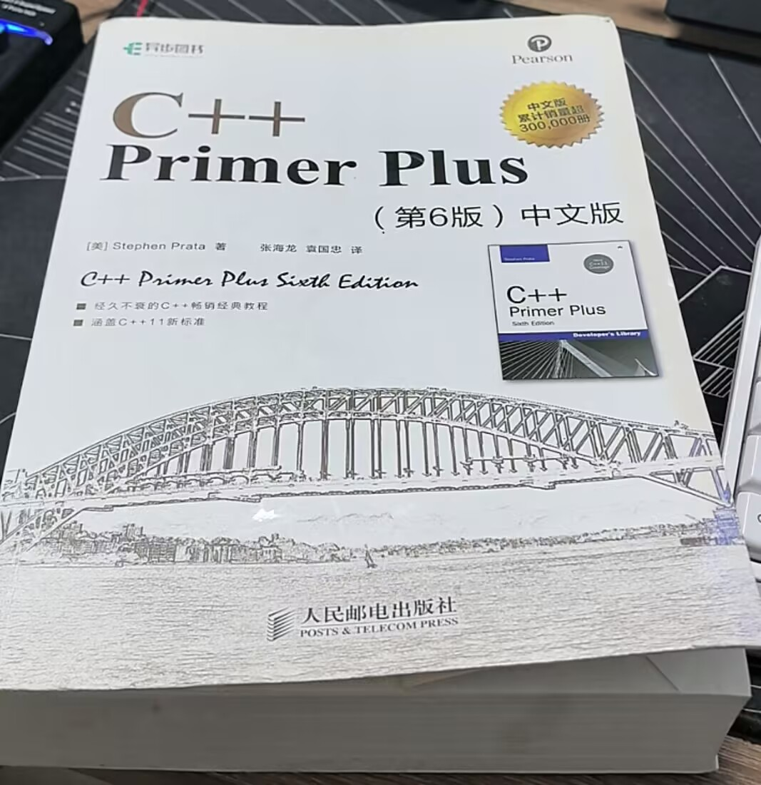

# C++ Primer Plus — 知识地图

[← 学科总览](../MOC.md) | [← 主页](../../README.md)

> 状态：正在啃,后面刷题精学LeetCode

[GITHUB嵌入式C++教程](https://github.com/Awesome-Embedded-Learning-Studio/Tutorial_AwesomeModernCPP)⭐⭐⭐⭐⭐

---

## 第 1 章 基础语法

→ [专题笔记](./基础语法.md)

| 序号 | 题目                                                                                                                   | 难度   | 对应公司            |
| ---- | ---------------------------------------------------------------------------------------------------------------------- | ------ | ------------------- |
| 3    | [C++的三大特性是什么？](https://mianbao.zutils.cn/questions/a5e97ab3-849f-47fc-857b-c940b56fba5f)                         | Easy   | 零跑汽车            |
| 8    | [const 和 #define 定义常量有什么区别？优缺点？](https://mianbao.zutils.cn/questions/dec06f3b-88c9-41e8-9c05-d1e78c025468) | Easy   | 中兴通讯            |
| 18   | [struct 和 class 的区别是什么？](https://mianbao.zutils.cn/questions/e2b2cbb9-6b69-43cc-9648-b654984cdfb6)                | Easy   | CVTE                |
| 23   | [常用的 C/C++ 关键字有哪些？]()                                                                                           | Easy   | 零跑汽车            |
| 24   | 指针与引用的相同点和区别是什么？                                                                                       | Easy   | 经纬恒润            |
| 28   | 重入函数、函数重写、函数重载分别是什么？                                                                               | Easy   | 博世                |
| 29   | 重写、重载、重定义的区别是什么？                                                                                       | Easy   | CVTE                |
| 30   | 重载 (overload) 和重写 (override) 的区别？                                                                             | Easy   | 海康威视            |
| 33   | C++ 和 C 哪个更快？                                                                                                    | Easy   | 石头科技 / insta360 |
| 75   | 什么是命名空间？使用 namespace 的优缺点？                                                                              | Middle | 其它                |
| 118  | C 语言产生死循环有哪些种？适合什么场景？                                                                               | Hard   | 已练习              |
| 126  | strcpy 和 memcpy 的区别是什么？                                                                                        | Hard   | 小米                |
| 129  | 执行 a=1; b=a++; a=a+1; 后 a 和 b 的值？为什么？                                                                       | Hard   | 小米                |
| 132  | 如何实现字符串大小写转换？                                                                                             | Hard   | 海康威视            |

## 第 2 章 面向对象 OOP

→ [专题笔记](./面向对象OOP.md)

| 序号 | 题目                                               | 难度   | 对应公司            |
| ---- | -------------------------------------------------- | ------ | ------------------- |
| 2    | C++构造函数中的深拷贝和浅拷贝的区别是什么？        | Easy   | 石头科技 / insta360 |
| 4    | C++面向对象三大特性是什么？虚函数的作用？          | Easy   | 经纬恒润            |
| 51   | C++ 中运算符重载规则和注意事项                     | Middle | 滴滴                |
| 54   | C++ 多继承的菱形问题如何解决？虚继承的原理         | Middle | 华为                |
| 71   | 两个函数对象进行变量传递时会有什么问题？如何解决？ | Middle | 字节跳动            |
| 76   | 什么是多态？C++ 中如何实现？                       | Middle | 中兴通讯            |
| 77   | 什么是虚函数？如何用 C 语言模拟 C++ 的多态？       | Middle | 安安创新            |
| 78   | 什么是深拷贝和浅拷贝？如何实现深拷贝？             | Middle | 其它                |
| 79   | 如何理解多态和运行时多态？                         | Middle | OPPO                |
| 104  | 多态实现的三个必要条件？底层原理？                 | Middle | 其它                |
| 105  | 多态的实现原理是什么？                             | Middle | 其它                |
| 113  | C++ 多态怎么理解？有哪些表现形式？                 | Hard   | 海康威视            |
| 114  | 多态实现原理，override、virtual 关键字作用？       | Hard   | 元戎启行            |
| 115  | C++ 的多态是如何实现的？                           | Hard   | 蔚来                |
| 116  | 继承、虚函数、多态怎么实现？虚表函数表是什么？     | Hard   | 石头科技 / insta360 |

---

## 第 3 章 虚函数

→ [专题笔记](./虚函数.md)

| 序号 | 题目                                                     | 难度   | 对应公司            |
| ---- | -------------------------------------------------------- | ------ | ------------------- |
| 27   | 纯虚函数的作用是什么？                                   | Easy   | CVTE                |
| 34   | C++ 虚函数的实现模型是什么？虚表指针内存布局差异？       | Easy   | 其它                |
| 50   | C++ 中虚函数表是怎么实现的？虚函数调用的开销             | Middle | 华为                |
| 52   | 虚函数和普通函数的区别？为什么析构函数声明为虚函数       | Middle | 字节跳动            |
| 57   | C++ 的析构函数能置为虚吗？                               | Middle | 经纬恒润            |
| 81   | 什么是虚析构函数？为什么要将基类声明为虚析构？           | Middle | 蔚来                |
| 86   | 父类析构没写 virtual，基类指针指向派生类对象 delete 时？ | Middle | 石头科技 / insta360 |
| 90   | 智能指针和虚函数，什么情况下需要使用虚函数？             | Middle | 其它                |
| 91   | 构造函数为什么一般不能设为虚函数？                       | Middle | 其它                |
| 92   | 构造函数和析构函数可以是虚函数吗？为什么？               | Middle | 中兴通讯            |
| 93   | 析构函数通常写成虚函数？                                 | Middle | CVTE                |
| 94   | 虚函数和纯虚函数有什么区别？                             | Middle | 其它                |
| 95   | 虚函数/纯虚区别？命名空间的作用？                        | Middle | 海康威视            |
| 96   | 虚函数的实现原理是什么？                                 | Middle | 其它                |
| 99   | 虚函数实现机制？vtable 和 vptr 详细说明？                | Middle | 其它                |
| 106  | 虚函数实现原理？RTOS 中使用它的开销？                    | Hard   | 大疆                |

---

## 第 4 章 内存管理

→ [专题笔记](./内存管理.md)

| 序号 | 题目                                                     | 难度   | 对应公司            |
| ---- | -------------------------------------------------------- | ------ | ------------------- |
| 6    | C++中堆的作用域有哪些？                                  | Easy   | CVTE                |
| 9    | delete[] 和 delete 的区别是什么？                        | Easy   | 大疆                |
| 13   | malloc 的底层实现机制是什么？                            | Easy   | CVTE                |
| 14   | new 和 malloc 的区别是什么？                             | Easy   | CVTE                |
| 31   | C 语言的内存管理是如何实现的？                           | Easy   | CVTE                |
| 42   | C++ 中构造函数造成内存泄露的原因是什么？                 | Middle | 安左创新            |
| 56   | C++ 的垃圾回收机制是怎样的？                             | Middle | 蔚来                |
| 63   | int a 和 vector\<int\> b 作为参数时，a b 存储位置？      | Middle | 智元机器人          |
| 83   | 全局变量和局部变量有什么区别？                           | Middle | 石头科技 / insta360 |
| 84   | 内存泄露是怎么造成的？在嵌入式中如何预防？               | Middle | 中兴通讯            |
| 89   | 怎么避免野指针和悬空指针？                               | Middle | 石头科技 / insta360 |
| 103  | 使用指针时如何避免内存泄漏？                             | Middle | 零跑汽车            |
| 112  | C++ 内存分布有哪些？                                     | Hard   | 蔚来                |
| 119  | 内存分布内容及堆栈区别？malloc/free 与 new/delete 区别？ | Hard   | 艾派克微            |
| 122  | new/delete 和 malloc/free 的区别？                       | Hard   | 蔚来                |
| 131  | 如何从结构体成员地址反向获取结构体首地址？               | Hard   | 其它                |
| 135  | 常见的内存泄漏场景有哪些？如何检测和避免？               | Hard   | 艾派克微            |
| 139  | 什么是内存碎片？如何解决？                               | Hard   | 其它                |
| 140  | 什么是内存对齐？为什么要对齐？                           | Hard   | 其它                |
| 141  | 什么是空指针和野指针？如何防范？                         | Hard   | 其它                |
| 152  | 什么是零拷贝 (Zero-copy)？                               | Hard   | 其它                |

---

## 第 5 章 智能指针

→ [专题笔记](./智能指针.md)

| 序号 | 题目                                                    | 难度   | 对应公司            |
| ---- | ------------------------------------------------------- | ------ | ------------------- |
| 21   | 什么是智能指针？常见的智能指针有哪些？                  | Easy   | 其它                |
| 25   | 智能指针有哪些？各有什么特点和使用场景？                | Easy   | 禾赛                |
| 26   | 智能指针有哪些？他们的区别和使用场景是什么？            | Easy   | 宇树科技            |
| 37   | C++ 中 shared_ptr, unique_ptr, weak_ptr 的区别和使用    | Middle | 米哈游              |
| 39   | C++ 中 std::unique_ptr 的使用场景和注意事项             | Middle | 智元机器人          |
| 40   | C++ 中 std::weak_ptr 解决什么问题？                     | Middle | 字节跳动            |
| 65   | shared_ptr, unique_ptr 的区别？局部 unique_ptr 的销毁？ | Middle | insta360            |
| 66   | shared_ptr 引用计数是原子的吗？如何保证线程安全？       | Middle | 蔚来                |
| 67   | shared_ptr 的实现原理是什么？                           | Middle | 智元机器人          |
| 73   | 什么是 RAII？                                           | Middle | 其它                |
| 107  | C++ 中强引用和弱引用的区别是什么？                      | Hard   | 石头科技 / insta360 |
| 108  | 智能指针作用？unique, shared, weak 区别与原理？         | Hard   | 博智智能            |
| 137  | 智能指针有哪些，分别解决什么问题？                      | Hard   | 石头科技 / insta360 |
| 138  | 智能指针有哪些？weak_ptr 怎么用，怎么定义？             | Hard   | 石头科技 / insta360 |

---

## 第 6 章 STL 容器

→ [专题笔记](./STL容器.md)

| 序号 | 题目                                                   | 难度   | 对应公司            |
| ---- | ------------------------------------------------------ | ------ | ------------------- |
| 7    | STL 里的哪些容器是线程安全的？                         | Easy   | 智能机器人          |
| 16   | std::map 和 std::unordered_map 的区别和适用场景？      | Easy   | 网易                |
| 17   | std::vector 和 std::array 的区别？在嵌入式中如何选择？ | Easy   | 小米                |
| 32   | C++ 中 vector 扩容时会有哪些影响？                     | Easy   | 经纬恒润            |
| 61   | STL 中的 map 可以输出哪些时间复杂度？                  | Middle | 腾讯                |
| 62   | STL 中顺序表还是链表的性能？哪个容器是单继承关系？     | Middle | 经纬恒润            |
| 69   | std::string 的内存管理策略？SSO 优化？                 | Middle | 阿里巴巴            |
| 70   | vector 的扩容原理？不手动扩容时的分配策略？            | Middle | 石头科技 / insta360 |
| 101  | vector 底层实现？如何扩容？效率更高的扩容方式？        | Middle | CVTE                |
| 102  | map 底层实现？除了红黑树还有其它的实现吗？             | Middle | CVTE                |
| 127  | unordered_map 和 map 的区别是什么？                    | Hard   | 元戎启行            |

---

## 第 7 章 C++11 新特性

→ [专题笔记](./C++11新特性.md)

| 序号 | 题目                                                  | 难度   | 对应公司   |
| ---- | ----------------------------------------------------- | ------ | ---------- |
| 12   | lambda 表达式什么时候用？捕获列表有哪些方式？         | Easy   | 经纬恒润   |
| 20   | 什么是左值和右值？C++11 中引入右值引用的作用？        | Easy   | 腾讯       |
| 35   | C++11/14/17/20 各引入了哪些重要特性？                 | Middle | 阿里巴巴   |
| 36   | C++17 中 std::optional, std::variant, std::any 的用法 | Middle | 字节跳动   |
| 38   | C++ 中 std::move 的原理和注意事项                     | Middle | 宇树科技   |
| 45   | C++ 中 chrono 应该如何使用？                          | Middle | 智元机器人 |
| 46   | C++ 中 bind 函数和 std::bind 的用法                   | Middle | 腾讯       |
| 48   | C++ 中 std::tuple 和 structured bindings 的用法       | Middle | 未曾科技   |
| 64   | lambda 表达式捕获方式？存储在哪个内存段？             | Middle | 经纬恒润   |
| 98   | 右值引用和引用分别是什么？什么是移动语义？            | Middle | 声网       |
| 109  | C++11 之后有哪些新特性？                              | Hard   | 经纬恒润   |
| 110  | C++11 之后常见特性？结合嵌入式开发说明？              | Hard   | 其它       |
| 111  | C++11 新特性有哪些？                                  | Hard   | 蔚来       |
| 143  | C++11 中的 atomic 库有什么作用？                      | Hard   | 其它       |
| 144  | 什么是内联函数？它与宏的区别？                        | Hard   | 其它       |
| 145  | C++ 11 新特性：auto 和 decltype 区别？                | Hard   | 其它       |
| 146  | C++ 11 新特性：基于范围的 for 循环原理？              | Hard   | 其它       |
| 147  | 什么是移动构造函数？                                  | Hard   | 其它       |
| 148  | 什么是完美转发 (Perfect Forwarding)？                 | Hard   | 其它       |
| 149  | 什么是线程局部存储 (Thread Local Storage)？           | Hard   | 其它       |
| 150  | std::function 和函数指针的区别？                      | Hard   | 其它       |

---

## 第 8 章 关键字与语法

→ [专题笔记](./关键字与语法.md) | [volatile](./volatile.md)

| 序号 | 题目                                                 | 难度   | 对应公司 |
| ---- | ---------------------------------------------------- | ------ | -------- |
| 5    | C/C++ 中 static 修饰全局变量、函数和局部变量的作用？ | Easy   | 暴蓝科技 |
| 10   | extern "C" 的作用是什么？                            | Easy   | CVTE     |
| 11   | extern 关键字的作用是什么？extern "C" 的含义？       | Easy   | 海康威视 |
| 15   | static 的定义与用法有哪些？                          | Easy   | CVTE     |
| 19   | 什么是 constexpr? 与 const 的区别？                  | Easy   | OPPO     |
| 22   | 什么是类型转换？(static_cast, dynamic_cast 等)       | Easy   | 腾讯     |
| 43   | C++ 中 mutable 关键字在什么场景下使用？              | Middle | 字节跳动 |
| 49   | C++ 中异常处理机制是怎样的？try-catch-throw          | Middle | 海康威视 |
| 68   | static 关键字在 C/C++ 中的常见用法？                 | Middle | 蔚来     |
| 87   | 宏定义常见用法？与内联函数的区别？                   | Middle | 鼎桥通信 |
| 97   | dynamic_cast 与 static_cast 区别？动态绑定底层实现？ | Middle | 百度     |
| 123  | static 关键字的作用和应用场景？                      | Hard   | 零跑汽车 |
| 124  | static 的作用和应用场景有哪些？                      | Hard   | 其它     |
| 125  | static, final, finally, finalize 的用法与区别？      | Hard   | 小米     |
| 151  | C++ 的类型安全是什么？                               | Hard   | 其它     |

---

## 第 9 章 并发编程

→ [专题笔记](./并发编程.md) | [原子性与atomic](./原子性与atomic.md)

| 序号 | 题目                                           | 难度   | 对应公司 |
| ---- | ---------------------------------------------- | ------ | -------- |
| 44   | C++ 中 atomic 的特性方法和原理                 | Middle | 腾讯     |
| 47   | C++ 中 std::thread 的使用方法                  | Middle | 腾讯     |
| 53   | C++ 中线程创建函数是什么？std::thread 注意事项 | Middle | 华硕     |
| 82   | 什么是死锁？在嵌入式操作系统中如何预防？       | Middle | 大疆     |
| 100  | C++ 中的通信信号是什么？信号与线程的区别？     | Middle | 中兴通讯 |

---

## 第 10 章 模板编程与设计模式

→ [专题笔记](./模板编程与设计模式.md)

| 序号 | 题目                                    | 难度   | 对应公司 |
| ---- | --------------------------------------- | ------ | -------- |
| 1    | C++常见设计模式有哪些？                 | Easy   | 零跑汽车 |
| 41   | C++ 中如何实现单例模式？线程安全的单例  | Middle | 米哈游   |
| 55   | C++ 模板的原理是什么？模板特化和偏特化  | Middle | 华为     |
| 72   | 什么是 CRTP (静态多态)？                | Middle | 其它     |
| 74   | 什么是 SFINAE？在模板编程中的应用？     | Middle | 其它     |
| 80   | 什么是 PIMPL 模式？                     | Middle | 其它     |
| 85   | 单例模式如何实现？                      | Middle | CVTE     |
| 128  | 什么是黑框小程序？在 C++ 中如何实现？   | Hard   | 经纬恒润 |
| 134  | 嵌入式开发中常用的设计模式有哪些？      | Hard   | 大疆     |
| 153  | 在 C++ 中如何通过底层手段实现反射机制？ | Hard   | 其它     |

---

## 第 11 章 编译链接与嵌入式

→ [专题笔记](./编译链接与嵌入式.md)

| 序号 | 题目                                                                                                               | 难度   | 对应公司         |
| ---- | ------------------------------------------------------------------------------------------------------------------ | ------ | ---------------- |
| 58   | C++ 编译过程分为哪几个阶段？                                                                                       | Middle | CVTE             |
| 59   | 在嵌入式开发过程中，C++ 的使用注意事项有哪些？                                                                     | Middle | 零跑汽车         |
| 60   | C 语言编译后，由 main 函数执行前经过了什么操作？                                                                   | Middle | 安安创新         |
| 88   | 嵌入式中有哪些常见异常？它们和内核的区别？                                                                         | Middle | 其它             |
| 117  | C++ 调用 C 函数怎么调用？混合编译结果？                                                                            | Hard   | 深度量化         |
| 120  | CRC 的原理是什么？                                                                                                 | Hard   | 蔚来             |
| 121  | extern "C" 作用？为什么引用 C 头文件要用它？                                                                       | Hard   | 海康威视         |
| 130  | 在嵌入式开发中，C 和 C++ 的使用差异？                                                                              | Hard   | 经纬恒润         |
| 133  | 如何设计一个跨平台的 C++ 模块？                                                                                    | Hard   | 睿创自控         |
| 136  | [平时编程用 C 还是 C++？分别适合什么场景？](https://mianbao.zutils.cn/questions/9a6c732d-396d-4040-a10e-36f400861277) | Hard   | 影石 / insta360 |
| 142  | 什么是大端和小端？如何判断？                                                                                       | Hard   | 其它             |
