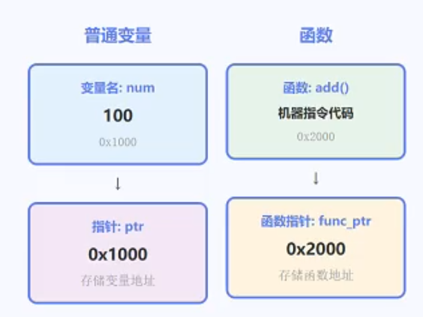

# 函数与指针

[← C语言知识地图](./MOC.md)

---



---

## 1. 函数指针声明

```c
返回类型 (*指针名)(参数类型列表);
```

从右往左读：**指针名 is a pointer to function taking (...) returning ...**

```c
int (*fp)(int, int);   // fp 指向"两个int参数、返回int"的函数
void (*fp2)(void);     // fp2 指向"无参、无返回值"的函数
```

> `int *fp(int, int);` 是**函数声明**（返回 `int*`），不是函数指针 — `()` 优先级高于 `*`，必须加括号。

---

## 2. 赋值 — 函数名即地址

函数名本身就是一个指针常量，`func` 和 `&func` 等价。

```c
int add(int a, int b) { return a + b; }

int (*fp)(int, int);
fp = add;         // ✅
fp = &add;        // ✅ 等价
```

---

## 3. 调用 — `fp` 和 `(*fp)` 等价

```c
int result = fp(3, 4);     // ✅ 简洁写法
int result = (*fp)(3, 4);  // ✅ 显式解引用
```

---

## 4. 回调函数（函数指针作参数）

```c
// 通用排序 — 比较逻辑由调用者提供
void sort(int arr[], int n, int (*cmp)(int, int)) {
    for (int i = 0; i < n - 1; i++) {
        for (int j = i + 1; j < n; j++) {
            if (cmp(arr[i], arr[j]) > 0) {
                int tmp = arr[i]; arr[i] = arr[j]; arr[j] = tmp;
            }
        }
    }
}

int ascending(int a, int b)  { return a - b; }
int descending(int a, int b) { return b - a; }

sort(arr, 5, ascending);   // 升序
sort(arr, 5, descending);  // 降序
```

> 标准库 `qsort` 就是这个模式：
>
> ```c
> void qsort(void *base, size_t n, size_t size,
>            int (*cmp)(const void *, const void *));
> ```

---

## 5. 函数指针数组 — 跳转表

```c
// 四则运算跳转表
int add(int a, int b) { return a + b; }
int sub(int a, int b) { return a - b; }
int mul(int a, int b) { return a * b; }
int div_(int a, int b) { return a / b; }

int (*ops[4])(int, int) = {add, sub, mul, div_};

int result = ops[0](10, 5);  // add(10,5) = 15
result = ops[2](10, 5);      // mul(10,5) = 50
```

读法：`ops is an array[4] of pointer to function(int, int) returning int`

> 状态机、命令解析大量使用跳转表替代 `switch-case`。

---

## 6. 函数指针作返回值

```c
// 原生声明：get_op 返回"指向 int(int,int) 的函数指针"
int (*get_op(char op))(int, int) {
    switch (op) {
        case '+': return add;
        case '-': return sub;
        case '*': return mul;
        case '/': return div_;
        default:  return NULL;
    }
}

int (*fp)(int, int) = get_op('+');
fp(10, 5);  // 15
```

> 原生声明很绕，工程中用 `typedef`：
>
> ```c
> typedef int (*binop_t)(int, int);
> binop_t get_op(char op) { ... }
> ```

---

## 7. typedef 简化

```c
typedef int (*Operation)(int, int);  // Operation 是类型名

Operation fp = add;                  // 清爽
Operation ops[4] = {add, sub, mul, div_};
Operation get_op(char op) { ... }
```

---
