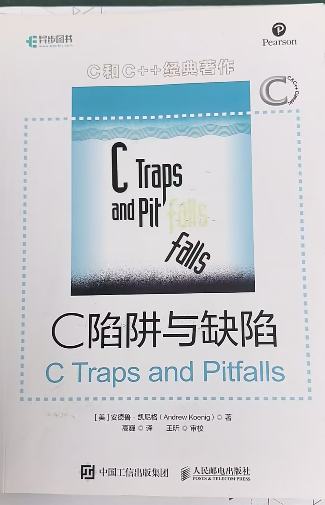

# C 陷阱与缺陷 — 知识地图

[← 学科总览](../MOC.md) | [← 主页](../../README.md)

> 原书：*C Traps and Pitfalls* — Andrew Koenig



---

<details>
<summary><h3 style="display:inline">第 1 章 词法陷阱</h3></summary>

&和|是按位运算符，&&和||是逻辑运算符

<details>
<summary><style="display:inline">词法中的贪心法，编译整体程序识别字符</summary>

编译器通常会在内存中开辟一个缓冲区（Buffer），把源代码分块读进去。它维护两个关键指针：

* **`lexeme_beginning`（起始指针）：** 指向当前正在识别的符号的开头。
* **`forward`（前进指针）：** 负责向后探测。

起始指针会停留在已经识别的字符的下一个位置，前进指针往后，如果前进指针继续向前，两个指针不能成为一个字符，那么就识别成一个字符，然后起始指针挪移到上一个有效符号结束的下一个位置。

</details>

<details>
<summary><style="display:inline">018和18和0x18分别是多大？整形变量问题</summary>

开头是0识别为8进制，开头是0x识别为16进制，其余识别为十进制，都转化成2进制补码存储

</details>

</details>

<details>
<summary><h3 style="display:inline">第 2 章 语法陷阱</h3></summary>

[1.函数声明与函数指针，请说明 (*(void( * )( ) )0)();如果你不能理解，就点进去](第2章-函数声明与函数指针.md)

[2.符号优先级:   !和&amp;谁的优先级更高,忘了就看看](符号优先级.md)

<details>
<summary><style="display:inline">悬挂"else"引发的问题：</summary>

```
if(x==0)
    if(y==0)error();
else{z=x+y;
    f(&z);}
```

c语言中，else始终与同一括号内最近的i未匹配的if结合，实际效果：

```
if(x==0){
    	if(y==0)error();
	else{
		z=x+y;
    		f(&z);
	}
}
```

</details>

</details>

<details>
<summary><h3 style="display:inline">第 3 章 语义陷阱</h3></summary>

[1.指针与数组,二维数组的名称是指向[0][0]的还是指向[0]的](指针与数组.md)?

[2.非数组的指针,malloc怎么用的?有3个使用的点还记得吗?](非数组的指针.md)

[3.数组的和指针的声明,数组名什么时候不能当做指针?](作为参数的数组声明.md)

[4.求值顺序,y[i]=x[i++];先自增还是先赋值?](求值顺序.md)

</details>

<details>
<summary><h3 style="display:inline">第 4 章 链接</h3></summary>

[1.什么是链接器](什么是链接器.MD)?

<details>
<summary><style="display:inline">2.声明与定义,extern的意思</summary>

extern关键字:extern int a说明了a的存储空间是在程序的其他地方分配的

</details>

<details>
<summary><style="display:inline">3.static修饰符的2个作用,你还记得吗</summary>
</details>

1局部变量:使变量在函数外不能使用,且变为永久性的

2全局变量:使变量只在这个文件生效,防止命名污染

</details>

<details>
<summary><style="display:inline">头文件</summary>

对于声明,可以所有外部对象只在一个地方(.h)声明

然后在使用到这个声明的变量的地方 `#include <.h>`

定义这个变量的源文件也要包含这个头文件

那么这些声明中只有一个定义,所以是合法的

</details>

<details>
<summary><h3 style="display:inline">第 5 章 库函数</h3></summary>

[返回整数的getchar函数,getchar的返回值能否用char类型的变量接取]()?

[更新顺序文件,文件读写能否同时进行?](更新顺序文件.md)

[缓冲输出与内存分配,setbuf库函数的使用方法?]()


</details>

<details>
<summary><h3 style="display:inline">第 6 章 预处理器</h3></summary>

1.宏不是函数,现代编程规范严禁使用宏来定义类型,应该用typedef

</details>

<details>
<summary><h3 style="display:inline">第 7 章 可移植性缺陷</h3></summary>

[1.int,long之类的到底是几位的,为什么会在&#34;可移植性缺陷&#34;这一章出现?](可移植性缺陷.md)

[2.负数除法取整?](除法运算时发生的截断.md)


</details>

---

## 读书笔记 / 重点摘录

<!-- 全书读完后在这里做总结或索引 -->
