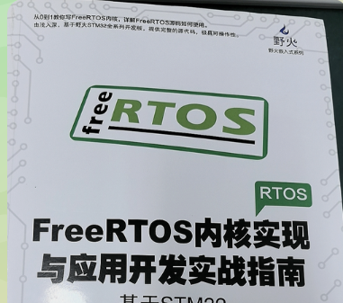

# FreeRTOS内核实现与应用开发实战指南

[← 学科总览](../MOC.md) | [← 主页](../../index.md) | [对照库中的FreeRTOS开发笔记](../../术中自有万钟粟/嵌入式工程架构/freeRTOS/MOC.md)

---

按照初始化和运行的先后顺序↓

| 内容                  | 笔记链接                                   |
| --------------------- | ------------------------------------------ |
| 编程风格,命名规则解析 | [FreeRTOS编程风格](./FreeRTOS编程风格.md)     |
| 任务(线程)的定义      | [任务(线程)的定义](./任务(线程)的定义.md)     |
| freertos启动          | [freertos启动](./freertos启动.md)             |
| 任务插入链表和调度    | [任务插入链表和调度](./任务插入链表和调度.md) |
| 临界段保护            | [临界段保护](./临界段保护.md)                 |
