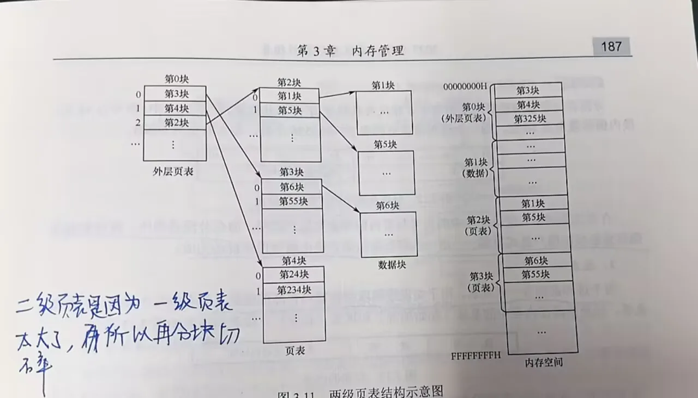

# 段式管理

[← 内存管理](内存管理.md) | [← MOC| ](MOC.md)[← 主页](../../index.md)

---

### 为什么会有段式管理

页式管理解决了内存离散分配的问题,但它是按**固定大小**切分地址空间,更像是站在系统分配方便的角度看问题。

而程序本身往往天然带有功能结构,例如:

- 主程序段
- 子程序段
- 数据段
- 栈段

这些部分在逻辑上彼此独立,长度也通常不同。段式管理就是顺着这种程序结构来划分地址空间,把一个进程分成若干个**有意义的逻辑段**。

所以段式管理的核心出发点不是“方便平均切块”,而是:

- 按程序逻辑组织内存
- 便于共享和保护
- 让用户和编译器都更容易理解地址空间

这和 [编译与链接导论](../C++PrimerPlus/C++编译与链接/编译与链接导论.md) 里讲到的代码段、数据段、栈区这些概念是连着的。

### 段式管理的基本知识点

### 段表

为了把逻辑地址中的段号转换成物理地址,操作系统要为每个进程建立一张**段表**。

段表的作用是记录:

**段号 -> 该段在内存中的起始地址和长度**

一个段表项通常至少包含下面这些信息:

1. **段基址**:该段装入内存后的起始物理地址
2. **段长**:该段实际长度
3. **保护信息**:例如只读、可写、可执行
4. **存在位/访问位**:某些系统中也会记录该段当前是否在内存、是否被访问过

#### 地址变换过程

假设逻辑地址为 $(S,W)$,地址变换过程通常是:

1. 根据段号 $S$ 查段表
2. 取出该段的段基址 $B$ 和段长 $L$
3. 检查是否满足 $W < L$
4. 如果合法,形成物理地址

$$
\text{物理地址} = B + W
$$

可以看出,段式管理中保持不变的是**段内偏移量**,变化的是“该段当前装入到了哪一段物理起始位置”。

#### 段式和页式的区别

- **页式管理是一维地址空间**
- **段式管理是二维地址空间**

这个说法的意思不是说页式管理真的只有一项信息,而是说用户对地址空间的理解方式不同。

页式管理下,用户通常面对的是一个**线性地址空间**,地址从 0 开始顺着排:

虽然系统内部会把它拆成“页号 + 页内偏移”,但这只是硬件变换需要,对用户来说它仍然是一串连续编号的一维地址。

而段式管理下,用户看到的地址天然是:

$$
(段号,段内地址)
$$

也就是先定位“哪一段”,再定位“段内哪个位置”,所以叫**二维地址空间**。

可以直接这样记:

- 页式管理:先有一个线性空间,系统再把它分页
- 段式管理:地址空间从一开始就被分成多个逻辑维度

### 段页式存储管理

