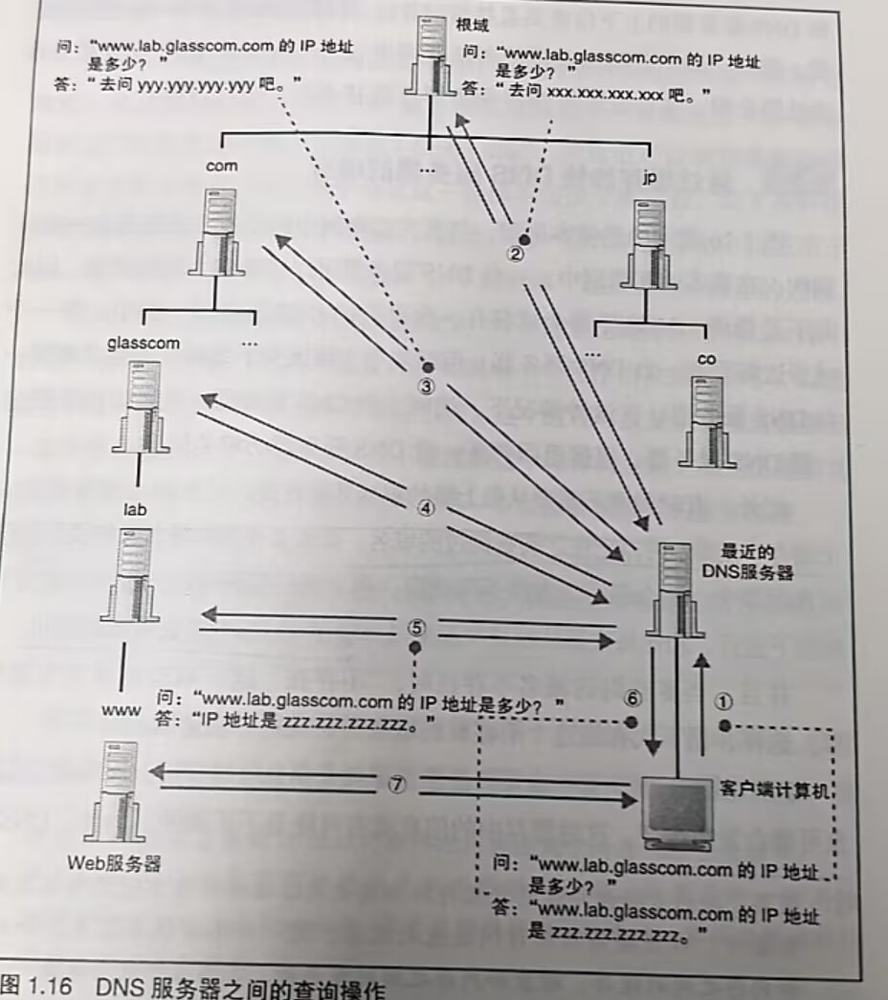

# DNS

[← 返回 MOC](MOC.md) | [← 主页](../../index.md)

---

在网络中每个设备都会分配一个地址,就像某条路上的"XX号XX室","号"对应的是子网的地址,而"室"是分配给子网中的计算机的

IP地址是一串32位的数字,按照8bit为一组分成4组

那**如何查IP呢**很简单,就是向最近的DNS服务查https://evil0knight.github.io/的地址在哪里,然后DNS就返回地址了

### 全世界DNS服务器大接力

DNS处理域名,域名类型,然后记录成表

互联网太大了，因此，DNS 采用了**分布式**的树状层次结构：

* **根域名服务器 (Root DNS)：** 最高级别的老大哥，逻辑上只有一个,但是分为了13组,一共1500多个分布在全世界
* **顶级域名服务器 (TLD DNS)：** 负责管理某个顶级域名，比如 `.com`、`.cn`、`.edu`
* **权限域名服务器 (Authoritative DNS)：** 负责一个具体区域的解析，比如你学校官网的域名就是由你们学校的权限服务器管理的。
* **本地域名服务器 (Local DNS)：** 也就是你电脑网络设置里的那个 DNS（通常由你的宽带运营商比如电信、联通提供）。它是你上网查域名的“第一代理人”。

1. 一个域的信息是作为一个整体存放在DNS服务器中的,不能将一个域拆开来放到多个DNS服务器中
2. 根服务器信息保存在互联网中的所有DNS服务器中,这样,任何DNS服务器都可以找到并访问根服务器,因此,客户端想要查询信息只要和最近的DNS服务器联络就能顺藤摸瓜找到所有的域名的IP,
3. 具体查询如下图
4. 很多时候不需要每次都从上级往下找,DNS服务器有缓存功能,可以加快查询速度,缓存是由有效期的
   找到IP了之后看[套接字](套接字.md),如何传输信息

---

如果你正在跟随梳理, 返回 [MOC←](MOC.md)
