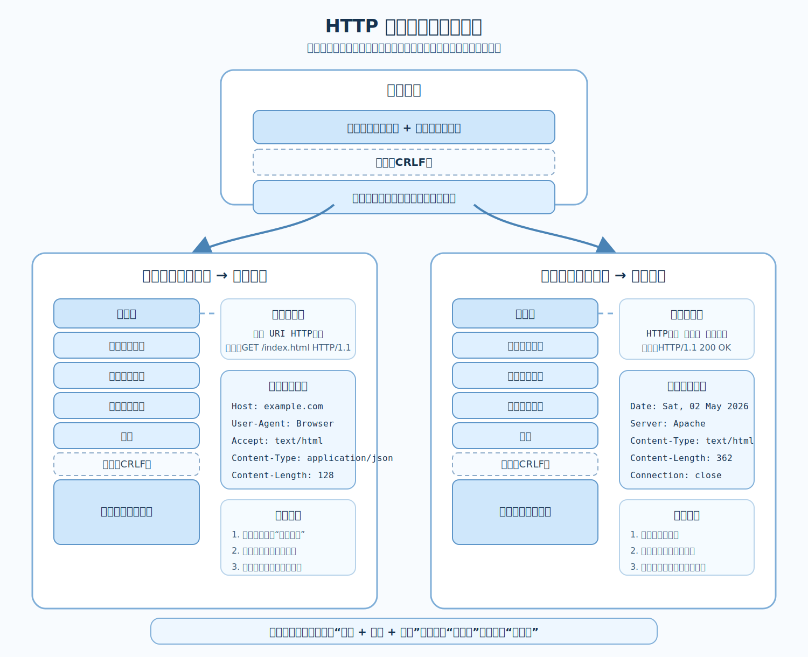

# HTTP报文

[← 返回 MOC](MOC.md) | [← 主页](../../index.md) | [← 返回HTTP万维网](HTTP万维网.md)

---

## 整体结构

HTTP 请求报文和响应报文都可以先看成同一个骨架：`报文首部 + 空行(CRLF) + 报文主体`。它们真正的区别，主要出现在首部中的第一行，请求报文是**请求行**，响应报文是**状态行**。

## 请求报文

请求报文通常由 `请求行`、若干首部字段、一个空行和可选的报文主体组成。

- 请求行格式：`方法 URI HTTP版本`
- 常见方法：`GET`、`POST`、`PUT`、`DELETE`
- `GET` 往往只有首部，没有主体；`POST` 和 `PUT` 常常会带上主体数据

## 响应报文

响应报文通常由 `状态行`、若干首部字段、一个空行和可选的报文主体组成。

- 状态行格式：`HTTP版本 状态码 原因短语`
- 常见状态码：`200 OK`、`404 Not Found`、`500 Internal Server Error`
- 状态码速查见 [HTTP状态码](HTTP状态码.md)
- 报文主体里放的通常是真正返回给客户端的数据，比如 HTML、JSON、图片等

## 常见首部字段

- `Host`：请求的目标主机
- `Content-Type`：报文主体的数据类型
- `Content-Length`：报文主体的长度
- `Connection`：连接管理方式
- `Cookie` / `Set-Cookie`：用于状态保持

## 本章小结

HTTP 报文可以记成“共同骨架 + 不同首行”。先从整体上看清 `首部、空行、主体` 这三层，再分别理解请求行和状态行，后面的各种首部字段就更容易串起来了。

---

如果你正在跟随梳理, 返回 [MOC←](MOC.md)
