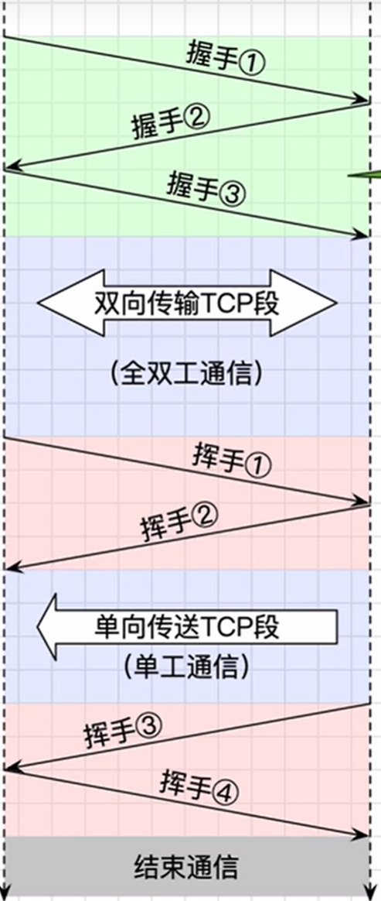

# TCP

[← 返回 MOC](MOC.md) | [← 主页](../../../README.md)

---

---

面向连接,可靠交付,全双工,面相字节流(就是不管那个进程,就按顺序发不分片,UDP面向报文段)

[TCP报文段格式](TCP报文段.MD)

🟢3次握手:前两次是为了确保发送接收双方的发送和接收功能没问题,增加第3次是因为网络延迟,这是传输层独有的

如果一开始请求的握手后来到了,但是请求方早就完成了交流,而被请求方却觉得又要交流了,就会浪费被请求方的资源

🟢滑动窗口,看数据链路层的[滑动窗口](滑动窗口.md)但因为要考虑网络环境,不同点在于:

1. TCP的窗口大小根据拥塞程度随时变大变小
2. 字节流确认而不是一帧一帧

   在早期的不可靠链路上（比如早期的无线电或电话线），数据链路层必须严格搞滑动窗口来保证每一段路都不丢包。

但在现在的**以太网(Ethernet)**或 **Wi-Fi** 中，数据链路层往往变得非常“简单粗暴”：如果校验出错了，直接丢弃，把重传的重任交给上层的 TCP。

🟢零窗口:接收方窗口满了,window=0,发送,如果窗口又不满了但是说明窗口空了的报文丢了,所以发送方要定时发探测报文

那为什么不接收方发需要接受报文呢,因为如果信息死锁,那么就会一直等下去,

> **发送方探测可以确保是接受方没处理完而不是网络不畅通**

🟢4次挥手:前两次就双方告诉要结束了,中间的等待时间是2MSL,1确保握手信息从网络中消失,并且能接受到握手信息不然又建立新的连接,然后受延迟的关闭信息来了给你建立的链接莫名其妙关掉了2把没传完的信息传完

---

---

本章小结
