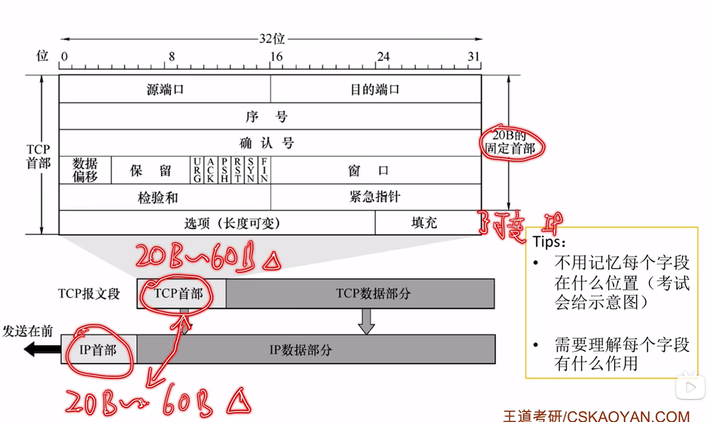

# TCP报文段

[← 返回 MOC](MOC.md) | [← 主页](../../../README.md)|[←返回TCP协议](TCP协议.md)

---

1. **序号seq** : 所有字节都按顺序编号,序号表示当前报文在字节流中的交付顺序,比如:第一个报文起始序号是500(随机的),MSS最大字长1000B,第二个报文序号就是1500
2. **确认号ack**:ACK==1(除了握手1),	ack有效(注意大小写,是两个东西),用于表示确认号之前的都正确接收了
3. **数据偏移**:首部长度
4. **URG** ：紧急指针有效，告诉系统此报文段中有紧急数据。
5. **ACK** ：确认序号有效。TCP 规定，连接建立后所有传送的报文段都必须把 ACK 置 1。
6. **PSH** ：推送。接收方应尽快把数据交付给应用层，而不是等缓存满了再传。
7. **RST** ：复位。连接出错了，必须断开重新连接。
8. **SYN** ：同步。在**三次握手**建立连接时用来同步序号,只有握手1和握手2,SYN==1
9. **FIN** ：终止。数据发完了，释放连接,只有挥手1和挥手3,FIN==1
10. **窗口 (Window, 16位)** ：指接收方目前的接收缓存大小。它告诉发送方：”我这儿还能存多少字节，你别发太猛把我撑死。”这就是**滑动窗口**机制。
11. **校验和 (Checksum, 16位)** ：防止数据在传输过程中出错（被电磁干扰改了位）。如果校验失败，接收方直接丢弃。
12. **紧急指针 (Urgent Pointer, 16位)** ：只有 URG=1 时才有效，指明紧急数据在报文段中的结束位置。
