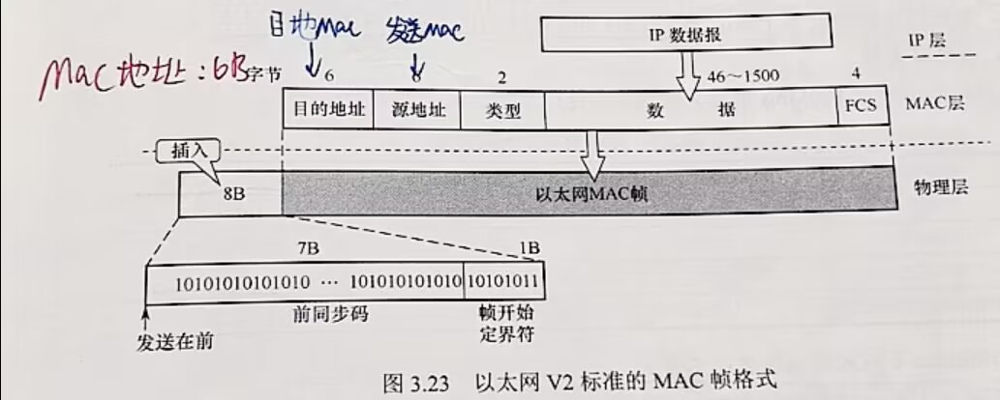
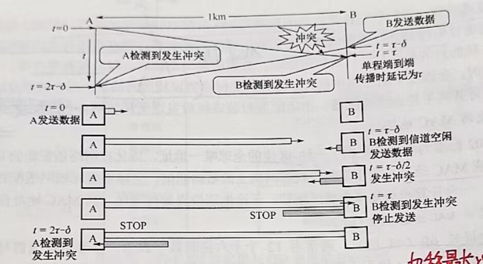

# 以太网

[← 返回 MOC](MOC.md) | [← 主页
](../../../README.md)

---

## 1. 局域网 (LAN) 简介

**局域网 (Local Area Network, LAN)** 是指在某一区域内（如一个学校、工厂或办公楼）由多台计算机互联成的计算机组。

* **主要特点：** 覆盖范围小（几百米到几公里）、传输速率高（10Mbps 到 100Gbps 以上）、误码率低、通常为一个单位所独占。
* **拓扑结构：** 星型（目前最流行，以交换机为中心）、总线型、环型、树型。
* **核心技术：** 决定局域网特性的三个主要技术是 **拓扑结构** 、**传输介质**和 **介质访问控制方法** （如 CSMA/CD, CSMA/CA, 令牌环）。

## 3. IEEE 802.3 标准

**IEEE 802.3** 是 IEEE（电气电子工程师学会）制定的**有线以太网**标准。

* 在局域网体系结构中，数据链路层被拆分为两个子层：**逻辑链路控制 (LLC)** 子层（目前基本不用）和 **介质访问控制 (MAC)** 子层。
* 业界实际上最广泛使用的是 **DIX https://www.google.com/search?q=Ethernet V2** 标准，它与 IEEE 802.3 只有极微小的差别，现在通常将两者统称为“以太网”。

## 4. MAC 地址

 **MAC地址 (Media Access Control Address)** ，也称物理地址或硬件地址。

* **长度：** 48位（6个字节），通常用12个十六进制数表示，例如 `00:1A:2B:3C:4D:5E`。
* **唯一性：** 全球唯一。前3个字节是 **组织唯一标识符 (OUI)** （分配给厂商），后3个字节是厂商自行分配的 **网络接口标识符** 。
* **作用：** 在局域网中，网卡（网络适配器）通过 MAC 地址来唯一识别对方，决定是否接收该数据帧。

## 5. MAC 帧格式

以太网 V2 的 MAC 帧结构非常简洁，由以下几个部分组成：

* **目的 MAC 地址 (6字节):** 接收方的物理地址（单播、多播或全1的广播地址 `FF:FF:FF:FF:FF:FF`）。
* **源 MAC 地址 (6字节):** 发送方的物理地址。
* **类型 (2字节):** 标志上一层（网络层）使用的是什么协议。例如 `0x0800` 代表 IPv4，`0x0806` 代表 ARP。
* **数据载荷 (46 ~ 1500字节):** 网络层交下来的数据。为了满足 CSMA/CD 的最小帧长要求（64字节），数据部分如果不足46字节，会自动填充冗余字节。
* **FCS (4字节):** 帧检验序列，使用循环冗余校验 (CRC) 检查帧在传输中是否出错。出错则直接丢弃。

> *注：物理层会在 MAC 帧前面加上 8字节的 **前导码** （7字节同步码 + 1字节帧开始定界符）用于时钟同步，但这部分不算在 MAC 帧体内。*

## 6. CSMA/CD (带有冲突检测的载波监听多路访问)

这是 **早期半双工有线以太网** （如使用集线器 Hub 的以太网）的核心协议。

* **核心口诀：** 先听后发，边听边发，冲突停发，随机重发。
* **冲突检测：** 站点在发送数据的同时会监听信道。如果检测到电压异常（说明信号叠加发生了冲突），就会立刻停止发送，并发送一个干扰信号（Jamming signal）通知所有站点。
* **最小帧长与截断二进制指数退避：** 为了确保发送完一个帧之前能够检测到可能发生的最远冲突，规定了最小帧长（10Mbps 下为 64 字节）。冲突后，使用“截断二进制指数退避算法”随机等待一段时间后再尝试重传。
* 

**争用期 = **$2\tau$**** （即端到端的往返传播时延）。

为了让发送方在 **$2\tau$** 的争用期内能够一直保持发送状态（从而能够监听到碰撞），数据帧不能太短。发送这个帧所花费的时间（传输时延），必须大于或等于争用期 **$2\tau$**。

* **公式：** **$传输时延 = \frac{帧长}{数据传输率} \ge 2\tau$**
* 也就是：**$最短帧长 = 2\tau \times 数据传输率$**

**经典例子（10Mbps 以太网）：**

在传统的 10Base-T 以太网中，标准规定：

* 争用期 **$2\tau$** 设定为 **$51.2 \mu s$**。
* 数据传输率为 **$10 Mbps$**（即 **$10 \times 10^6$** bit/s）。
* **$最短帧长 = 51.2 \times 10^{-6} s \times 10 \times 10^6 bit/s = 512 bit = 64 Byte$**。

## 7. IEEE 802.11 WIFI

**IEEE 802.11** 是**无线局域网 (WLAN)** 的通用标准，也就是我们熟知的 Wi-Fi。

* 它主要分为两大类架构：
  * **有固定基础设施 (Infrastructure):** 最常见，所有的手机、电脑都连接到一个中心节点—— **接入点 (AP，即无线路由器)** 。
  * **无固定基础设施 (Ad-hoc):** 也就是自组网，设备之间直接点对点通信。

## 8. CSMA/CA (带有碰撞避免的载波监听多路访问)

无线网络由于介质的特殊性（信号衰减快，无法做到“边听边发”；存在 **隐蔽站问题** ），无法使用 CSMA/CD，必须使用  **CSMA/CA** 。

* **核心机制：** 尽量**避免**冲突的发生，而不是等冲突发生了再去检测。
* **关键技术：**
  * **IFS (帧间间隔):** 不同的帧具有不同的优先级，发送前需要等待不同时长的 IFS（如 SIFS, DIFS）。
  * **预约信道 (RTS/CTS):** 可选机制。发送长数据前，发送方先发 RTS (Request To Send)，接收方回 CTS (Clear To Send)，从而通知周围所有隐藏站点保持静默。
  * **ACK 确认机制:** 因为无线信道不可靠且无法直接检测冲突，所以 MAC 层必须有确认机制。发完一帧没收到 ACK，就认为发生了碰撞并重传。

* 若站点首次尝试发送数据（非因重传而发送），且检测到信道空闲，则在等待时间 DIFS 后（信道持续空闲），立即发送整个数据帧。否则执行步骤 2）。
* 站点选取一个随机数，设置退避计时器。计时器运行的规则是：若信道忙，则冻结计时器（暂停递减），并继续等待。直至信道变为空闲（称为推迟接入）；若信道空闲，且在时间 DIFS 内持续空闲，则开始争用信道，进行倒计时。当计时器减至 0 时（仅可能发生在信道持续空闲期间），站点立即发送整个数据帧并等待确认。
* 发送站收到确认后，若仍有后续帧待发送，则转到步骤 2）。若在规定时间（由重传计时器控制）内未收到确认，则按二进制指数退避规则增大竞争窗口，再转到步骤 2）重新尝试。

## 9. 以太网交换机 

以太网交换机本质上是一个 **多端口的网桥** ，工作在数据链路层。它的出现让以太网从“共享式”走向了“交换式”，是现代局域网的绝对核心。

* **全双工与无冲突：** 交换机的每个端口都可以独占带宽。当采用全双工模式连接各主机时， **根本不会发生冲突，因此现代交换机网络中不再需要使用 CSMA/CD 协议** 。
* **三大核心转发逻辑：**
  1. **自学习 (Learning):** 读取数据帧的 **源 MAC 地址** ，将该地址与接收到该帧的端口号绑定，记录在 MAC 地址表中（带老化时间）。
  2. **转发/泛洪 (Forwarding/Flooding):** 读取数据帧的 **目的 MAC 地址** 。如果表中查不到，则向除了接收端口外的所有端口广播（泛洪）；如果能查到，就单播转发到对应端口。
  3. **过滤 (Filtering):** 如果查表发现目的端口和源端口是同一个端口，则直接丢弃该帧。

---

## 本章小结
