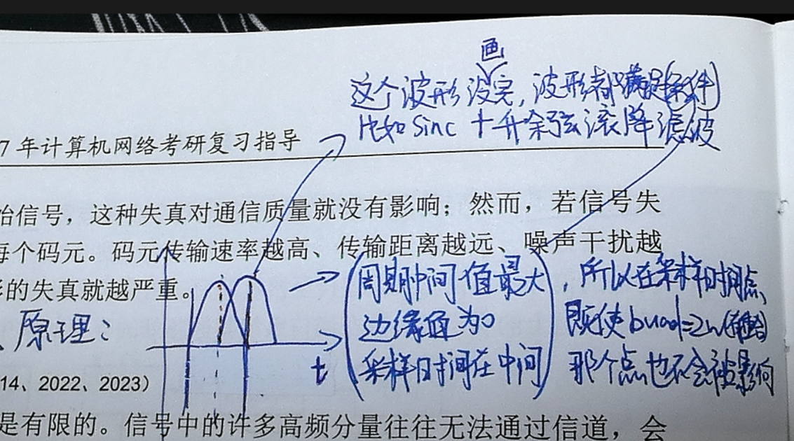
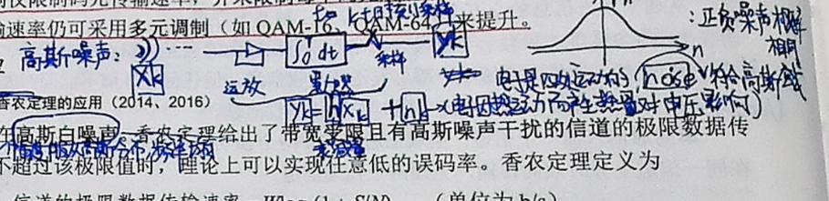
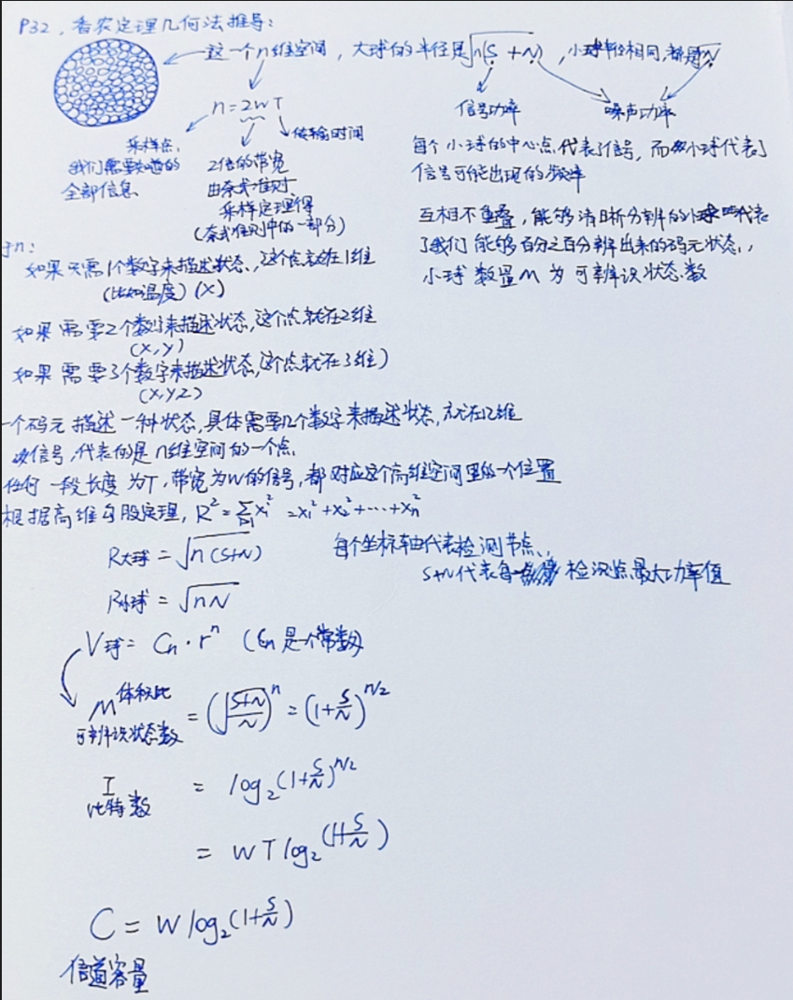

# 基础概念

[← 返回 MOC](MOC.md) | [← 主页](../../index.md)

在物理层的数据通信中，我们首先需要理解几个核心概念。

## 码元 (Symbol)

- **定义**：在数字通信中，表示一段持续固定时间的完整波形。一个码元可以携带若干比特的信息量。
- **示例**：例如在某些调制方案中，一个码元有 4 种状态，则一个码元携带 $\log_2 4 = 2$ 比特；在 WIFI（如 256-QAM）中，一个码元可以携带 8 bit 的信息量（因为 $2^8 = 256$ 种状态）。

## 波特率(baud)

实际传输中，传输速率以**每秒发送的符号（baud）数量**进行计算，**即波特率。** 当一个符号只包含两种可能，即一个事件两种可能，那么此时1baud=1bit。此时波特率等于比特率。 一个符号也有可能包含多个可能，例2中，一个符号中包含四个电平，那么接受端的一个事件，有了abcd四种可能，那么1baud=2bit。此时波特率为比特率的两倍。

## 奈奎斯特准则 (Nyquist Theorem)

- **适用条件**：理想低通（无噪声、带宽受限）信道。
- **核心思想**：避免码间串扰，码元的传输速率有上限。
- **公式**：

  $$
  \text{理想低通信道下的极限数据传输速率} = 2W \log_2 V \quad \text{(bit/s)}
  $$

  - $W$：信道带宽（Hz）
  - $V$：每个码元包含的离散电平数目（即状态数）
- **结论**：带宽越宽，极限波特率（码元传输速率 $2W$）越高。

## 香农定理 (Shannon's Theorem)

- **适用条件**：有噪声的信道。
- **核心思想**：信道的极限信息传输速率受限于带宽和信噪比。
- **公式**：

  $$
  C = W \log_2(1 + S/N) \quad \text{(bit/s)}
  $$

  - $C$：信道的极限信息传输速率
  - $W$：信道带宽（Hz）
  - $S$：信道内所传信号的平均功率
  - $N$：信道内部的高斯噪声功率
  - $S/N$：信噪比（通常用分贝 dB 表示：$10 \log_{10}(S/N)$）
- **结论**：带宽越大或信噪比越高，极限传输速率越大。只要传输速率低于极限速率，就一定能找到某种方法实现无差错传输。
