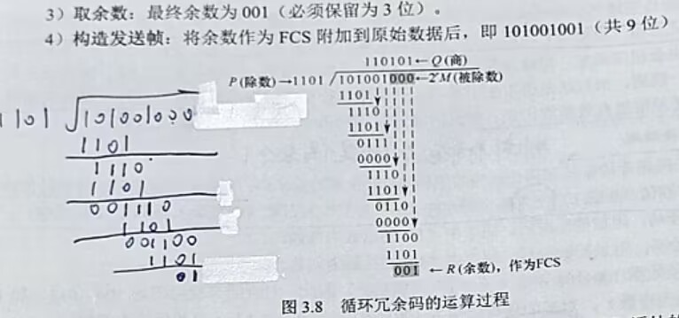

# 模2除法

[← 返回 CRC](CRC循环冗余校验.md)

---

## 核心规则:模2运算中，比起正常除法,**减法是 XOR（异或）**：

## 验证（接收方）

接收方收到 `101001001`，对 `1101` 做同样的模2除法：

余数全0 → 传输无误 ✓

---

## 常见错误

**最高位=0时依然做了XOR** — 最高位=0表示除数无法"对齐进去"，必须跳过，直接补入下一位。
