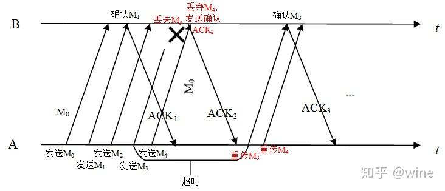
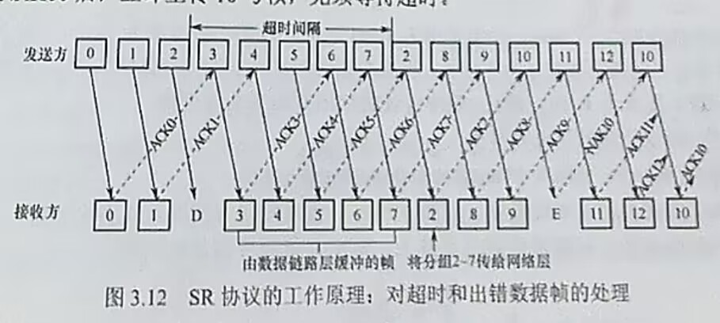

# 滑动窗口

[← 返回 MOC](MOC.md) | [← 主页](../../../README.md)|[←TCP协议](TCP协议.md)

---

1.单帧滑动窗口(s-w):停止等待协议

2.多帧滑动窗口后退N帧(GBN):

发送窗口满了还没接收到ACK则判定没收到的那个失败了,从那个开始重新传

* 首先需要明确的是, GBN协议中接收窗口的大小 **W_R=1**
* 其次, GBN协议中, 对发送窗口的大小也有要求, 若采用 **n** 比特编号(对发送的帧编号),  **发送窗口的大小应满足:** $1\leq W_T\leq 2^n-1$ , 这是因为发送窗口过大, 会使得接收方 **无法区别新帧和旧帧** ⬇️⬇️⬇️
* 

| **阶段**             | **动作说明**                                      | **逻辑状态**                                                 |
| -------------------------- | ------------------------------------------------------- | ------------------------------------------------------------------ |
| **Step 1: 满额发送** | 发送方一口气发送帧**0, 1, 2, 3** 。               | 窗口**$W_T = 4$**已填满。                                        |
| **Step 2: 回绕接收** | 接收方全部收到，窗口滑向下一轮，**等待新帧 0** 。 | 接收方视角：旧 0 已死，新 0 当立。                                 |
| **Step 3: ACK 黑洞** | 所有的确认包（ACK）在网络中全部丢失。                   | 发送方依然认为 0-3 未送达。                                        |
| **Step 4: 超时重传** | 发送方计时器到期，重新发送**旧帧 0** 。           | 发送方视角：救救孩子，再发一次 0。                                 |
| **Step 5: 逻辑崩溃** | 接收方看到帧 0 飞过来。                                 | **陷入死循环：**接收方无法判断这是重发的旧 0，还是它正在等的新 0。 |

3.选择重传协议(S-R)

* 缓冲区数量正常等于发送方的发送缓冲区
* 发送方为每个未确认的帧维护独立的计时器,超时仅重传该帧
* 接收方重复接受:丢弃并ACK

---

## 本章小结

<style="display:inline">111

