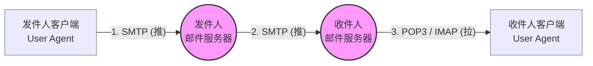

# 电子邮件

[← 返回 MOC](MOC.md) | [← 主页](../../../README.md)

---

看着上面这张图，我们需要死死捏住以下三个核心考点：

### 1. 发送与中转：SMTP 协议（推）

* **角色：** 负责把邮件从你的电脑**“推” **到你的服务器，以及从你的服务器** “推”**到对方的服务器。
* **底层：** 基于  **TCP** ，熟知端口号是  **25** 。
* **致命缺陷（考研超级高频考点！）：** 原始的 SMTP 协议非常老，它 **只能传输 7 位的 ASCII 码文本** 。也就是说，它不能传中文，不能传图片，不能传音视频附件。
* **怎么解决缺陷？** 引入了  **MIME (多用途互联网邮件扩展)** 。
  * **MIME 的作用：** 它不是一个单独的传输协议，而是一个“翻译官”。它负责在发送前，把你的图片、中文翻译成 SMTP 能看懂的 ASCII 码；在接收后，再把 ASCII 码还原成图片和中文。**做选择题时，看到“多媒体”、“非ASCII”，立刻找 MIME。**

### 2. 接收：POP3 与 IMAP 协议（拉）

邮件到了对方服务器后，对方服务器是不会主动把邮件塞给收件人的（因为收件人可能没开机）。必须由收件人主动去**“拉”**取。

* **POP3 (邮局协议版本3)：**
  * 基于  **TCP** ，端口  **110** 。
  * **特点：** 简单粗暴。通常是“下载并删除”模式，你把邮件拉到本地电脑后，服务器上的原件就删了（虽然现在也能设置保留，但它的本质不支持多设备状态同步）。
* **IMAP (因特网邮件访问协议)：**
  * 基于  **TCP** ，端口  **143** 。
  * **特点：** 现代且高级。它能 **同步状态** 。你在手机上把一封邮件标记为“已读”，电脑上也会显示“已读”；你在本地建了个文件夹，服务器上也会同步建一个。

---
