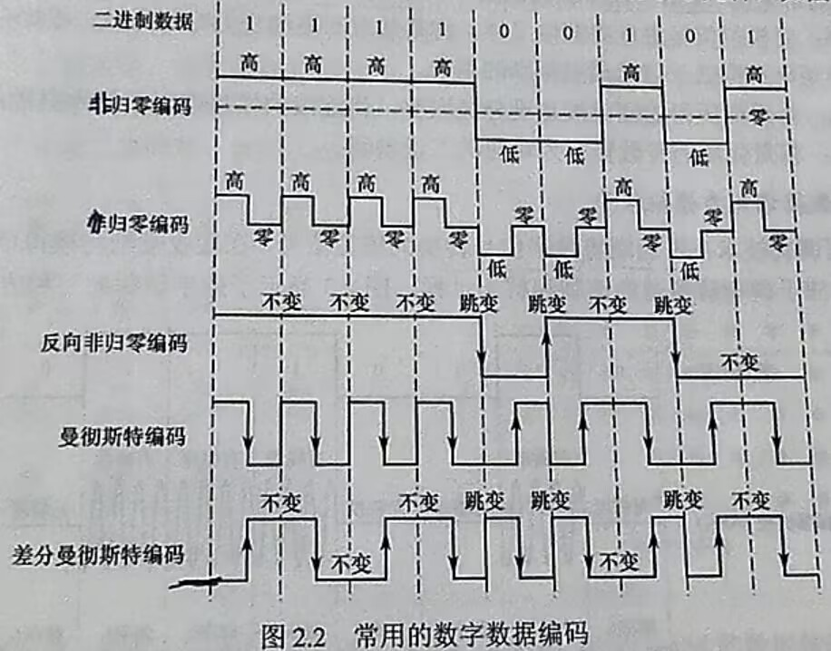
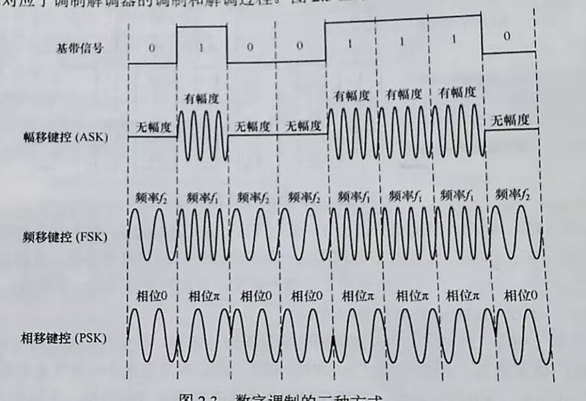
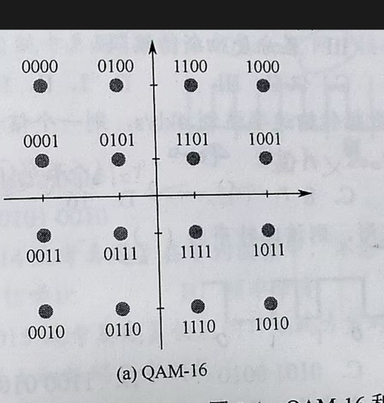

# 编码与调制

[← 返回 MOC](MOC.md) | [← 主页](../../index.md)

数据在物理信道上的传输分为两种基本形式：**基带传输**（通常使用编码技术）和**频带传输**（通常使用调制技术）。

## 数字数据编码为数字信号 (编码)

将二进制数据转换成适合在数字信道上传输的电信号。

- **归零编码 (RZ)**：信号状态在一个码元周期内一定会回到零电平。优点是自带时钟同步信号，缺点是带宽利用率低。
- **非归零编码 (NRZ)**：正电平表示1，负电平（或零电平）表示0，在一个码元周期内不归零。缺点是无法传递时钟同步信号，接收端难以分辨连续的0或1。
- **曼彻斯特编码 (Manchester)**：每个码元的中间有一个跳变。例如，从高到低跳变表示1，从低到高跳变表示0。这个跳变既作时钟信号又作数据信号。常用于以太网。
- **差分曼彻斯特编码**：同曼彻斯特编码一样在中间有跳变（用于时钟同步），但数据的表示由码元开始边界**是否有跳变**决定（例如：有跳变表示0，无跳变表示1）。抗干扰能力比曼彻斯特更强。

## 数字数据调制为模拟信号 (调制)

将数字数据转换为适合在模拟信道（如无线电波）中传输的模拟信号。

- **幅移键控 (ASK)**：通过改变载波信号的振幅来表示数字数据（如0没振幅，1有振幅）。
- **频移键控 (FSK)**：通过改变载波信号的频率来表示数字数据（如低频表示0，高频表示1）。
- **相移键控 (PSK)**：通过改变载波信号的相位来表示数字数据（如初相位0度表示0，180度表示1）。
- **正交幅度调制 (QAM)**：结合 ASK 和 PSK，同时改变载波的幅度和相位，以在同一个码元中传输更多的比特（例如 16-QAM，256-QAM 等）。
