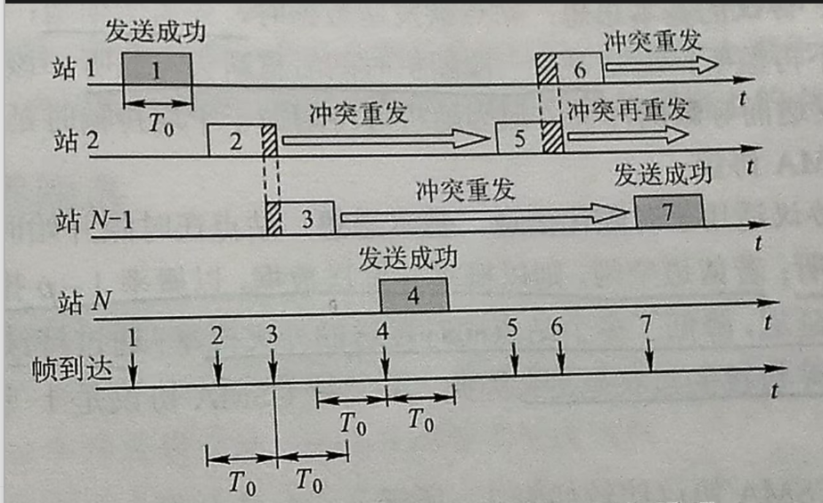
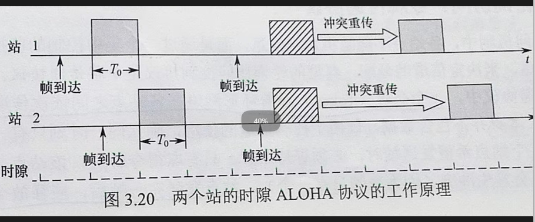

# 随机访问控制

[← 返回 MOC](MOC.md) | [← 主页](../../index.md)

---

## 1. ALOHA 协议

ALOHA 是最早的随机访问协议，分为纯 ALOHA 和时隙 ALOHA。

### 纯 ALOHA (Pure ALOHA)

* **原理：** 不进行任何检测，想发就发。如果一段时间内没收到确认（ACK），就认为发生了冲突，等待一段随机时间后重传。
* **性能：** 极其简单，但碰撞概率高。最大吞吐量仅为  **18.4%** 。

### 时隙 ALOHA (Slotted ALOHA)

* **原理：** 把时间划分为等长的 **时隙** ，规定只能在每个时隙的**开始时刻**发送帧。
* **提升：** 减少了碰撞发生的窗口（从 **$2t$** 减小到 **$t$**）。如果发生碰撞，由于所有帧都在时隙起点开始，碰撞只发生在时隙内。
* **性能：** 最大吞吐量提升至  **36.8%** 。

---

## 2. CSMA 协议 (载波监听多路访问)

CSMA 的核心思想是**“先听后说”**。发送前先检测信道上是否有其他节点在发送。

根据监听到信道忙后的行为，分为以下三种坚持策略：

| **策略类型**    | **监听到信道空闲 (Idle)**                                   | **监听到信道忙 (Busy)**                 | **优点**                         | **缺点**                         |
| --------------------- | ----------------------------------------------------------------- | --------------------------------------------- | -------------------------------------- | -------------------------------------- |
| **1-坚持 CSMA** | **立即发送**                                                | **继续监听** ，直到空闲                 | 只要空闲就发，利用率高                 | 多个节点同时等待时，空闲瞬间会集体碰撞 |
| **非坚持 CSMA** | **立即发送**                                                | **放弃监听** ，等待一个随机时间后再监听 | 减少了空闲瞬间的集体碰撞               | 导致信道可能在一段时间内处于闲置状态   |
| **p-坚持 CSMA** | **以概率**$p$**发送** ，以**$1-p$**推迟到下一时隙 | **继续监听** ，直到空闲                 | 试图在“坚持”和“非坚持”之间寻找平衡 | 概率**$p$**的选择难以达到最优        |

---

## 3. 令牌访问控制 (Token Passing)

虽然你将其列在随机访问下，但 **令牌（Token）实际上属于受控访问（Controlled Access）** ，因为它完全消除了碰撞。

* **原理：** 网络中存在一个特殊的控制帧，称为 **令牌** 。令牌在逻辑环路中按顺序传递。
* **规则：**
  1. 只有拿到令牌的节点才有权发送数据。
  2. 发送完数据或没有数据发时，必须将令牌传递给下一个节点。
* **特点：** 在高负载下效率极高，因为没有碰撞开销；但在低负载下，节点即使有数据也要等令牌传过来，存在时延。

---

## 本章小结
