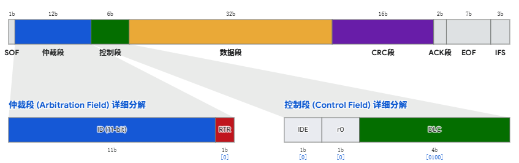
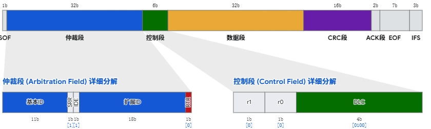
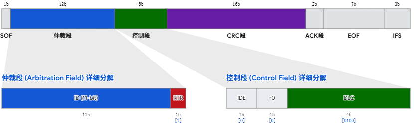
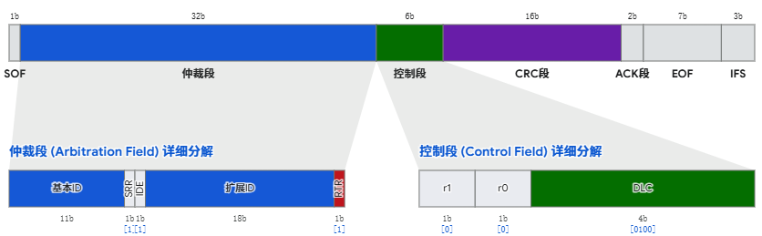
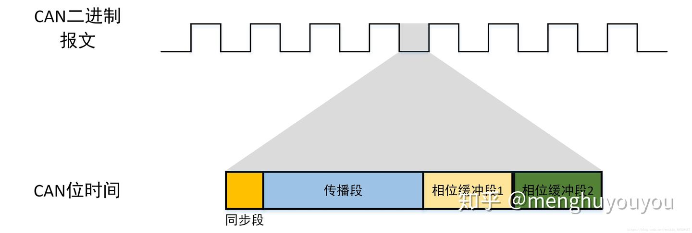

# CAN基础

[← 返回 MOC](MOC.md) | [← 主页](../../index.md)

---

### 🔴CAN是什么

> 控制器局域网CAN( Controller Area Network)属于现场总线的范畴，是一种有效支持分布式控制系统的串行通信网络。是由 **德国博世公司在20世纪80年代专门为汽车行业开发的一种串行通信总线。** 由于其高性能、高可靠性以及独特的设计而越来越受到人们的重视，被广泛应用于**汽车业、航空业、工业控制、安全防护**等领域。

### 🔴物理层与差分通信

CAN是靠can_h和can_l两根线的压差来表达0和1的

如何表达1:当两个线没有电压差的时候,就是1的意思,

如何表达0:当两个线有电压差的时候,就是0的意思,

---

从差分信号到逻辑电平,需要一个**CAN收发器**翻译为TTL电平,发送则相反

---

为了解决压摆率和阻抗匹配,需要加一个终端电阻,参考[终端电阻](CAN终端电阻.md)

---

如果还是对抗干扰不满意:[信号线防干扰](../../术中自有万钟粟/PCB电路/信号线防干扰.md)

### 🔴帧类型

#### 数据帧,DLC:0到8,以4为例

标准帧

扩展帧

扩展帧扩展了ID,更适合更复杂的系统,SRR保证了基本ID的优先级高于扩展ID

IDE辅助识别了这是扩展帧还是标准帧

#### 遥控帧,DLC:0到8,以4为例

标准帧

扩展帧

#### 错误帧

错误帧用于在检测到通信错误时，破坏当前错误报文并通知所有节点。

| 字段                          | 位数  | 说明                        |
| ----------------------------- | ----- | --------------------------- |
| Error Flag（错误标志）        | 6 bit | 主动错误时一般为 6 个显性位 |
| Error Delimiter（错误界定符） | 8 bit | 错误帧结束                  |

总长度：**14 bit**
见 [错误检测与重发](#error-detect)

#### 过载帧

过载帧用于延迟下一帧发送，给节点留出处理时间。

| 字段                             | 位数  | 说明             |
| -------------------------------- | ----- | ---------------- |
| Overload Flag（过载标志）        | 6 bit | 请求延迟后续发送 |
| Overload Delimiter（过载界定符） | 8 bit | 过载帧结束       |

总长度：**14 bit**

| **触发场景**                   | **物理表现**                       | **背后逻辑**                                                                                |
| :----------------------------------- | ---------------------------------------- | ------------------------------------------------------------------------------------------------- |
| **场景 A：内部原因**           | 节点在“帧间隔”的间歇段前两步主动发 0。 | **CPU 忙不过来了** 。缓冲区满或中断处理太慢，硬件自动申请暂停。                             |
| **场景 B：IFS 抢跑**           | 在帧间隔 (IFS) 的前 2 位检测到显性位。   | **时钟不同步/抢跑** 。本该休息的时间有人踩了油门，节点通过过载帧强行把大家拉回起跑线。      |
| **场景 C：界定符最后一位报错** | 在错误/过载界定符的第 8 位检测到显性位。 | **同步失败** 。界定符最后一位必须是隐性位，如果不是，说明总线还没平静，需再次进入过载状态。 |

#### 帧间帧

帧间帧用于分隔前一帧和后一帧。

| 字段                   | 位数  | 说明       |
| ---------------------- | ----- | ---------- |
| Intermission（间隔段） | 3 bit | 3 个隐性位 |

说明：帧间隔结束后，总线才进入新的发送竞争。

这里分健康节点和不健康节点

健康节点3个1之后就可以发,不健康的8个1才可以发

### 🔴CAN总线特性

#### 多主从:

**在总线空闲状态(逻辑1)下，任意节点都可以向总线上发送信息** 。另外：最先向总线发送信息的节点获得总线的发送权；当多个节点同时向总线发送消息时，所发送消息的优先权高的那个节点获得总线的发送权。

这里当一个节点发送完时,可能有多个节点同时发送信息,这时候是优先级的作用体现出来了

### 🔴错误检测与重发

``

CAN 之所以可靠，一个重要原因就是它在发送和接收时会一直检查错误；一旦发现错误，就会发送错误帧，让当前报文作废，并准备后续自动重发。

补充一点:为防止突发错误,当同样的电平持续5位则添加一个位的反型数据位

#### 5 大错误检测机制

- **位错误 (Bit Error)：** 节点在往总线上发送电平的同时，会把总线上的实际电平读回来，如果自己发的是逻辑 1（隐性）但读回来是 0（显性）（仲裁段和 ACK 段的合法覆盖除外），就立刻识别为位错误。
- **填充错误 (Stuff Error)：** CAN 为了保证时钟同步，不允许总线上连续出现 6 个相同电平，若接收方真的连续读到了 6 个相同位，就立刻判定为填充错误。
- **CRC 错误 (CRC Error)：** 发送方会根据数据算出 CRC 校验码放在尾部，接收方收到后也会再算一遍，如果对不上，就说明是 CRC 错误。
- **格式错误 (Form Error)：** 报文里有些固定位置必须是规定好的位值，如果这些位置出现了不该出现的电平，就判定为格式错误。
- **应答错误 (ACK Error)：** 发送方在 ACK 槽本来希望有接收成功的节点把总线拉成显性位，如果读回来还是隐性位，就说明没人确认收到，判定为应答错误。

#### 错误标志重叠

一旦有节点检测到错误,就会连续发6个0来提醒所有节点发生错误了,按照只能连续5个0的规则,最终所有节点都会发0

| **场景**             | **触发机制**            | **总线显性宽度**      | **物理过程**                                                                                                                                         |
| -------------------------- | ----------------------------- | --------------------------- | ---------------------------------------------------------------------------------------------------------------------------------------------------------- |
| **场景 A：全网同步** | **全局错误**(如 CRC)    | **$6$Bits**         | 所有节点同时发现异常，同时起跑。电平完全重叠。                                                                                                             |
| **场景 B：追尾接力** | **局部错误**(如 位错误) | **$12$Bits**        | 节点 A 报错发完**$6$**个**$0$**时，节点 B 才刚数到第**$6$**个**$0$**触发报错。**$6 \text{ (A)} + 6 \text{ (B)} = 12$**。 |
| **场景 C：部分重叠** | **反应时差**            | **$6 \sim 12$Bits** | 节点 B 在节点 A 报错过程中（如第**$3$**位时）意识到不对劲，开始跟进。                                                                                    |

报错完了,会发8位的错误界定符(逻辑1)来制造一个冷静期,然后重新开始

#### 错误处理 3 种状态

- **错误主动 (Error Active)：** 节点刚开始工作时，一般都处于错误主动状态。这时它可以正常收发数据；如果它发现总线出错，会主动发送**主动错误帧**去打断当前报文，然后等待后续自动重发。可以把它理解成：**这个节点目前状态正常，发现错了就大声提醒全网。**
- **错误被动 (Error Passive)：** 如果一个节点错误越来越多，它就会进入错误被动状态。这时它仍然可以继续通信，但说明这个节点已经“不太健康”了；再检测到错误时，它对总线的影响会变小，不再像错误主动时那样强力打断总线。可以把它理解成：**这个节点还能说话，但已经不敢大声说了。**
- **总线关闭 (Bus-Off)：** 如果一个节点累计错误太多，就会进入总线关闭状态。一旦进入这个状态，这个节点会被强制退出总线，不能再发送数据，也基本不再参与正常通信，直到软件或硬件让它恢复。可以把它理解成：**这个节点错误太严重，先踢下线，别再影响全网。**

#### 错误处理流程

- **先发现错误：** 节点在发送或接收时，利用前面的 5 种检测机制持续检查报文。
- **再发错误帧：** 一旦确认出错，节点立即发错误帧，告诉所有节点“这一帧无效”。
- **当前报文作废：** 所有节点都会认为这次传输失败，这一帧不能用了。
- **发送方准备重发：** 如果这个发送节点还没严重到被踢下线，后面会重新发送这帧数据。
- **错误太多就降级：** 如果某个节点反复出错，它会从**错误主动**变成**错误被动**。
- **再严重就下线：** 如果错误继续累计，这个节点最终会进入**总线关闭**，退出通信。

### 🔴总线仲裁

当节点同时发送的时候,所有的节点也会进行回读（节点在向总线上发送报文的过程中，同时也对总线上的二进制位进行“回读”，对比**该节点发出的二进制位**与**总线上当前的二进制位**是否一致，就可节点数据是否被正确接收。)当发1收0则优先级较低,停止发送

**前提：** 前 11 位基础 ID 完全相同。
**铁律：** `0` (显性) 永远秒杀 `1` (隐性)。

#### 1. 终极优先级排名

**标准数据帧** > **标准遥控帧** > **扩展数据帧** > **扩展遥控帧**

**RTR** (数据/遥控开关)
**SRR** (扩展帧专属卧底)

**IDE** (长短 ID 开关)

### 🔴报文过滤

MCU里设置CAN控制器,里面有个验收滤波器,当ID传进来,会与设定的掩码逐位匹配,不对的直接过滤掉

---

### 🔴位时序

采样点再两个相位缓冲段之间采样,保证采样的稳定

### 🔴硬同步与再同步

当检测到SOF,立即设置自己的 `Sync_Seg`（同步段）,这是***硬同步***

以同步段为预期,与bit边沿对比,做***再同步***

如果跳变边沿滞后,相位缓冲1就增加一点

如果跳变边沿提前,相位缓冲2后边砍掉,提前进入下一个CAN位时间

不过对相位缓冲的设置受SJW限制,SJW=2则最多增减两个tq(时钟周期×分频系数)
