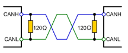

# CAN终端电阻

[← 返回 MOC](MOC.md) | [← 主页](../../index.md)|[←CAN基础](CAN基础.md)

---

### 🔴什么是终端电阻

就是加载收发方终端的电阻

### 🔴为什么通常是两端120Ω

**CAN** 总线终端电阻的作用有3个：

#### 1、提高抗干扰能力，让高频低能量的信号迅速走掉

CAN总线有“显性”和“隐性”两种状态，“显性”代表“0”，“隐性”代表“1”

当两个线没有电压差的时候,就是1的意思,所以这时候需要一个很小的电阻来短路把两端的电压拉到相同

此时两根线都是悬空的状态,如果没有终端电阻,那么扰动会轻松产生电压差,特别是在电车领域里

#### 2、确保总线快速进入隐性状态，让寄生电容的能量更快走掉

显性时,总线的寄生电容会充电,那么到隐形时,压摆率就会小,这时候也需要一个短路把两端的电压平衡

但是从隐形到显性时,如果阻值过小那么压摆率也会小,这时候又不要短路了

#### 3、提高信号质量，放置在总线的两端，让反射能量降低

信号在较高的转换速率情况下，信号边沿能量遇到阻抗不匹配时，会产生信号反射；传输线缆横截面的几何结构发生变化，线缆的特征阻抗会随之变化，也会造成反射。

能量发生反射时，导致反射的波形与原来的波形进行叠加，就会产生振铃。

查看[特征阻抗知识](../../术中自有万钟粟/PCB电路/特征阻抗.md)

采用两根汽车使用的典型线缆，将它们扭制成双绞线，就可根据上述方法得到特征阻抗大约为120Ω，这也是CAN标准推荐的终端电阻阻值，所以这个120Ω是测出来的，不是算出来的，都是根据实际的线束特性进行计算得到的。当然在ISO 11898-2这个标准里面也是有定义的。
