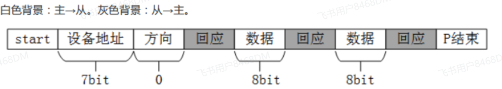
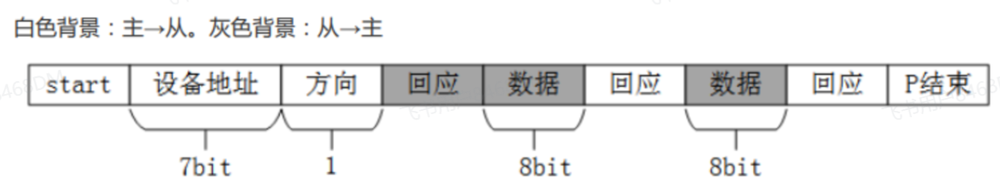

# IIC 知识

[← IIC 模块总览](../MOC.md) | [← 主页](../../../index.md)

> I2C（IIC）学习笔记：协议、时序、地址、上拉电阻。

## 协议要点

I2C 是**同步**总线，两条线：SDA（数据）、SCL（时钟），都是**开漏输出 + 上拉电阻(100K 常用 4.7K，400K 常用 2.2K~4.7K)**，靠线与实现多从机。

- **半双工**：同一时刻只能收或发；
- **多从机寻址**：主机发起，靠 7 位地址选从机；
- **速率**：标准 100Kbps、快速 400Kbps、高速 3.4Mbps。

## 时序

- **起始 S**：SCL 高电平时，SDA 由高到低；
- **停止 P**：SCL 高电平时，SDA 由低到高；
- **应答 ACK/NACK**：每发一个字节后第 9 个时钟，接收方拉低 SDA 表示收到（ACK），拉高表示没收到（NACK）；
- 数据在 SCL 高电平期间必须稳定，只在 SCL 低电平期间变化。

1. IIC写操作:
   
2. IIC读操作:

   

## 地址

7 位地址 + 1 位读写位组成一个字节：`地址 << 1 | 读/写`（写 = 0，读 = 1）。部分器件（如 AT24C02）低 3 位由硬件引脚 A2:A0 决定。
