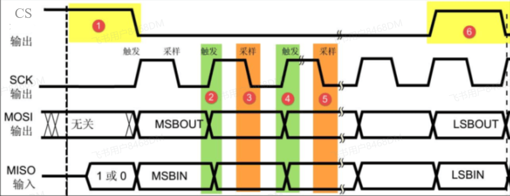

# SPI 知识

[← SPI 模块总览](../MOC.md) | [← 主页](../../../index.md)

> SPI 学习笔记：协议、4 种模式、片选、信号。

## 协议要点

SPI 是**同步**总线，4 条线：SCK、MOSI[**主** （Master） **出** （Out）  **从** （Slave） **入** （In）]、MISO[**主** （Master） **入** （In）  **从** （Slave） **出** （Out）]、CS。

- **全双工**：收发同时进行；
- **速度快**：几十 Mbps；
- **无寻址**：靠 CS 片选区分从机，一个从机一根 CS；
- **主从固定**：时钟由主机产生。

## 4 种模式（CPOL / CPHA）

| 模式 | CPOL        | CPHA | 采样沿     |
| ---- | ----------- | ---- | ---------- |
| 0    | 0（空闲低） | 0    | 上升沿采样 |
| 1    | 0（空闲低） | 1    | 下降沿采样 |
| 2    | 1（空闲高） | 0    | 下降沿采样 |
| 3    | 1（空闲高） | 1    | 上升沿采样 |

CPOL 定空闲时 SCK 电平，CPHA 定第几个边沿采样，主机从机必须一致，否则通信错乱。

## 通信时序:

* CS拉低,从机开始通信,CS拉高,从机停止通信
* SCK上升沿的时候,MOSI和MISO改电平,SCK下降沿的时候MOSI和MISO保持电平,被采样

## 菊花链

SPI本质是一个移位寄存器,需要内部的“并行数据”与外部引脚的“串行传输”之间的转换,且要以极高的硬件效率实现全双工.

* **发送时（并转串 - PISO）** ：CPU 把一个字节（8-bit）并行写入数据寄存器，移位寄存器将其锁存。在时钟（SCK）的驱动下，每来一个时钟沿，最高位（MSB）或最低位（LSB）就被**挤出**到引脚上，8 拍时钟刚好把 8 个 bit 串行推出去。
* **接收时（串转并 - SIPO）** ：引脚上的电平在每个时钟沿被采样，作为 1 个 bit 被**塞入**移位寄存器并向里推移。8 拍时钟过后，凑齐一个完整的字节，硬件再并行通知 CPU 或 DMA 读取。

当主机产生 8 个 SCK 时钟周期时：

* 主机的 bit 顺着 **MOSI** 移入从机；
* 从机的 bit 同时顺着 **MISO** 移入主机；
* **8 个时钟之后，主机和从机完成了一次无缝的“数据互换”** 。
