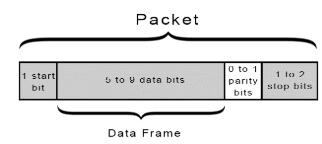
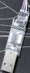

# uart(串口)

[← 返回 MOC](MOC.md) | [← 主页](../../../README.md)

---

## 简介

串口(UART),全称  **Universal Asynchronous Receiver/Transmitter** ，中文叫“ **通用异步收发器** ”

注意，它 **不是像 SPI 或 I2C 那样的通信协议**，而是一块真实存在的电路.

工作:

* 把 MCU 内部的**并行数据**转成**串行形式**发出去；
* 或者把接收到的**串行数据**还原成**并行数据**送进系统。

TX对RX,RX对TX

1起始,5~9数据位,可选1[奇偶校验](../../书中自有黄金屋/计算机网络/奇偶校验码.md),1 ~2停止位,这些串口助手都有

UART引脚--->USB转TTL,要[下载驱动](https://pan.baidu.com/s/1OfEdpC5rkB4MYNhvWFjdkQ?pwd=4444)--->通过串口助手(电脑上就有基础版本的,底下搜串口助手就好,常见好用的[XCOM](https://pan.baidu.com/s/1ZDK04_Jja_ZhFBHBu4F5Cw?pwd=4444),[VOFA](https://pan.baidu.com/s/18cFV1iPln29mzxJqMRTMOw?pwd=4444))

也可以用[逻辑分析仪](../../术中自有万钟粟/逻辑分析仪.MD)之间看波形并且翻译,更可以[示波器](../../术中自有万钟粟/示波器.md)

通过[RS232,RS485,TTL](../../库中车马多如簇/RS485-RS232.md)三种电平发送

---

## 知识要点

UART是**异步**⭐的,就是没有时钟线,一个TX,一个RX,一个GND

**硬件流控（RTS/CTS）** ：接收缓冲区快满时通过CTS让对方暂停发送，防止数据丢失。这两个算可选

| 协议           | 线数           | 速率              | 特点                                       |                                 |
| -------------- | -------------- | ----------------- | ------------------------------------------ | ------------------------------- |
| **UART** | 2线（TX/RX）   | 几百Kbps          | 异步、点对点、全双工、简单                 | 调试串口、蓝牙/GPS模组          |
| **I2C**  | 2线（SDA/SCL） | 100K/400K/3.4Mbps | 同步、半双工、多从机、带寻址               | 传感器、EEPROM、RTC             |
| **SPI**  | 4线            | 几十Mbps          | 同步、全双工、速度快、无寻址               | Flash、LCD、ADC ,屏幕等高速外设 |
| **CAN**  | 2线（差分）    | 1Mbps             | 多主多从、差分抗干扰、带仲裁、汽车工业常用 | 汽车和工业总线                  |

选型原则：**低速简单**用 UART，**多设备低速**用 I2C，**高速短距离**用 SPI，**长距离抗干扰**用 CAN。

### **波特率自适应** 方法：

* 发送方先发特定字符（如 `0x7F`），接收方测量脉冲宽度自动计算波特率
* STM32支持硬件自动波特率检测：利用起始位下降沿到特定边沿的时间推算

### 波特率计算:

波特率 = `时钟频率 / (分频系数 × 过采样倍数)`

以STM32为例：

* USART挂在APB总线上（假设APB时钟=84MHz）
* 过采样16倍：`BRR = APB_CLK / (16 × BaudRate)`
* 如115200波特率：`BRR = 84000000 / (16 × 115200) = 45.57`
* 取整为45，实际波特率 = `84000000 / (16×45) = 116667`
* 误差 = `(116667-115200)/115200 ≈ 1.27%`（在±3%以内，可用）

关键：误差不超过±3%，否则会出现乱码。高波特率时误差更容易超标。

### Linux中UART的子系统,主要做什么?:

**Linux UART 子系统** 在 TTY 框架下工作：

层次结构：**用户空间** → **TTY 核心层** → **Line Discipline** → **UART 驱动**

主要工作：

* 实现 `uart_ops` 回调函数：`startup`、`shutdown`、`set_termios`（配置波特率等）、`start_tx`（启动发送）
* 注册 `uart_port` 到 serial core
* 处理收发中断，数据通过 **TTY 缓冲区**传递给上层

优化手段：

* 使用 **DMA** 做大块数据传输，减少中断次数
* 接收用  **DMA + 空闲中断** ，检测到总线空闲时触发 DMA 完成

用户空间通过 `/dev/ttyS0` 或 `/dev/ttyAMA0` 访问串口。

### UART问题排查:

**误码率**是错误比特数占总比特数的比例。

 **软件排查** ：确认双方波特率完全一致（包括数据位、停止位、校验位）、检查时钟精度（误差>2%可能出错）、检查缓冲区溢出。

 **硬件排查** ：用示波器看波形、检查走线长度和干扰、确认电平匹配（3.3V和5V需转换）、检查共地。

### 保证数据传输准确性的手段：

1. **校验位（Parity）** ：帧中加入奇校验或偶校验位，接收方检测单 bit 错误。但只能检测不能纠正，且只能检测奇数个 bit 翻转
2. **波特率一致** ：双方波特率误差控制在 ±3% 以内，否则采样偏移导致数据错
3. **CRC 校验** ：上层协议对整包数据做 CRC16/CRC32 校验，检错能力远强于 parity
4. **帧头+帧长+校验和** ：设计完善的通信协议包含帧头识别、数据长度、校验和字段
5. **ACK/重传机制** ：接收方收到数据后回 ACK，发送方超时未收到 ACK 则重发
6. **硬件层面** ：注意信号完整性，避免长线传输可以加 **RS-485/RS-422** 差分收发器

### 使用的3种电平的区别:

[RS485,RS232,TTL](../../库中车马多如簇/RS485-RS232.md)

---

## [UART接收程序](UART接收程序.md)

## [UART发送程序](UART发送程序.md)
