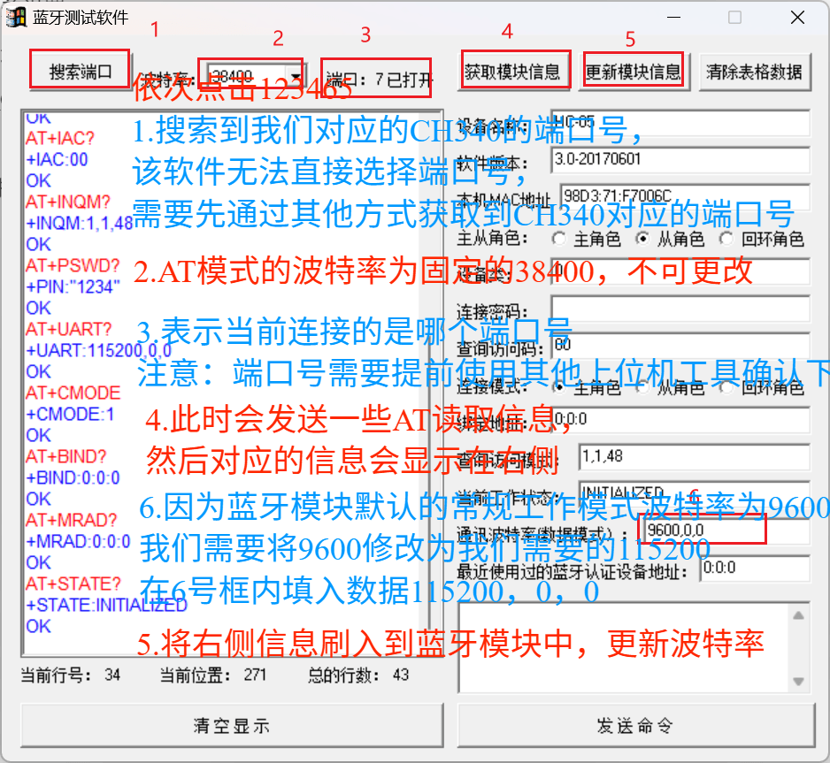

# HC-05

[← 返回 蓝牙目录](../MOC.md) |[← 库目录](../../MOC.md)| [← 主页](../../../index.md)

> [AT指令测试工具下载](https://pan.baidu.com/s/1kb2hclCqq_K5NoWAjkX_mQ?pwd=4444)
>
> 本地已经放置在 `E:\ProgramFile\UART_Serial_Assistant\HC-05蓝牙模块PC调试及指令文件`

---

## 配置板上的HC-05:

使用`蓝牙测试软件.exe`

按住按钮上电,然后按照图中指示操作:

## [配置电脑端蓝牙](https://blog.csdn.net/TENET123/article/details/139554032?ops_request_misc=%257B%2522request%255Fid%2522%253A%2522CE0EE9F9-7607-4639-A969-6CA4732F06F1%2522%252C%2522scm%2522%253A%252220140713.130102334..%2522%257D&request_id=CE0EE9F9-7607-4639-A969-6CA4732F06F1&biz_id=0&utm_medium=distribute.pc_search_result.none-task-blog-2~all~sobaiduend~default-1-139554032-null-null.142^v100^pc_search_result_base7&utm_term=hc-05%E8%93%9D%E7%89%99%E6%A8%A1%E5%9D%97%E8%BF%9E%E6%8E%A5PC&spm=1018.2226.3001.4187)

里面有不同的地方,要先去串口连接,然后右下角弹出一个弹窗,点一下在输入1234然后才能连接
