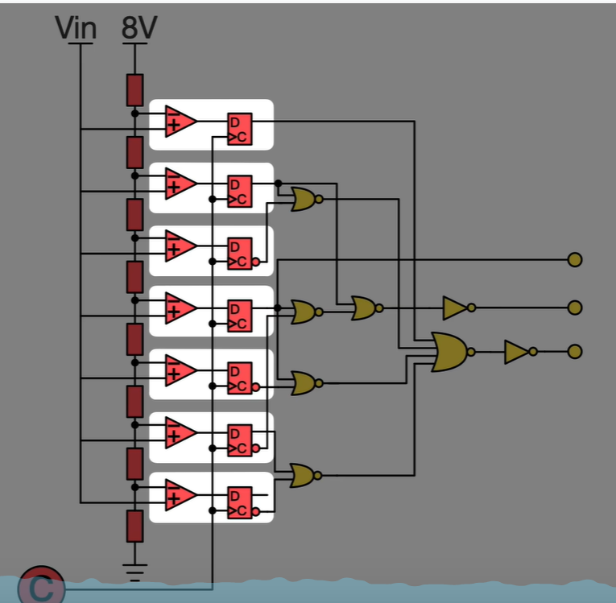

# ADC（模数转换器）

[← 返回 Cortex-M4内核原理](./MOC.md) | [← 主页](../../index.md)

---

## 比较器类型

1. 并联比较型AD

   
2. 计数比较型AD
3. 逐次逼近AD
4. 双积分型AD

## 采集路径

1. 比较器把值存进DR中--
2. 设置EOC标志位为1表示采集完成
3. 如果配置了中断,那么触发中断来读取,但也可能是轮询(就不触发中断)
4. 通过LDR指令搬运数据到cpu寄存器组里			(**产生数据搬移的总线操作**)
5. 通过STR指令将CPU寄存器里的值再写入SRAM里(**产生数据搬移的总线操作**)
