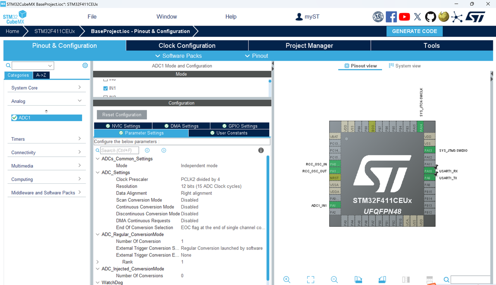

# ADC（模数转换器）

[← 返回 Cortex-M4内核原理](./MOC.md) | [← 主页](../../index.md)

---

## 比较器类型

1. 并联比较型AD

   
2. 计数比较型AD
3. 逐次逼近AD
4. 双积分型AD

## 采集路径

1. 比较器把值存进DR中--
2. 设置EOC标志位为1表示采集完成
3. 如果配置了中断,那么触发中断来读取,但也可能是轮询(就不触发中断)
4. 通过LDR指令搬运数据到cpu寄存器组里			(**产生数据搬移的总线操作**)
5. 通过STR指令将CPU寄存器里的值再写入SRAM里(**产生数据搬移的总线操作**)

## ADC配置

- **Scan Conversion Mode 是控制：** ADC 是否按照配置的通道序列，对多个通道进行依次转换。（我们本次就一个通道，所以未开启）

  - 如果是 **Enable**，ADC 将按照在规则通道 (Regular Channels) 中配置的通道序列，依次对多个通道进行转换。每次触发（无论是软件触发还是硬件触发），ADC 都会按照顺序对所有配置的通道进行一次完整的转换序列。适用于需要同时采集多个模拟信号的情况，例如多传感器数据采集、数据监测等。
    - **如果同时启用了 Continuous Conversion Mode (连续转换模式)**，ADC 会在完成一次完整的通道序列转换后，立即开始下一次序列的转换，形成一个连续的循环。如果没有启用 Continuous Conversion Mode (连续转换模式)，ADC 在完成一次通道序列转换后停止，等待下一个触发事件。
    - **如果同时启用了 Discontinuous Conversion Mode (非连续转换模式)**，会将通道序列分成若干组，每次触发事件只转换一组通道。
  - 如果是 **Disable**，ADC 仅对配置的一个通道进行转换，没有通道序列的概念。每次触发只转换一个通道，简单高效。适用于只需要采集一个模拟信号的简单应用，例如单一传感器的读取。
- **Continuous Conversion Mode (连续转换模式) 是控制：** 是否持续的对某一个通道不停地转换，你会在 DR 里面一直看到数据更新，EOC 标志位一直会产生。于是你可以通过轮询或者中断的方式一直来取 ADC 的数据。
- **Discontinuous Conversion Mode (非连续转换模式) 是控制：** 是否 ADC 将进入 非连续转换模式 (Discontinuous Conversion Mode)。

  - 在非连续转换模式下 (Enable)，ADC 会将配置的通道序列分成若干小组，每个小组的大小由 Discontinuous Number (非连续数目) 参数确定，范围是 1 到 8。（应确保 Scan Conversion Mode 也是 Enable 的）
  - **ADC 会在每个触发事件（比如软件或硬件触发）下，仅转换一个小组的通道，然后停止，等待下一个触发事件。** 每次非连续转换都需要新的触发事件。这种模式适用于需要在多个触发事件下分批次采样的情况。
    - 例如，在实时控制系统中，可能希望在每个控制周期内只采样部分通道（而不是 全部通道），以减少 CPU 负担。比如说，如果你配置了 6 个通道的序列，且将 Discontinuous Number 设置为 2，那么 ADC 会将这 6 个通道分成 3 组，每组 2 个通道。每次触发事件会启动一组（2 个通道）的转换，需要 3 次触发事件才能完成所有通道的转换。
