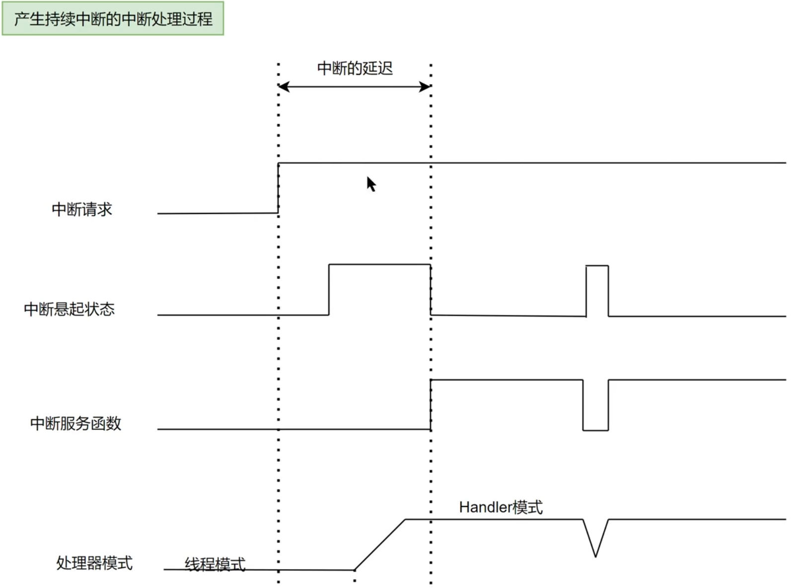

# 中断请求与悬起

[← 中断总览](./MOC.md) | [← 主页](../../../index.md)

---

## 时序图:



## 中断请求与中断悬起

中断就两步：**请求 → 悬起**

```
外设事件 → 中断请求(Request) → 中断悬起(Pending) → CPU 响应
```

| 阶段               | 谁干的事 | 硬件行为                                                                          |
| ------------------ | -------- | --------------------------------------------------------------------------------- |
| **中断请求** | 外设     | 外设内部状态位置 1（如 TIMx_SR 的 UIF、USART_SR 的 RXNE），同时向 NVIC 发请求信号 |
| **中断悬起** | NVIC     | 收到请求信号后，把对应中断号的 Pending 位置 1，排队等 CPU                         |

CPU 响应后 → **Pending 位硬件自动清 0**。但外设那边拉高的状态位**不会自动清**，必须在 ISR 里软件手动清——忘了清就会：退出 ISR → 外设状态位还拉着 → 又产生请求 → Pending 又置 1 → 又进 ISR → 死循环。

---

## NVIC 寄存器

| 寄存器         | 全称                             | 功能                      |
| -------------- | -------------------------------- | ------------------------- |
| **ISER** | Interrupt Set-Enable Register    | 使能中断                  |
| **ICER** | Interrupt Clear-Enable Register  | 禁能中断                  |
| **ISPR** | Interrupt Set-Pending Register   | 软件置 Pending，写 1 有效 |
| **ICPR** | Interrupt Clear-Pending Register | 清除 Pending，写 1 有效   |

### 中断悬起(Pending)  1 的条件

- 外设产生中断请求，且 NVIC 中该中断已使能 → 硬件自动置 Pending
- 软件写 ISPR → 手动置 Pending（即使外设没产生请求）
- 如果中断未使能，外设请求会把 Pending 置 1，但 CPU 不会响应

### 中断悬起(Pending)清0的时机

1. **硬件自动清除**：CPU 进入 ISR 时，硬件自动清除 Pending 位（注意：这是针对 NVIC 侧的 Pending，不是外设标志位）
2. **软件清除**：写 ICPR（写 1 清 0）

> ⚠️ **外设侧标志位需要软件手动清除**——通常在 ISR 中读外设状态寄存器、写对应位清标志。不手动清除会导致 ISR 退出后又立刻重新进入。

---

## 为什么会"丢"中断？

Pending 位只有 **1 个 bit**——能记录"有中断在排队"，但记录不了"排了几个"。丢中断分两种情况：

### 中断悬起期间多次产生中断请求

第一次请求已经将 Pending 置 1，后续请求无法继续记录，只会与第一次请求合并，最终执行一次中断服务函数，其余请求丢失。

- 例如**关中断时间过长**：`__disable_irq()` 或 RTOS 临界区锁住期间，连续多次触发只能记录为 1 次，锁一开只响应一次。
- 例如**高优先级中断"饿死"低优先级**：低优先级中断的 Pending 一直挂着等不到 CPU，期间外设又触发多次，全部合并为一次。

### 中断服务函数执行期间多次产生中断请求

第一次新请求会将 Pending 置 1，后续请求仍无法继续记录。当前中断服务函数退出后只会再执行一次，其余请求丢失。

- 例如 **ISR 执行时间太长**（最常见）：ISR 里用了 `delay()`、复杂浮点计算、`printf` 打印等，还没退出同一个外设又触发了。
- 例如**外设硬件缓冲区溢出（ORE）**：以 UART 为例，CPU 没及时把 DR 寄存器的数据读走，下一个字节就到了，硬件触发 Overrun 直接丢弃新数据。
- 例如**外设状态位清除不当**：清晚了，退出 ISR 时状态位还没完全写清，CPU 误以为又来了一次中断（伪重复触发）；清错了，复合中断中一次性清掉了未处理事件的状态位，对应事件直接被漏掉。

> 📎 异常进入时的自动压栈与返回流程详见 [CPU 通用寄存器组](../cpu通用寄存器组.md)
