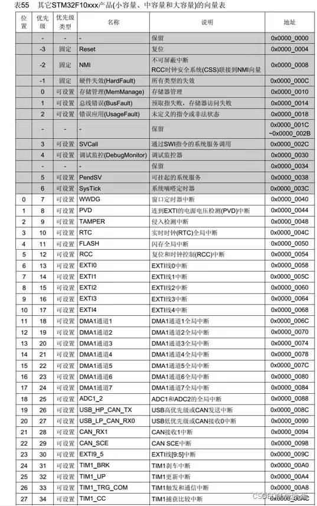
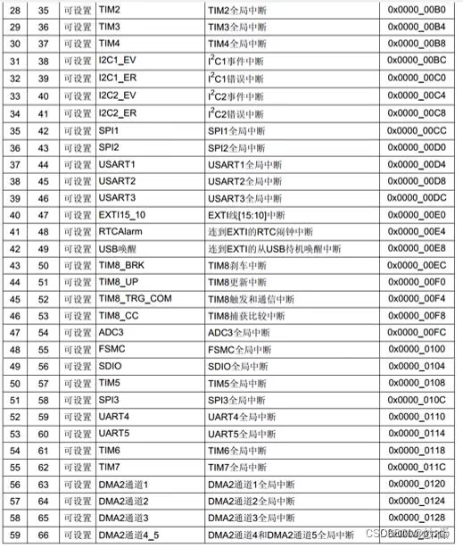

# 中断向量表与优先级

[← 中断总览](./MOC.md) | [← 主页](../../../index.md)

---

## 中断向量表

中断向量表建立了 **中断事件** 与 **中断处理程序入口地址** 的对应关系。

| **优先级** | **名称** | **说明** | **地址**  |
| ---------------- | -------------- | -------------- | --------------- |
| -3               | Reset          | 复位           | `0x0000_0004` |
| ...              | TIMx           | 定时器         | `0x0000_0080` |
| ...              | DMAx           | DMA控制器      | `0x0000_0130` |

---

## 中断优先级

以"蓝色小药丸"（STM32F103）为例，只使用了 **NVIC → IPR** 寄存器的高四位。

- 共有 **$0 \sim 15$** 个优先级。
- **优先级数值越小，优先级越高。**

### 优先级分组

需要设置 **AIRCR** 寄存器的第 8 到 10 位（`PRIGROUP` 字段）。

> **注意**：设置时需要向该寄存器的 **$31 \sim 16$** 位写入密钥 `0x05FA`，否则写入无效。

**分组逻辑**：将上述的 4 位分成两个部分：

1. **抢占优先级 (Preemption Priority)**：高位部分。高优先级可以打断低优先级的中断，实现中断嵌套。
2. **响应优先级 (Sub Priority / 候补优先级)**：低位部分。当两个中断同时到达时，优先处理响应优先级高的，但不具备打断（嵌套）能力。
