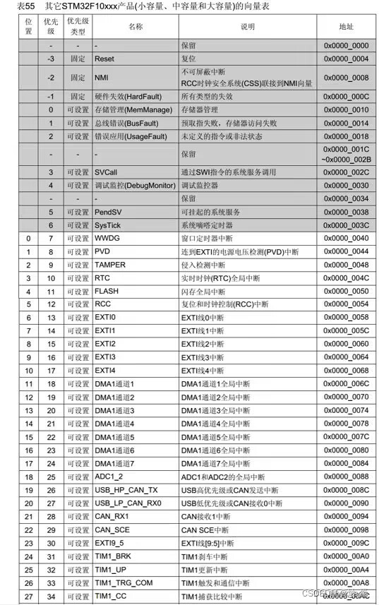
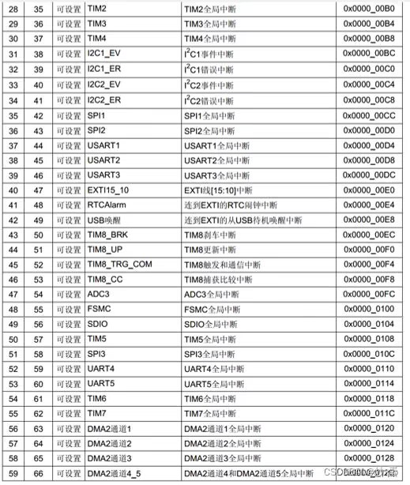

# 中断向量表与优先级

[← 中断总览](https://roboscience.feishu.cn/file/XP4mbqzrSonS7gxnAmScnAHFnPg/MOC.md) | [← 主页](https://roboscience.feishu.cn/index.md)

---

## 中断向量表

中断向量表建立了 **中断事件** 与 **中断处理程序入口地址** 的对应关系。

上电--->SCB_VTOR寄存器里面找到中断向量表的地址

---

## 中断编号

Exception Number 和 CMSIS 的 IRQn_Type 都是 **编号** ，不是优先级。

硬件使用 Exception Number 将内核异常和外设中断放在同一套异常模型中进行仲裁， CMSIS 则使用 IRQn_Type 方便 C 代码区分二者。

| 类型                   | 物理异常号Exception Number | CMSIS 中断号IRQn_Type                    |
| ---------------------- | -------------------------- | ---------------------------------------- |
| 内核系统异常           | 1～15                      | 使用负数表示；Reset 通常不定义对应的IRQn |
| 芯片厂商定义的外设中断 | 16 及以上                  | 从 0 开始递增                            |

| 异常或中断     | Exception Number | IRQn_Type                   |
| -------------- | ---------------- | --------------------------- |
| Reset          | 1                | 通常无Reset_IRQn            |
| NMI            | 2                | NonMaskableInt_IRQn = -14   |
| HardFault      | 3                | HardFault_IRQn = -13        |
| MemManage      | 4                | MemoryManagement_IRQn = -12 |
| BusFault       | 5                | BusFault_IRQn = -11         |
| UsageFault     | 6                | UsageFault_IRQn = -10       |
| SVCall         | 11               | SVCall_IRQn = -5            |
| DebugMonitor   | 12               | DebugMonitor_IRQn = -4      |
| PendSV         | 14               | PendSV_IRQn = -2            |
| SysTick        | 15               | SysTick_IRQn = -1           |
| 第一个外设中断 | 16               | 0                           |

对 CMSIS 已定义的异常或中断，两套编号满足：

$$
\text{Exception Number} = \text{IRQn} + 16
$$

> **不要把负数 ****IRQn**** 当成高优先级。** 例如 NMI 的 IRQn 是 $-14$，但其固定架构优先级是 $-2$；HardFault 的 IRQn 是 $-13$，固定架构优先级是 $-1$。Reset、NMI、HardFault 的固定架构优先级依次为 $-3$、$-2$、$-1$，不能通过 NVIC 配置。

## 优先级设置

| 优先级分组 | 抢占优先级 | 子优先级域 |
| ---------- | ---------- | ---------- |
| 0          | Bit[7:1]   | Bit[0]     |
| 1          | Bit[7:2]   | Bit[1:0]   |
| 2          | Bit[7:3]   | Bit[2:0]   |
| 3          | Bit[7:4]   | Bit[3:0]   |
| 4          | Bit[7:5]   | Bit[4:0]   |
| 5          | Bit[7:6]   | Bit[5:0]   |
| 6          | Bit[7]     | Bit[6:0]   |
| 7          | —         | Bit[7:0]   |

* **优先级分组** ：     由 SCB->AIRCR.PRIGROUP 配置，决定优先级寄存器 8 位字段如何切分；高位是抢占优先级，低位是子优先级域。
* **优先级寄存器** ：系统异常使用 SCB->SHPR1～SHPR3，外设中断使用 NVIC->IPR（CMSIS 映射为 SCB->SHP[] 和 NVIC->IP[]，有很多）。

都在NVIC外设里

* **抢占优先级与子优先级** ：硬件依据 PRIGROUP 解释同一个优先级字段（优先级寄存器）

抢占优先级决定能否打断当前中断；抢占优先级相同时，子优先级决定 Pending 中断的响应顺序，但不能触发嵌套。

CMSIS 通常通过 NVIC_SetPriorityGrouping() 设置 PRIGROUP，再通过 NVIC_SetPriority() 写入 SHPR 或 IPR 对应的优先级字段。
