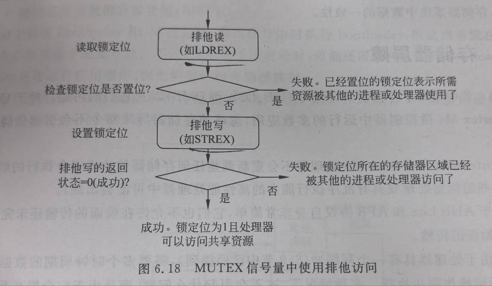

# 排他访问

[← 返回 存储器访问](./MOC.md) | [← 主页](../../../index.md)

---

> 锁定传输：
> 可能已经注意到了，Cortex-M3 和 Cortex-M4 处理器不支持 SWP 指令（交换）。
> 该指令一般用于 ARM7TDMI 等传统 ARM 处理器的信号量操作，目前它已被排他访问操作替代。架构 v6（如 ARM1136）首先支持排他访问。
>
> 信号量常用于给应用分配共享资源。当某个共享资源只能满足一个客户端或应用处理器时，还可将其称为互斥体（MUTEX）。
> 在这种情况下，若某个资源被一个进程占用，它就会被锁定到这个进程，在锁定解除前无法用于其他进程。
> 要创建 MUTEX 信号量，需要将某个存储器地址定义为锁定状态，以表示共享资源是否已被一个进程锁定。
> 当进程或应用要使用资源时，它需要首先检查资源是否已被锁定，若未被使用，则可以设置锁定状态，表示本资源目前已被锁定。
> 对于传统的 ARM 处理器，对锁定状态的访问由 SWP 指令执行，它可以确保读写锁定状态操作的原子性，避免资源被两个进程同时锁定。
>
> 对于新的ARM处理器：
> 读/写访问可由独立的总线执行。
> 这样，由于锁定传输流程中的读写必须要位于同一个总线，因此，SWP指令无法保证存储器访问的原子性，锁定传输也就被排他访问取代了，

排他访问就是一个乐观锁，如果失败了，就报错，程序决定是否重试
