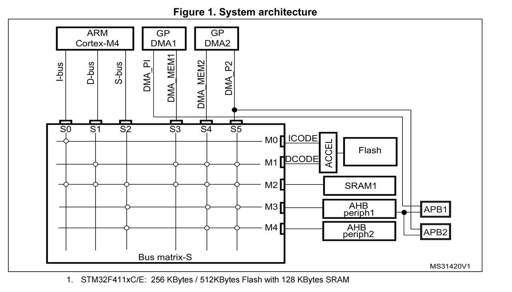
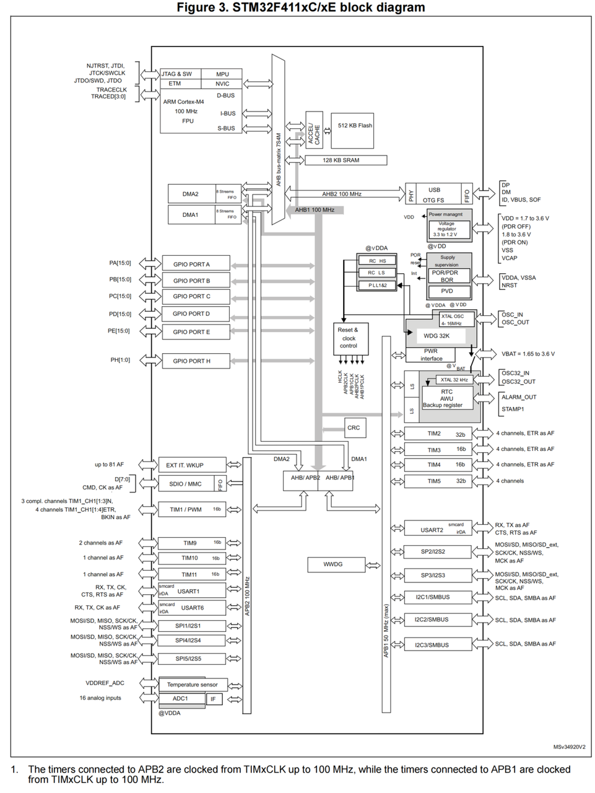

# 总线矩阵

[← 返回 MOC](MOC.md) | [← 主页](../../index.md)

> 以stm32f411ceu6为例

---

**目标:通过走不通的AHB实现高并发**

有关知识:

1. [DMA操作外设GPIO](../嵌软高手/DMA操作外设GPIO.md)、[DMA](./DMA.md)
2. [内存划分](https://app.diagrams.net/#Hevil0knight/Basic_learning_record/main/术中自有万钟粟/Cortex-M4内核原理/arm_mcu内存划分.drawio)
