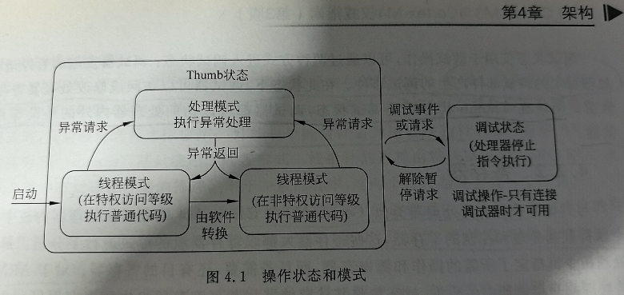
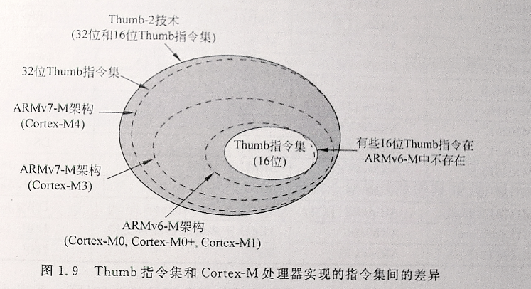

# 操作模式和状态

[← 返回 Cortex-M4内核原理](./MOC.md) | [← 主页](../../index.md)

---

Cortex-M3 和 Cortex-M4 处理器有**两种操作状态**和**两种操作模式**，另外处理器还可以区分**特权级**和**非特权级**访问等级。

---

## 操作状态

| 状态                    | 说明                                                 |
| ----------------------- | ---------------------------------------------------- |
| **debug调试状态** | 处理器被暂停后进入（如调试器断点触发），停止指令执行 |
| **Thumb 状态**    | 处理器执行代码的正常状态（即执行 Thumb 指令）        |

> Cortex-M 处理器**不支持 ARM 指令集**，因此不存在经典 ARM 处理器（如 ARM7TDMI）中的 ARM 状态。

---

## 操作模式

| 模式                               | 说明                              | 访问等级               |
| ---------------------------------- | --------------------------------- | ---------------------- |
| **处理模式**（Handler Mode） | 执行中断服务程序（ISR）等异常处理 | **始终为特权级** |
| **线程模式**（Thread Mode）  | 执行普通应用程序代码              | 可为特权级或非特权级   |

- 线程模式下的实际访问等级由特殊寄存器 **CONTROL** 控制。
- 软件可以将处理器从特权线程模式切换到非特权线程模式，但**无法从非特权切换回特权模式**——必须借助异常机制（触发异常 → 进入处理模式 → 修改 CONTROL → 返回线程模式）才能完成这种切换
- 通过 **MPU**（存储器保护单元）可设置存储器访问权限，防止某个任务破坏 OS 内核、其他任务使用的存储器和外设。
- **NVIC 寄存器均只支持特权访问**（用户态无法直接操作 NVIC）
