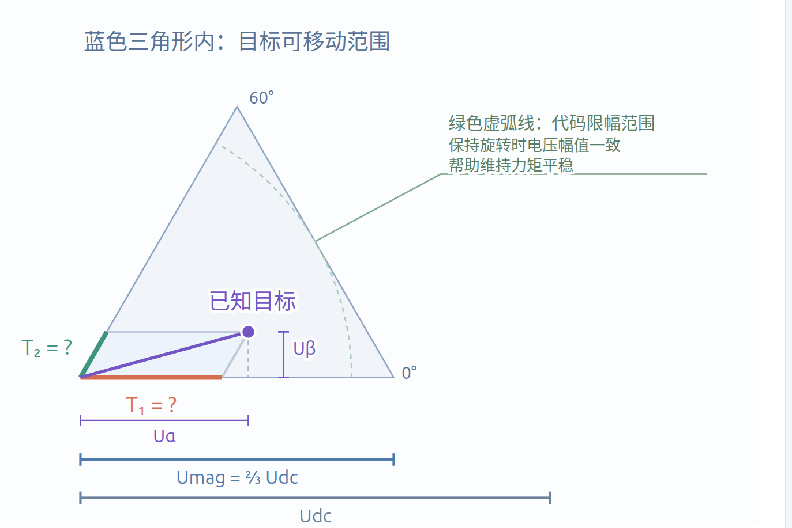
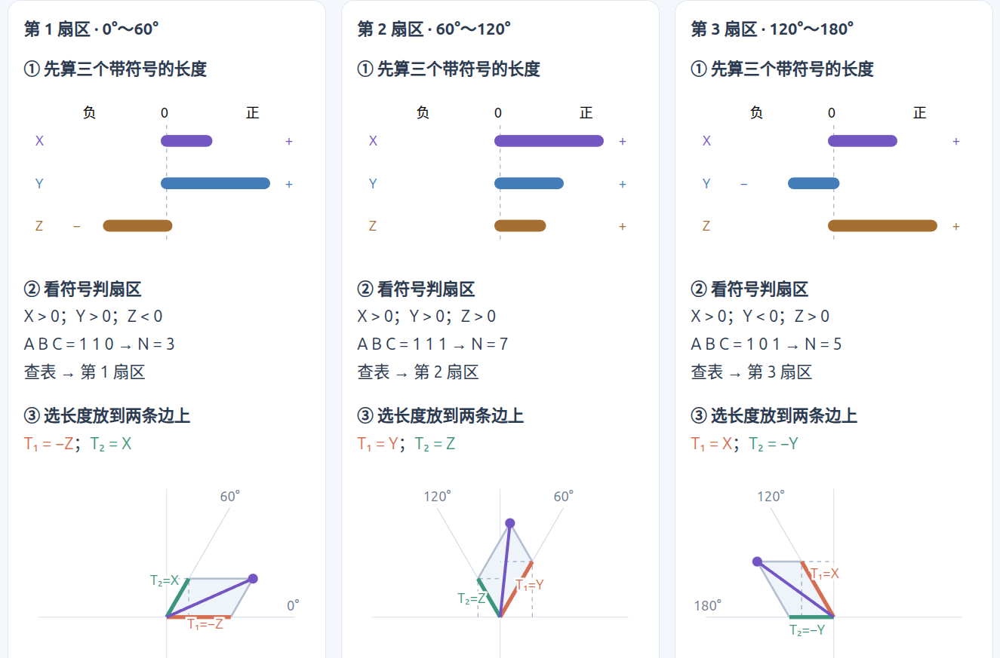
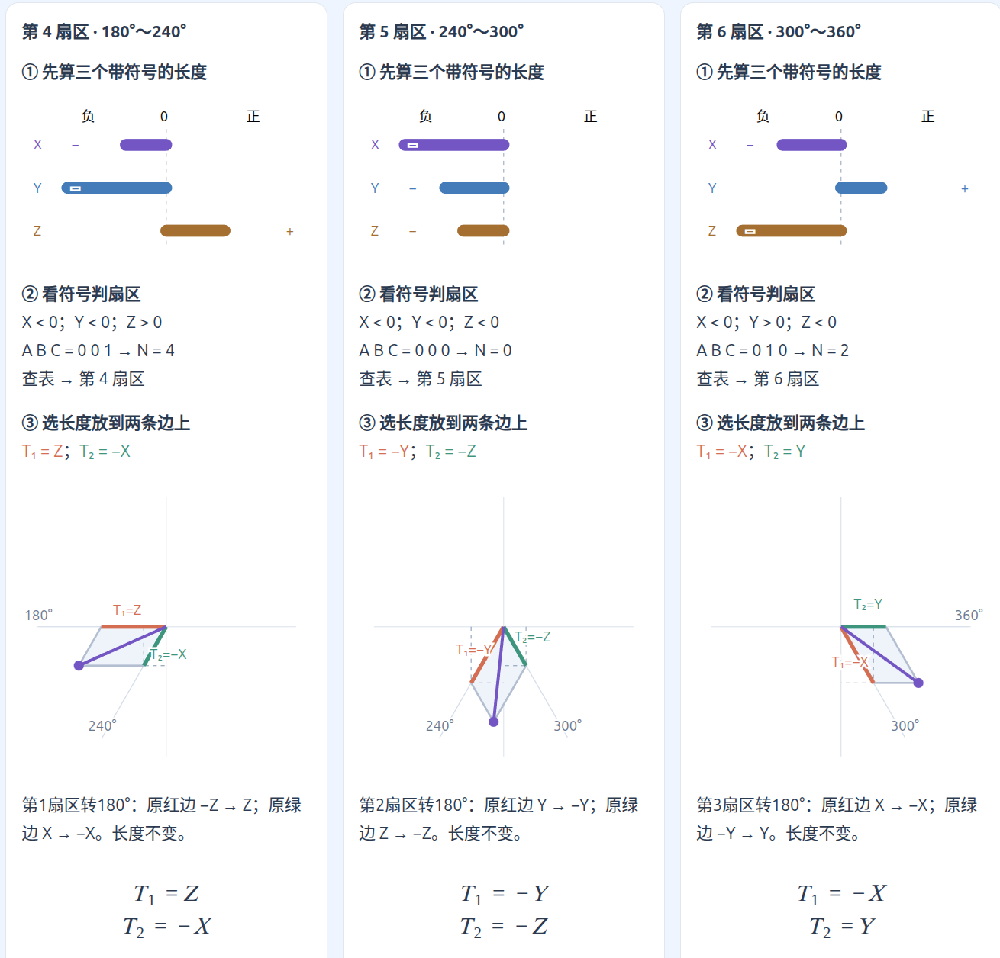
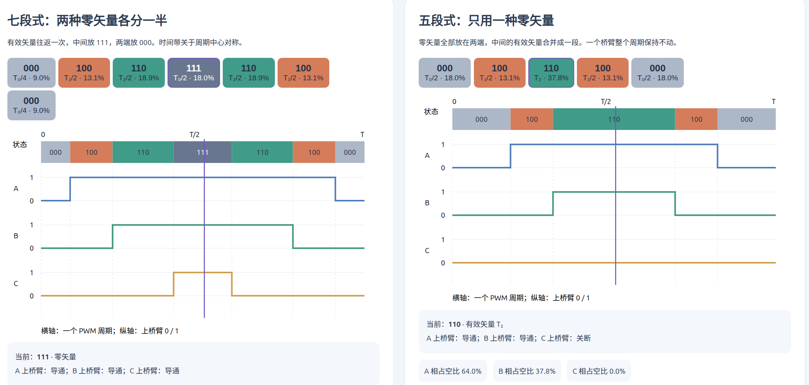
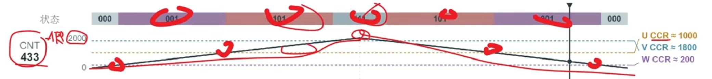

# SVPWM算法

[← 返回 FOC MOC](./MOC.md) | [← 返回主页](../../index.md)

---

## SVPWM算法概述

**输入 (Input)**

* 目标电压矢量 ：FOC 算法算出来的“我们到底想要什么”，即目标电压的大小 $V_{ref}$ 和角度 $\theta$（在代码里通常是经过坐标变换后的 $U_\alpha$ 和 $U_\beta$）。
* 母线电压 ：当前电源或电池的真实物理电压 $V_{bus}$（作为计算输出时间的参考基准）。

**处理 (Process)**

1. **找扇区** ：根据角度 **$\theta$**，判断目标矢量落在了六边形的哪一个切片（1~6 扇区）里，这就锁定了要用哪两个物理有效矢量来组合。
2. **算时间** ：根据电压大小 **$V_{ref}$** 和母线电压的比值，利用简单的三角函数推导，算出这两个有效矢量分别需要开启多长时间（**$T_1$** 和 **$T_2$**），剩下的时间全部用不发力的零矢量（**$T_0$**）填满。
3. **排时序** ：把算好的时间按“中心对齐”规则（七段式发波）分配给 A、B、C 三相。确保每次状态切换时，只有一个桥臂的 MOS 管动作，以把开关损耗降到最低。

**输出 (Output)**

* **3 个具体的 PWM 占空比数值** （对应单片机定时器里的比较寄存器值，如 CCR1、CCR2、CCR3）。
  这 3 个数字将被定时器硬件直接转化为驱动 6 个 MOS 管的真实高频方波电平信号。

## 公式推导（推导出来的结果直接用在代码里)

已知$ U_\alpha  U_\beta$，求$T_1 T_2$:

## 矢量作用时间计算和扇区判断

上面是一个扇区的，以此类推，可以得出一个公式：

$$
\begin{aligned}
X &= K U_\beta \\
Y &= K\left(\frac{\sqrt{3}}{2}U_\alpha + \frac{1}{2}U_\beta\right) \\
Z &= K\left(-\frac{\sqrt{3}}{2}U_\alpha + \frac{1}{2}U_\beta\right)
\end{aligned}
$$

其中，$K = \dfrac{\sqrt{3}T}{U_{\mathrm{dc}}}$，$T$ 为 PWM 周期。$X、Y、Z$ 是时间辅助量，按扇区选取对应的正负组合得到 $T_1、T_2$。

怎么选呢，查表即可：

最终结果就是，把$U_\alpha  U_\beta$带入公式，算出XYZ查表，得出$T_1 T_2$

## 第三步：七段式与五段式调制

7段式输出的电流波形最平滑（马鞍波），电机跑起来极其安静，谐波最小，但是功耗大

5段式逆变器的开关损耗降低1/3,但是会有噪音，也不丝滑

* **$T_{111} = K_0 \cdot T_0$**
* **$T_{000} = (1 - K_0) \cdot T_0$**

**算出基准跳变点：**

$$
T_{cm1} = \frac{(1 - K_0) \cdot T_0}{2}
$$

*(剩下的 **$T_{cm2}$** 和 **$T_{cm3}$** 依然是 **$T_{cm1}$** 加上对应的有效时间 **$T_1/2$** 和 **$T_2/2$**)*

**直接靠参数无缝切换：**

1. **你想用 7 段式？**
   代码里传参 `K0 = 0.5`。算出来的 **$T_{cm1} = T_0 / 4$**，直接变成完美的对称 7 段波。
2. **你想用 5 段式？**
   代码里传参 `K0 = 0`（全用000）或 `K0 = 1`（全用111）。算出来的某一相 CCR 直接贴底变 0，瞬间锁定成 5 段波。

## 第四步:合成磁场

### 定时器如何输出 PWM

| 寄存器                  | 含义             | 图中说明                                  |
| ----------------------- | ---------------- | ----------------------------------------- |
| CNT（计数器）           | 当前数到哪里     | 每个计数时钟加 1 或减 1，曲线表示变化趋势 |
| ARR（自动重装载寄存器） | 计数上限／折返点 | 本例 ARR = 2000，计数时钟为 80 MHz        |
| CCR（捕获／比较寄存器） | PWM 的比较阈值   | U、V、W 各有一个；CNT 到阈值时切换输出    |

中心对齐时，CNT 从 0 数到 ARR，再数回 0。本例 PWM 周期为：

$$
T = \frac{2 \times 2000}{80\ \mathrm{MHz}} = 50\ \mu\mathrm{s}
$$

采用 **PWM mode 2、高电平有效**，占空比为 $D$ 时：

$$
CCR \approx ARR(1-D) = 2000(1-D)
$$

图中的三相比较值：$CCR_U \approx 1000$、$CCR_V \approx 1800$、$CCR_W \approx 200$。比较值取整显示，时间条按理想比例绘制。

### 例如:七段式状态时序

一个 PWM 周期内，开关状态按下面的顺序切换：

$$
000 \rightarrow 001 \rightarrow 101 \rightarrow 111 \rightarrow 101 \rightarrow 001 \rightarrow 000
$$

其中 $001$、$101$ 为该扇区的有效矢量，$000$、$111$ 为零矢量；通过各状态的作用时间，在一个 PWM 周期内合成目标平均电压矢量。

