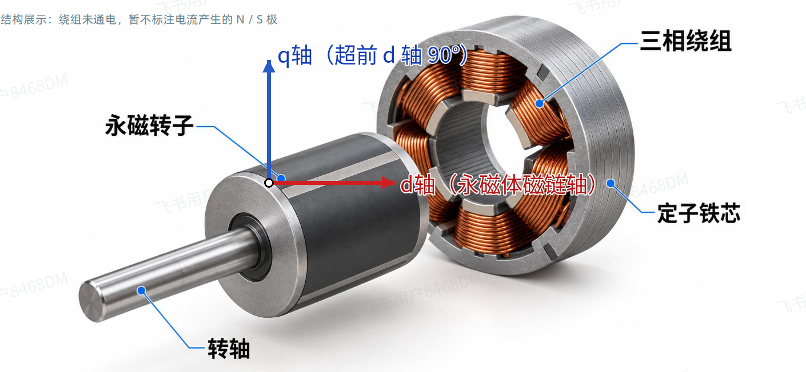
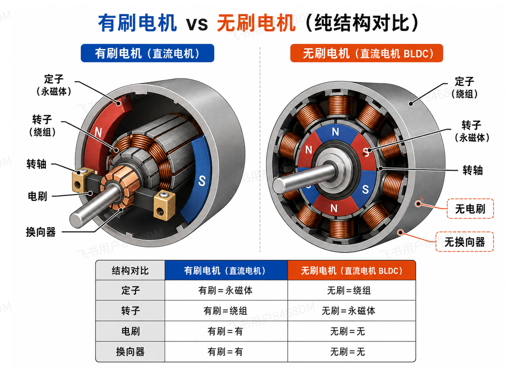
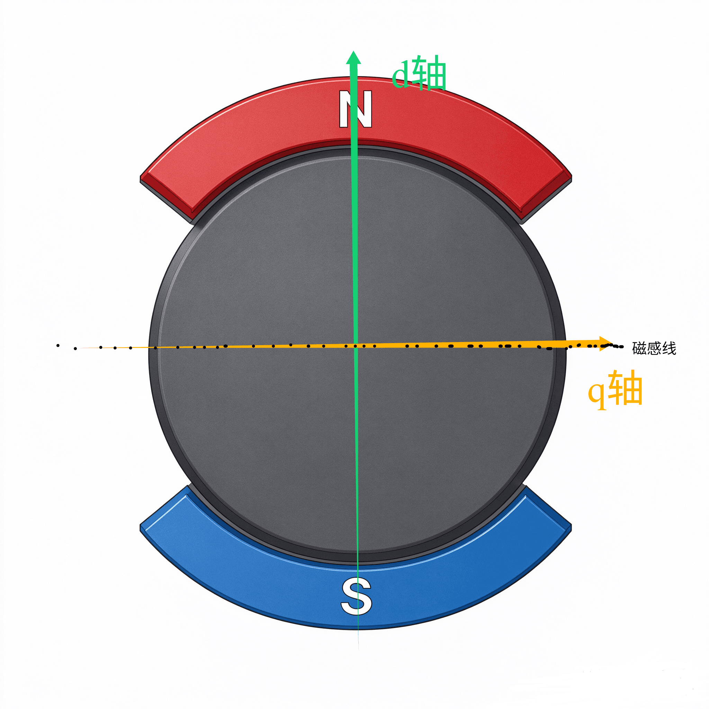
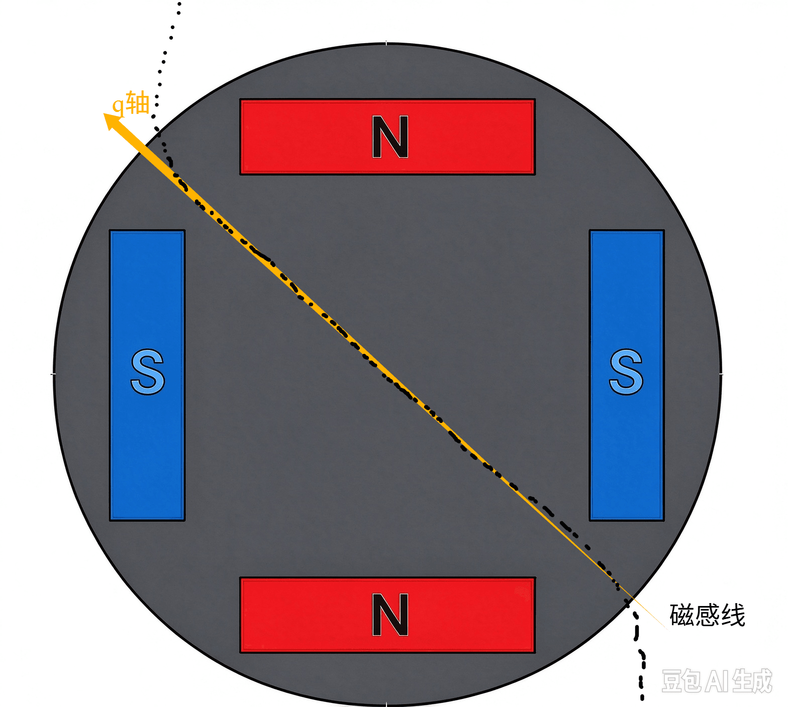
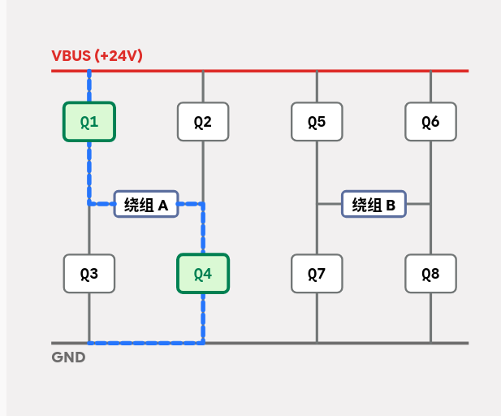
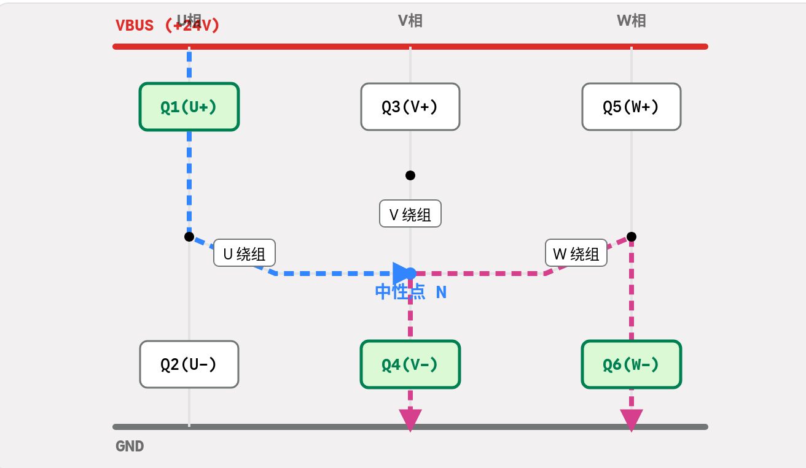

# 电机学基础

[← 返回 FOC MOC](./MOC.md) | [← 返回主页](../../index.md)

---

## 一、电机基本结构与工作原理

电机是一种将 电能 与 机械能 相互转换的电磁装置。在FOC控制中，我们主要关注 永磁同步电机（PMSM） 和 无刷直流电机（BLDC） 。

### 主要组成部分

- 定子 (Stator) ：静止部分，通常嵌有三相绕组。
- 转子 (Rotor) ：旋转部分，通常由永磁体（如钕铁硼）构成。
- 位置传感器 ：如编码器、旋转变压器、霍尔传感器，用于检测转子位置。
- 轴承与机壳 ：提供机械支撑与保护。

### 基本工作原理

基于“同性相斥，异性相吸”的电磁原理。通过向定子绕组通入受控的电流，产生一个 旋转磁场 ，该磁场吸引或排斥转子上的永磁体，从而产生连续的旋转力矩。

## 二、电磁感应与转矩产生

电机转矩的产生是电磁相互作用的结果，核心遵循以下几个基本定律。

### 核心物理定律

### 转矩公式

对于永磁同步电机，电磁转矩的通用表达式为：

$$
T_e = \frac{3}{2} \cdot \frac{P}{2} \left[ \psi_f \, i_q + (L_d - L_q) \, i_d \, i_q \right]
$$

其中：
$T_e$：电磁转矩，单位为 N·m，       $P$：电机极对数，无量纲
$\psi_f$：永磁体磁链，单位为 Wb，   $i_d$、$i_q$：直轴、交轴电流，单位为 A，
$L_d$、$L_q$：直轴、交轴电感，单位为 H

#### 推导：

1. 高中物理课本里，一个面积为 **$S$**、匝数为 **$N$** 的通电线圈，放在磁感应强度为 **$B$** 的匀强磁场中，通入电流 **$I$** 时，它受到的力矩 **$T$** 的公式是：

$$
T = N \cdot B \cdot I \cdot S \cdot \sin\theta
$$

*（注：**$\theta$** 是线圈法线与磁场方向的夹角）*
  2. FOC 通过极其精准地控制三相电流，让定子线圈产生的磁场，永远和转子磁铁保持绝对的 **$90^\circ$** 垂直（最大力矩)

$$
T = N \cdot B \cdot S \cdot I
$$

3. $B \cdot S$ == $\Phi$（磁通量）， **$N \cdot \Phi$**== $\psi$（磁链），因为这是永磁体产生的，所以叫永磁磁链 $\psi_f$。
   电流 $I$ 是什么？ 这个只负责产生垂直推力的电流，在 FOC 坐标系里，就是剥离出来的交轴电流 $i_q$。代入进去：
   $$
   \underbrace{N \cdot B \cdot S}_{\psi_f} \cdot \underbrace{I}_{i_q} \implies T = \psi_f \cdot i_q
   $$
4. **乘上工程放大系数：**
   多加几对磁铁（极对数 **$\frac{P}{2}$**）：电机为了力气更大，转子上贴了好多对磁铁（比如 4 对、7 对）。每多一对磁铁，线圈每转一圈被磁场推的次数就翻倍。所以要乘上极对数 **$\frac{P}{2}$**
   多加两相线圈（三相系数 **$\frac{3}{2}$**）：电机塞满了互差 120 度的三组线圈（三相）。经过数学投影后，三相系统的总出力是单相的 1.5 倍，所以要乘上 **$\frac{3}{2}$**

把这两个工程系数往公式最前面一挂：

$$
T_e = \frac{3}{2} \cdot \frac{P}{2} \cdot \psi_f \cdot i_q
$$

5. 对于表贴式转子,

   $$
   L_d == L_q
   $$

   磁场既不喜欢从磁铁走又不喜欢从空气走,导致磁场都是直线
   所以定子的磁场对转子的力从各个方向是一致的
   公式到

   $$
   T_e = \frac{3}{2} \cdot \frac{P}{2} \cdot \psi_f \cdot i_q
   $$

   就停了
   
6. 但是如果是内嵌式的话,磁场方向就有所不同了,以为铁的磁通率很高,磁场会铁的地方走,这时候如果偏一点角度,磁感线就会像从铁芯走,这时候磁感线就会偏转一定的角度,产生弯折从而产生额外的扭矩:

   

## 三、三相绕组与旋转磁场

三相绕组是产生 圆形旋转磁场 的关键，这是FOC算法能够实现的基础。

那为什么是3相不是2相，按照向量来说，如果两个力互相垂直，也是可以做出来的啊？

这个涉及到成本问题：两相的需要用到4根线，8个MOS

而三相绕组只要

### 1. 三相绕组空间分布

三个绕组（ABC，UVW，RST三种叫法)在空间上互差 $120^\circ$ 电角度。
