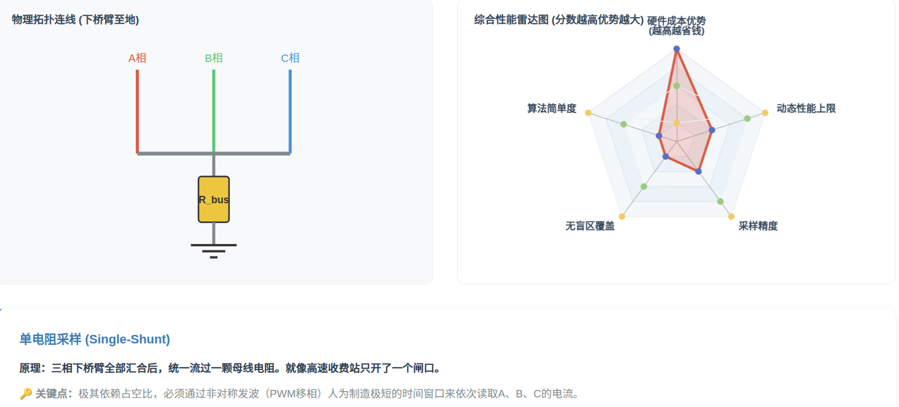
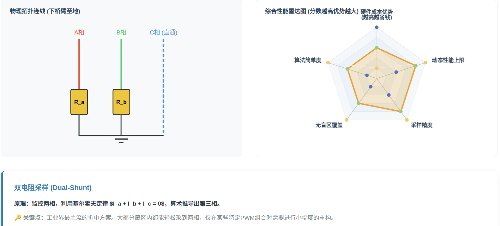
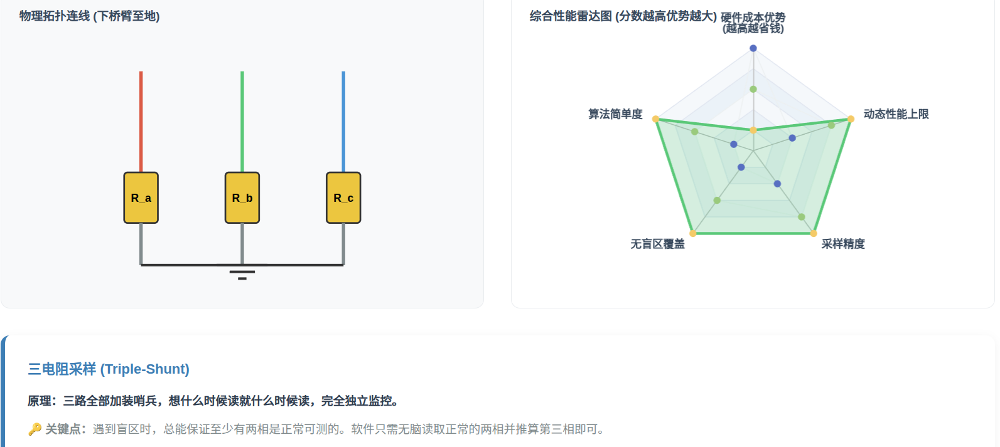

# 电流采样与处理

[← 返回 FOC MOC](./MOC.md) | [← 返回主页](../../index.md)

---

## 一、引言：为什么电流采样至关重要？

在无刷电机磁场定向控制（FOC）中， 精确的相电流信息是矢量控制的基础 。我们需要将测得的相电流（$I_a$, $I_b$, $I_c$）通过 Clarke 和 Park 变换，转换为旋转坐标系下的直轴电流 $I_d$ 和交轴电流 $I_q$。$I_d$ 和 $I_q$ 分别对应电机的励磁分量和转矩分量，是电流环PI控制器的反馈输入。因此， 采样精度、实时性和抗噪声能力 直接决定了整个控制系统的性能、效率与稳定性。硬件上的采样放大可参考 [INA240A1 电流采样放大器](../../库中车马多如簇/硬件原器件/INA240A1电流采样放大器.md)

## 二、相电流采样方法

根据在电路中放置采样电阻的数量和位置，主要分为三种方法。

1. 单电阻采样

优点： 成本最低，仅需一个采样电阻和一套运放电路。
缺点： 采样窗口窄，对PWM时序和ADC触发要求极高；在低占空比时可能无法采样；软件算法复杂。
2. 双电阻采样

优点： 成本适中，采样窗口比单电阻宽，软件复杂度中等，是折中且常用的方案。
缺点： 仍存在部分PWM模式下的采样盲区，需要合理选择采样相。
3. 三电阻采样

优点： 采样精度高，无盲区，对PWM模式没有限制，软件实现相对简单，可靠性最高。
缺点： 成本最高，需要三套采样运放电路，占用更多的ADC通道。

### 三种采样方法对比

| 对比项      | 单电阻采样             | 双电阻采样      | 三电阻采样           |
| ----------- | ---------------------- | --------------- | -------------------- |
| 硬件成本    | 最低                   | 中等            | 最高                 |
| 采样精度    | 较低（易受噪声干扰）   | 中等            | 最高                 |
| 软件复杂度  | 最高（时序苛刻）       | 中等            | 最低                 |
| PWM调制范围 | 受限（低占空比难采样） | 较宽            | 全覆盖               |
| 适用场景    | 成本敏感的中低速应用   | 通用型FOC控制器 | 高性能伺服、精密控制 |

## 三、ADC采样技术要点

ADC 的接口封装、DMA 搬运和采样缓冲处理见 [ADC Port](../../库中车马多如簇/ADC/MOC.md)。
