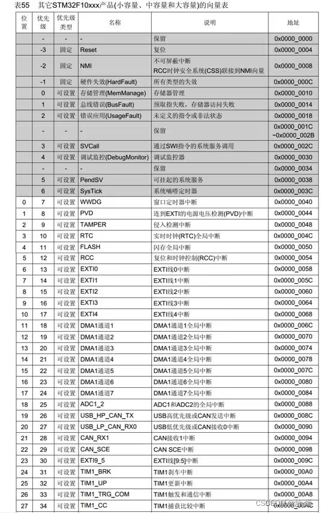
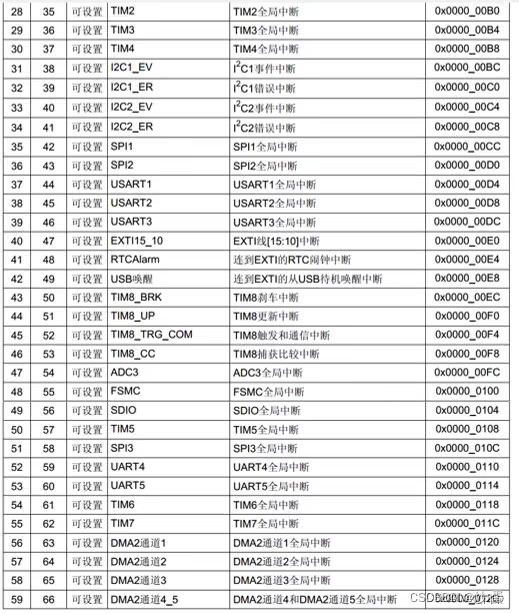

# 中断（以蓝色小药丸/STM32 为例）：

[← 返回 MOC](MOC.md) | [← 主页
](../../index.md)

---

## 1. 内部中断和外部中断

* **内部中断** ：由处理器内部事件触发。例如：定时器溢出、串口接收缓冲区非空等。
* **外部中断** ：由按键等外部事件触发。
* **可屏蔽中断** ：可由程序控制其屏蔽的中断。
* **不可屏蔽中断 (NMI)** ：不能由程序屏蔽的中断，如掉电等。

## 2. 各寄存器与基础概念

### 2.1 中断向量表

中断向量表建立了 **中断事件** 与 **中断处理程序入口地址** 的对应关系。





| **优先级** | **名称** | **说明** | **地址**  |
| ---------------- | -------------- | -------------- | --------------- |
| -3               | Reset          | 复位           | `0x0000_0004` |
| ...              | TIMx           | 定时器         | `0x0000_0080` |
| ...              | DMAx           | DMA控制器      | `0x0000_0130` |

### 2.4 中断优先级

以“蓝色小药丸”（STM32F103）为例，只使用了 **NVIC → IPR** 寄存器的高四位。

* 共有 **$0 \sim 15$** 个优先级。
* **优先级数值越小，优先级越高。**

#### 优先级分组

需要设置 **AIRCR** 寄存器的第 8 到 10 位（`PRIGROUP` 字段）。

> **注意** ：设置时需要向该寄存器的 **$31 \sim 16$** 位写入密钥 `0x05FA`，否则写入无效。

 **分组逻辑** ：将上述的 4 位分成两个部分：

1. **抢占优先级 (Preemption Priority)** ：高位部分。高优先级可以打断低优先级的中断，实现中断嵌套。
2. **响应优先级 (Sub Priority / 候补优先级)** ：低位部分。当两个中断同时到达时，优先处理响应优先级高的，但不具备打断（嵌套）能力。

### 2.5 CMP 比较匹配基础

定时器模块包含一个自由运行的计数器（CNT）和一个或多个比较寄存器（Compare Register，CMP）。当 CNT == CMP 时，硬件触发 **比较匹配事件**，可配置为产生中断。这是定时器中断（PWM、输出比较、输入捕获等）的通用底层机制。

```
计数器值 CNT
     │
     ▼
  ┌──────────────────────────────────────────┐
  │  0 ──────────────── CMP ──────── ARR     │
  │                      ↑                   │
  │               比较匹配，触发中断           │
  └──────────────────────────────────────────┘
```

* **ARR（Auto-Reload Register）**：定时器周期，CNT 到达 ARR 后归零（或反向计数）。
* **CMP / CCR（Capture/Compare Register）**：比较值，CNT 到达此值时触发事件或中断。
* 每个通道通常有独立的 CMP 寄存器，可产生独立的中断。

---

## 3. PWM 比较匹配中断（CMP Interrupt）

## 4. 中心对齐模式下的双 CMP 中断（每通道两个比较点）

在四开关 Buck-Boost 等功率变换器中，PWM 采用**中心对齐（上下计数）模式**，每个通道配置两个比较寄存器：

```cpp
struct PWMDutyVariable
{
    bool     buckBoostMode = false;
    float    dutyA         = 0.0f;
    float    dutyB         = 0.0f;
    uint16_t ACMP1         = 8000;   // 通道A — 上升沿阶段触发
    uint16_t ACMP3         = 8000;   // 通道A — 下降沿阶段触发
    uint16_t BCMP1         = 8000;   // 通道B — 上升沿阶段触发
    uint16_t BCMP3         = 8000;   // 通道B — 下降沿阶段触发
};
```

### 4.1 计数器与双 CMP 的时序关系

* 计数器从 0 上升到 ARR，再下降回 0，构成一个完整 PWM 周期。
* **CMP1**：CNT 上升过程中与比较值相等时触发，对应 PWM 输出的**前半周期事件**。
* **CMP3**：CNT 下降过程中与同一（或不同）比较值相等时触发，对应**后半周期事件**。
* 每周期共触发 **2 次** CMP 中断（上升 + 下降各一次）。

### 4.2 占空比与 CMP 值的关系

设 ARR = 8000（对应 100% 周期），占空比 $d$：

$$
\text{CMP1} = \text{CMP3} = \text{ARR} \times (1 - d)
$$

> 对称模式下 CMP1 == CMP3；非对称模式下两者不同，可产生相移或不对称波形。

### 4.3 双 CMP 中断的典型用途

| 中断点          | 触发时机         | 典型操作                          |
| --------------- | ---------------- | --------------------------------- |
| CMP1（上升沿）  | PWM 高电平开始前 | 更新下一周期占空比、触发 ADC 采样 |
| CMP3（下降沿）  | PWM 高电平结束后 | 读取 ADC 结果、执行控制算法       |
| OVF（ARR 顶点） | 计数器到达峰值   | 同步多路 PWM、周期性保护检测      |

### 4.4 CMP 值更新时机

双 CMP 模式下，**必须在 OVF 或 CMP 中断内更新 CMP 寄存器**，避免在计数器运行中途写入导致毛刺：

```c
// 在 OVF 中断（计数器归零/到顶）时统一更新，保证下一周期生效
void PWM_OVF_IRQHandler(void)
{
    // 根据控制算法计算新占空比
    float dutyA = ControlLoop_GetDutyA();
    float dutyB = ControlLoop_GetDutyB();

    // 对称模式：CMP1 == CMP3
    uint16_t cmpA = (uint16_t)(ARR * (1.0f - dutyA));
    uint16_t cmpB = (uint16_t)(ARR * (1.0f - dutyB));

    PWM_SetCMP(CH_A, CMP1, cmpA);
    PWM_SetCMP(CH_A, CMP3, cmpA);
    PWM_SetCMP(CH_B, CMP1, cmpB);
    PWM_SetCMP(CH_B, CMP3, cmpB);
}
```
