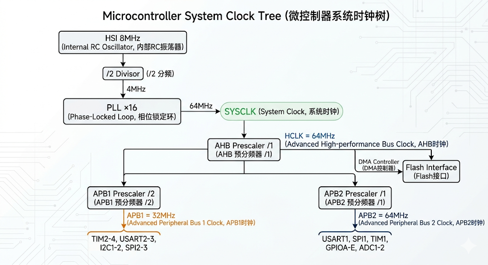

# 时钟：

[← 返回 MOC](MOC.md) | [← 主页](../../index.md)

---

时钟相较于芯片,相当于心脏,每个外设都需要心脏---脉搏来进行一步一步的运行

## 时钟是控制外设的开关

还是以蓝色小药丸举例,如何进行低功耗?就是要把不用的外设关掉,不运行,就是低功耗了,这里就需要时钟去关闭外设,如何关?

**RCC（Reset and Clock Control）管理-->时钟门控（Clock Gating）**

### **RCC**能干什么?

1.管理时钟源,内部晶振还是外部晶振?

2.管理运行频率,8M?32M?

3.管理外设的时钟使能

## 时钟树:

时钟源-->分频器-->倍频器-->选择器-->外设

看一下相关部分的时钟树



### 时钟源HSI:

芯片内部的8MhzRC振荡器,精度不如外部

```
osc.OscillatorType = RCC_OSCILLATORTYPE_HSI;
osc.HSIState = RCC_HSI_ON;
osc.HSICalibrationValue = RCC_HSICALIBRATION_DEFAULT;
```

### 锁相环PLL倍频:

你输入一个频率,他输出一个更高的频率

倍频的过程分两步：先分频，再倍频。HSI的8MHz先经过2分频变成4MHz，然后4MHz经过16倍频变成64MHz。数学上就是：8 / 2 × 16 = 64MHz。

```

osc.PLL.PLLState = RCC_PLL_ON;
osc.PLL.PLLSource = RCC_PLLSOURCE_HSI_DIV2;  // 8MHz / 2 = 4MHz
osc.PLL.PLLMUL = RCC_PLL_MUL16;              // 4MHz × 16 = 64MHz
```

### AHB和APB总线分频:

因为64MHz并不是直接给所有模块用的。它先经过 **AHB（Advanced High-performance Bus）** 分频器得到HCLK，这是CPU本身运行的时钟频率，也是整个总线矩阵的核心时钟。

```
clk.SYSCLKSource = RCC_SYSCLKSOURCE_PLLCLK;   // SYSCLK = PLL输出
clk.AHBCLKDivider = RCC_SYSCLK_DIV1;          // HCLK = SYSCLK / 1 = 64MHz
```

**APB1总线** ：分频系数为2，所以APB1的时钟频率（PCLK1）= HCLK / 2 = 32MHz。

如USART2 ~3,TIM2 ~4,I2C,SPI2 ~3 许多外设的时钟频率是有上限的

**APB2总线** ：分频系数为1，所以APB2的时钟频率（PCLK2）= HCLK / 1 = 64MHz。

如GPIOA-E、USART1、SPI1、TIM1、ADC）可以承受更高的时钟频率

```
clk.APB1CLKDivider = RCC_HCLK_DIV2;   // APB1 = 64MHz / 2 = 32MHz
clk.APB2CLKDivider = RCC_HCLK_DIV1;   // APB2 = 64MHz / 1 = 64MHz
```

## __HAL_RCC_GPIOx_CLK_ENABLE 宏详解

```
__HAL_RCC_GPIOA_CLK_ENABLE();    // 使能GPIOA的时钟
__HAL_RCC_GPIOB_CLK_ENABLE();    // 使能GPIOB的时钟
__HAL_RCC_GPIOC_CLK_ENABLE();    // 使能GPIOC的时钟
__HAL_RCC_GPIOD_CLK_ENABLE();    // 使能GPIOD的时钟
__HAL_RCC_GPIOE_CLK_ENABLE();    // 使能GPIOE的时钟
```

```
#define __HAL_RCC_GPIOC_CLK_ENABLE()    do {
    __IO uint32_t tmpreg;
    RCC->APB2ENR |= RCC_APB2ENR_IOPCEN;
    tmpreg = RCC->APB2ENR;
    (void)tmpreg;
    } while(0)
```

`RCC->APB2ENR |= RCC_APB2ENR_IOPCEN;`是核心操作。

`RCC`是一个指向RCC寄存器结构体的指针，

`APB2ENR`是APB2外设时钟使能寄存器（APB2 Peripheral Clock Enable Register）

`RCC_APB2ENR_IOPCEN`是一个位掩码，代表第4位（bit4），置1就表示使能GPIOC的时钟。`

`tmpreg = RCC->APB2ENR; (void)tmpreg;`这两行看起来很奇怪——读出来赋给一个临时变量然后又不用。这不是Bug，而是刻意为之的延迟操作。ARM Cortex-M3的总线写操作是缓冲的，写入指令执行完毕时，数据可能还没有真正到达寄存器。紧接着读一次同一个寄存器，可以强制等待前一次写操作完成，确保时钟使能真正生效后再继续执行后续代码。这是一个非常重要的细节——如果你在使能时钟之后立刻去操作外设的寄存器，而时钟还没有真正稳定，可能会导致不可预测的行为。

## ⚠️忘开时钟的症状和排查

没开时钟,是不会报错的

原因是对外设的写操作达到了地址,因为没开时钟,所以没人接受,但是从CPU的角度,写操作是完成的

所以要看看有没有 `__HAL_RCC_GPIOX_CLK_ENABLE()`

或者直接调试查看 `RCC_APB2ENR` 寄存器地址`0x40021018`

## C++处理时钟

在理解了时钟使能的原理和忘记它的后果之后，我们来看看项目中的C++模板系统是如何优雅地解决这个问题的。

在我们项目的 `device/gpio/gpio.hpp`文件中，时钟使能被封装在 `GPIO`模板类的 `setup()`方法中。每当用户调用 `setup()`来初始化一个GPIO引脚时，时钟使能会作为第一步自动执行：

```
// 来源: codes_and_assets/stm32f1_tutorials/1_led_control/device/gpio/gpio.hpp
void setup(Mode gpio_mode, PullPush pull_push = PullPush::NoPull, Speed speed = Speed::High) {
    GPIOClock::enable_target_clock();  // 第一步：自动使能对应端口的时钟
    GPIO_InitTypeDef init_types{};
    init_types.Pin = PIN;
    init_types.Mode = static_cast
```

注意看 `setup()`方法的第一行——`GPIOClock::enable_target_clock()`。这个调用隐藏在 `GPIO`类的 `private`区域中，用户完全不需要关心。不管你是初始化GPIOA的Pin5还是GPIOC的Pin13，只要调用了 `setup()`，对应的端口时钟就会被自动使能。

而这个自动选择是怎么实现的呢？答案在 `GPIOClock`这个嵌套类中，它使用了C++17的 `if constexpr`来实现编译期的条件分支：

```
// 来源: codes_and_assets/stm32f1_tutorials/1_led_control/device/gpio/gpio.hpp
class GPIOClock {
  public:
    static inline void enable_target_clock() {
        if constexpr (PORT == GpioPort::A) {
            __HAL_RCC_GPIOA_CLK_ENABLE();
        } else if constexpr (PORT == GpioPort::B) {
            __HAL_RCC_GPIOB_CLK_ENABLE();
        } else if constexpr (PORT == GpioPort::C) {
            __HAL_RCC_GPIOC_CLK_ENABLE();
        } else if constexpr (PORT == GpioPort::D) {
            __HAL_RCC_GPIOD_CLK_ENABLE();
        } else if constexpr (PORT == GpioPort::E) {
            __HAL_RCC_GPIOE_CLK_ENABLE();
        }
    }
};
```

`if constexpr`是C++17引入的编译期条件判断。和普通的 `if`语句不同，`if constexpr`的条件在编译时就被求值，只有条件为 `true`的那个分支会被编译进最终的代码，其他分支会被直接丢弃。因为 `PORT`是模板的非类型参数（`GpioPort`枚举值），它在编译时就确定了，所以编译器可以完全确定应该调用哪个时钟使能宏。

这意味着，当你写下 `GPIO<GpioPort::C, GPIO_PIN_13>`这个模板实例化时，编译器自动生成了只包含 `__HAL_RCC_GPIOC_CLK_ENABLE()`的 `enable_target_clock()`函数——没有运行时的 `if-else`判断开销，没有函数指针，没有任何多余的东西。最终生成的机器码和你手写一行 `__HAL_RCC_GPIOC_CLK_ENABLE()`完全等价。

这就是C++模板元编程的魅力—— **零成本抽象** 。你在源代码层面获得了"不可能忘记开时钟"的安全性（因为 `setup()`自动帮你做了），在编译后的二进制层面又没有任何额外开销。

回到我们的 `main.cpp`：

```
// 来源: codes_and_assets/stm32f1_tutorials/1_led_control/main.cpp
intmain(){
HAL_Init();
clock::ClockConfig::instance().setup_system_clock();
device::LED<device::gpio::GpioPort::C,GPIO_PIN_13>led;
while(1){
HAL_Delay(500);
led.on();
HAL_Delay(500);
led.off();
}
}
```

当你实例化 `device::LED<device::gpio::GpioPort::C, GPIO_PIN_13>`这个对象时，它的构造函数会调用 `GPIO<GpioPort::C, GPIO_PIN_13>::setup()`，而 `setup()`会自动调用 `GPIOClock::enable_target_clock()`，后者在编译期被确定为 `__HAL_RCC_GPIOC_CLK_ENABLE()`。整个链条严丝合缝，用户在 `main.cpp`中不需要写一行与时钟有关的代码。
