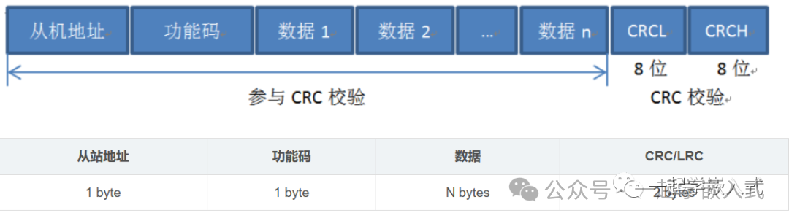
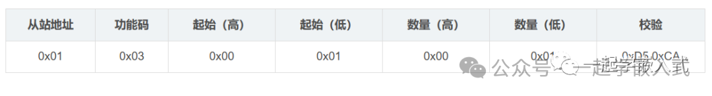
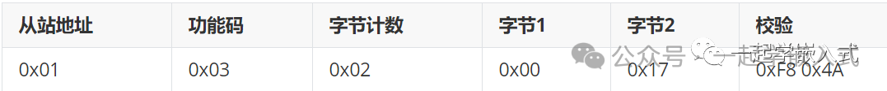
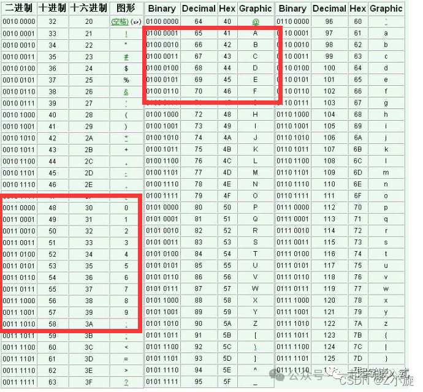
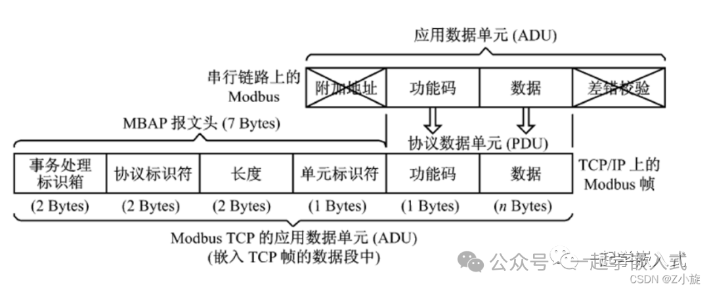

# Modbus

[← 返回 MOC](MOC.md) | [← 主页](../index.md)

> **一句话**：**一种**	应用层的报文传输的	**协议,只是协议**
>
> https://zhuanlan.zhihu.com/p/1923537303634150103

---

1969年PLC出现,为了通信,莫迪康Modicon公司创建了Modbus协议

---

### **Modbus RTU** ：

采用二进制格式，适用于串行通讯（如RS-485），效率高，是工业现场的主流选择,

**依靠时间间隔---3.5个字符时间,来区分一帧数据的开始和结束**

[CRC循环冗余校验(含程序)](../书中自有黄金屋/计算机网络/CRC循环冗余校验.md),发送方和接收方约定一个“除数”。对于 Modbus RTU 来说，这个除数是固定值 `0x8005`

| **字段名称**     | **从站地址** | **功能码** | **起始地址** | **数量** | **CRC 校验(FCS)** |
| ---------------------- | ------------------ | ---------------- | ------------------ | -------------- | ----------------------- |
| **对应值 (Hex)** | `01`             | `03`           | `00 00`          | `00 01`      | `84 0A`               |

主机发送报文格式如下：

从机回复报文格式如下：

### **Modbus ASCII** :

使用ASCII字符，便于调试，但数据冗余较多,数据接收的时候先转换成ASCII然后再判断

**有起始和结束字符,可以打断接收,对同步时序要求较松**

$$
LRC = - \sum_{i=1}^{n} Byte_i \pmod{256}
$$

LRC:前面相加取低八位再转补码

| **字段名称**            | **起始符** | **从站地址** | **功能码**  | **起始地址**    | **数量**        | **LRC 校验** | **结束符**    |
| ----------------------------- | ---------------- | ------------------ | ----------------- | --------------------- | --------------------- | ------------------ | ------------------- |
| **对应字符 (ASCII)**    | **`:`**  | **`0 1`**  | **`0 3`** | **`0 0 0 0`** | **`0 0 0 1`** | **`F B`**  | **`CR LF`** |
| **对应值,物理层 (Hex)** | `3A`           | `30 31`          | `30 33`         | `30 30 30 30`       | `30 30 30 31`       | `46 42`          | `0D 0A`           |

### Modbus TCP (以太网格式)

TCP 版本去掉了从站地址（由 IP 地址和 Unit ID 代替）和校验位（由 TCP 协议自身的校验和保证），并在前面增加了一个  **MBAP 报文头**(事务标识+协议标识+长度+单标识)

| **字段名称**     | **事务标识** | **协议标识** | **长度** | **单元标识** | **功能码** | **起始地址** | **数量** |
| ---------------------- | ------------------ | ------------------ | -------------- | ------------------ | ---------------- | ------------------ | -------------- |
| **对应值 (Hex)** | `00 01`          | `00 00`          | `00 06`      | `01`             | `03`           | `00 00`          | `00 01`      |

---

一主多从

---
