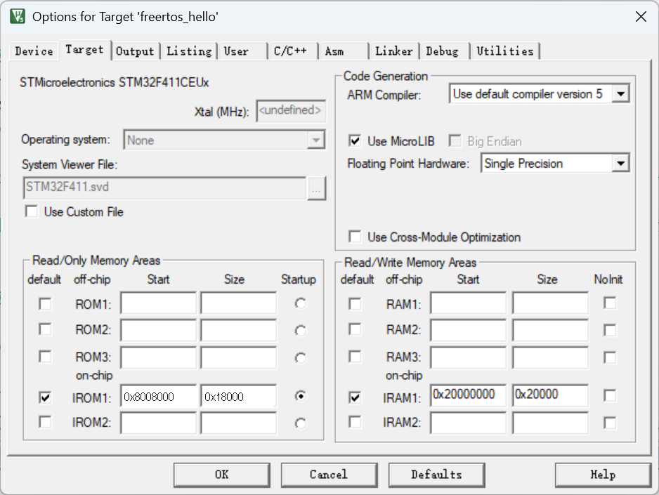

# IAP 实操 + 原理

[← OTA](./MOC.md) | [← 主页](../../index.md)

> 这里是 Bootloader 直接跳转到 APP 的基础实现。

---

## 原理

MCU 上电后先运行 Bootloader。需要启动 APP 时，Bootloader 读取 APP 向量表：第一个字是初始主栈指针 MSP，第二个字是复位入口地址。设置 MSP 后调用复位入口，即可进入 APP。了解一下[上电的流程](https://app.diagrams.net/#Hevil0knight%2FBasic_learning_record%2Fmain%2F%E6%9C%AF%E4%B8%AD%E8%87%AA%E6%9C%89%E4%B8%87%E9%92%9F%E7%B2%9F%2FCortex-M4%E5%86%85%E6%A0%B8%E5%8E%9F%E7%90%86%2Farm_mcu%E5%86%85%E5%AD%98%E5%88%92%E5%88%86.drawio#%7B%22pageId%22%3A%22arm_mcu_memory%22%7D)（右边）。

## 实操

[环境配置](环境配置.md)完成后，在 Bootloader 工程中单独建立跳转管理模块。

### 1. 新建 `Boot_Manager.h`

新建 `Tasks/Boot_Manager/Boot_Manager.h`：

```c
#ifndef __BOOT_MANAGER_H
#define __BOOT_MANAGER_H

/* Bootloader：0x08000000~0x08007FFF，共 32 KiB。 */
#define BOOTLOADER_START_ADDRESS  0x08000000U
#define BOOTLOADER_END_ADDRESS    0x08008000U
#define BOOTLOADER_SIZE           (BOOTLOADER_END_ADDRESS - BOOTLOADER_START_ADDRESS)

/* APP_RUN：0x08008000~0x0801FFFF，共 96 KiB。 */
#define APP_RUN_START_ADDRESS     BOOTLOADER_END_ADDRESS
#define APP_RUN_END_ADDRESS       0x08020000U
#define APP_RUN_SIZE              (APP_RUN_END_ADDRESS - APP_RUN_START_ADDRESS)

void DisablePeripherals(void);
void JumpToApp(void);

#endif
```

`APP_RUN_START_ADDRESS` 是 APP 的链接地址、向量表地址、Flash 擦写地址和 Bootloader 跳转地址，必须保持一致。

### 2. 新建 `Boot_Manager.c`

新建 `Tasks/Boot_Manager/Boot_Manager.c`：

```c
#include "Boot_Manager.h"
#include "main.h"
#include "tim.h"

typedef void (*pFunction)(void);

void DisablePeripherals(void)
{
    /* 关闭 TIM3 及其中断源。 */
    TIM_Cmd(TIM3, DISABLE);
    TIM_ITConfig(TIM3, TIM_IT_Update, DISABLE);
    TIM_ClearITPendingBit(TIM3, TIM_IT_Update);

    NVIC_DisableIRQ(TIM3_IRQn);
    NVIC_ClearPendingIRQ(TIM3_IRQn);

    /* 关闭 SysTick。 */
    SysTick->CTRL = 0U;
    SysTick->LOAD = 0U;
    SysTick->VAL  = 0U;

    TIM_DeInit(TIM3);
    RCC_APB1PeriphClockCmd(RCC_APB1Periph_TIM3, DISABLE);

    /* 恢复默认 HSI 时钟，供 APP 重新配置 PLL。 */
    RCC_DeInit();
}

void JumpToApp(void)
{
    uint32_t jump_address;
    pFunction jump_to_application;

    /* 向量表第一个字是初始 MSP，STM32F411 SRAM 范围为
       0x20000000~0x2001FFFF。 */
    if (((*(__IO uint32_t *)APP_RUN_START_ADDRESS) & 0x2FFE0000U) == 0x20000000U)
    {
        /* 向量表第二个字是 APP 的复位入口地址。 */
        jump_address = *(__IO uint32_t *)(APP_RUN_START_ADDRESS + sizeof(uint32_t));
        jump_to_application = (pFunction)jump_address;

        __set_MSP(*(__IO uint32_t *)APP_RUN_START_ADDRESS);
        jump_to_application();
    }
}
```

如果 Bootloader 还使用了其他定时器、串口或 DMA，也要在 `DisablePeripherals()` 中关闭对应外设和中断。

### 3. 加入 Keil 工程

1. 将 `Boot_Manager.c` 加入 Keil 的 Boot Manager 分组。
2. 在魔法棒的 **C/C++ → Include Paths** 中加入 `Tasks/Boot_Manager`。
3. 在 Bootloader 的 `main.c` 中包含 `Boot_Manager.h`，不再在 `main.c` 中定义 APP 地址和跳转函数。

```c
#include "Boot_Manager.h"

int main(void)
{
    /* Bootloader 原有初始化代码。 */

    DisablePeripherals();
    JumpToApp();

    while (1)
    {
        /* APP 无效时停留在 Bootloader。 */
    }
}
```

### 4. APP 程序配置

Keil 地址配置：

| 工程       | IROM1 Start  | IROM1 Size | 地址范围                    |
| ---------- | ------------ | ---------- | --------------------------- |
| Bootloader | `0x08000000` | `0x8000`   | `0x08000000~0x08007FFF`     |
| APP        | `0x08008000` | `0x18000`  | `0x08008000~0x0801FFFF`     |



APP 包含 `Boot_Manager.h`，并在初始化外设前设置向量表：

```c
#include "Boot_Manager.h"

int main(void)
{
    SCB->VTOR = APP_RUN_START_ADDRESS;
    __enable_irq();

    /* APP 原有初始化代码。 */
```

到这里就可以通过用户 Bootloader 跳转到用户 APP。
