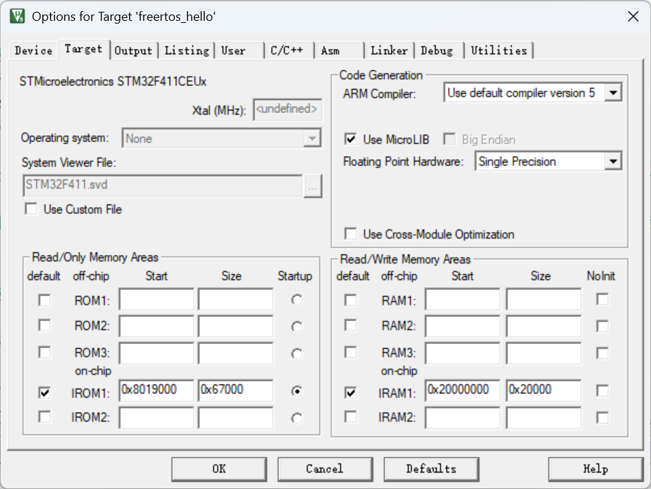

# IAP 实操 + 原理

[← bootloader](./MOC.md) | [← 主页](../../../index.md)

> 这里是直接从bootloader跳转到APP,是bootloader基础

---

## 原理:

在keil里配置程序flash0地址和4地址里的MSP和跳转函数,先跳转到用户bootloader里,然后用户bootloader再跳转到app里,了解一下[上电的流程](https://app.diagrams.net/#Hevil0knight%2FBasic_learning_record%2Fmain%2F%E6%9C%AF%E4%B8%AD%E8%87%AA%E6%9C%89%E4%B8%87%E9%92%9F%E7%B2%9F%2FCortex-M4%E5%86%85%E6%A0%B8%E5%8E%9F%E7%90%86%2Farm_mcu%E5%86%85%E5%AD%98%E5%88%92%E5%88%86.drawio#%7B%22pageId%22%3A%22arm_mcu_memory%22%7D)(右边)

## 实操

[环境配置](环境配置.md)后,

编译优化等级高一点

### bootloader程序配置:

改一下 `main.c`,已经写好注释了,

```
/**
  ******************************************************************************
	WeAct 微行创新 
	>> 标准库实例例程
  ******************************************************************************
  */

/* Includes ------------------------------------------------------------------*/
#include "main.h"
#include "tim.h"
#include "gpio.h"
#include "Debug.h"
#include <SEGGER_RTT.h>
#include "elog.h"

// 全局定义 STM32F411xE 或者 STM32F401xx
// 当前定义 STM32F411xE

// STM32F411 外部晶振25Mhz，考虑到USB使用，内部频率设置为96Mhz
// 需要100mhz,自行修改system_stm32f4xx.c

/** @addtogroup Template_Project
  * @{
  */ 

/* Private typedef -----------------------------------------------------------*/
/* Private define ------------------------------------------------------------*/
/* Private macro -------------------------------------------------------------*/
/* Private variables ---------------------------------------------------------*/
static __IO uint32_t uwTimingDelay;
RCC_ClocksTypeDef RCC_Clocks;

#define APP_FLASH_ADDR 0X8019000U
typedef void (*pFunction)(void);

static pFunction JumpToApplication;
static uint32_t JumpAddress;

/* Private function prototypes -----------------------------------------------*/
  void DisablePeripherals(void)
  {
      /* 关闭 TIM3 */
      TIM_Cmd(TIM3, DISABLE);
      TIM_ITConfig(TIM3, TIM_IT_Update, DISABLE);
      TIM_ClearITPendingBit(TIM3, TIM_IT_Update);

      /* 关闭 TIM3 在 NVIC 中的中断 */
      NVIC_DisableIRQ(TIM3_IRQn);
      NVIC_ClearPendingIRQ(TIM3_IRQn);

      /* 关闭 SysTick */
      SysTick->CTRL = 0U;
      SysTick->LOAD = 0U;
      SysTick->VAL  = 0U;

      /* 恢复 TIM3 外设寄存器 */
      TIM_DeInit(TIM3);

      /* 关闭 TIM3 外设时钟 */
      RCC_APB1PeriphClockCmd(RCC_APB1Periph_TIM3, DISABLE);

      /* 恢复默认 HSI 时钟，供 APP 重新配置 PLL */
      RCC_DeInit();
  }
void JumpToApp(void)
{
        uint16_t i;
        uint32_t jumpAddr,armAddr;
        //读取APP前4个字节数据
        armAddr=*(uint32_t *)APP_FLASH_ADDR;
        for(i=0;i<5000;++i)
        {
                log_i("bootloader running...\r\n");
        }
        /*
         * RAM地址范围是0x200000000~0x2001FFFF
         * 表示应用程序的入口地址在 RAM 的有效范围内（即在 0x20000000 到 0x2001FFFF 之间）
         * APP_FLASH_ADDR前四个字节的内容：表示应用程序的初始栈顶指针（SP）地址
         * __IO的作用是告诉编译器和开发者某个变量或指针是与硬件寄存器或内存映射外设相关的，
         * 确保编译器在处理这些变量时不会进行优化，从而保证每次访问都能读取或写入最新的值。
        */
        if (((*(__IO uint32_t*)APP_FLASH_ADDR) & 0x2FFE0000 ) == 0x20000000)
        {
                // 获取应用程序的入口地址（复位向量）
                jumpAddr = *(__IO uint32_t*) (APP_FLASH_ADDR + 4); //PC指针地址
                // 将函数指针.-应用程序的入口地址
                JumpToApplication=(pFunction)jumpAddr;
                // 设置栈顶指针为应用程序的初始值
                __set_MSP(*(__IO uint32_t*) APP_FLASH_ADDR);
                // 跳转到应用程序，开始执行
                JumpToApplication();
        }
        return;
}
/* Private functions ---------------------------------------------------------*/
 /*
  *power by WeAct Studio
  *The board with `WeAct` Logo && `version number` is our board, quality guarantee. 
  *For more information please visit: https://github.com/WeActTC/MiniF4-STM32F4x1
  *更多信息请访问：https://gitee.com/WeActTC/MiniF4-STM32F4x1
  */
/**
  * @brief  Main program
  * @param  None
  * @retval None
  */
int main(void)
{
	/* Enable Clock Security System(CSS): this will generate an NMI exception
     when HSE clock fails *****************************************************/
  RCC_ClockSecuritySystemCmd(ENABLE);
	SCB->VTOR=0X08000000 | 0X0;
 /*!< At this stage the microcontroller clock setting is already configured, 
       this is done through SystemInit() function which is called from startup
       files before to branch to application main.
       To reconfigure the default setting of SystemInit() function, 
       refer to system_stm32f4xx.c file */

  /* SysTick end of count event each 1ms */
  SystemCoreClockUpdate();
  RCC_GetClocksFreq(&RCC_Clocks);
  SysTick_Config(RCC_Clocks.HCLK_Frequency / 1000);
  

  /* Add your application code here */
  /* Insert 50 ms delay */
  Delay(50);

  GPIO_Config();
  TIM_Config();   
	app_elog_init();

  DisablePeripherals();
  JumpToApp();
  /* Infinite loop */
  while (1)
  {
	log_i("hi");
	Delay(1000);
	}
}

/**
  * @brief  Inserts a delay time.
  * @param  nTime: specifies the delay time length, in milliseconds.
  * @retval None
  */
void Delay(__IO uint32_t nTime)
{ 
  uwTimingDelay = nTime;

  while(uwTimingDelay != 0);
}

/**
  * @brief  Decrements the TimingDelay variable.
  * @param  None
  * @retval None
  */
void TimingDelay_Decrement(void)
{
  if (uwTimingDelay != 0x00)
  { 
    uwTimingDelay--;
  }
}

#ifdef  USE_FULL_ASSERT

/**
  * @brief  Reports the name of the source file and the source line number
  *         where the assert_param error has occurred.
  * @param  file: pointer to the source file name
  * @param  line: assert_param error line source number
  * @retval None
  */
void assert_failed(uint8_t* file, uint32_t line)
{ 
  /* User can add his own implementation to report the file name and line number,
     ex: printf("Wrong parameters value: file %s on line %d\r\n", file, line) */

  /* Infinite loop */
  while (1)
  {
  }
}
#endif

/**
  * @}
  */


/************************ (C) COPYRIGHT STMicroelectronics *****END OF FILE****/

```

### 然后APP程序配置:

```
int main(void)
{
  /* USER CODE BEGIN 1 */
	SCB->VTOR=FLASH_BASE | 0X19000;
	__enable_irq();
  /* USER CODE END 1 */
```



到这里就可以通过用户bootloader跳转到用户APP了
