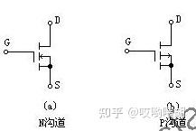

# MOS 管知识

[← 返回 PCB电路](./MOC.md)|←[四开关Buck-Boost仿真器](四开关Buck-Boost仿真器.md)

---

## 一、MOS 管基础



### 结构与分类

MOS 管:**栅极 G**、**漏极 D**、**源极 S**。

| 类型 | 符号特征        | 导通条件                      | 体二极管方向      | 介绍                                 |
| ---- | --------------- | ----------------------------- | ----------------- | ------------------------------------ |
| NMOS | 箭头朝内（向G） | $V_{GS} > V_{th}$（正阈值） | D → S（阳极在S） | 电子导电,速度快,用于高频电路         |
| PMOS | 箭头朝外（离G） | $V_{GS} < V_{th}$（负阈值） | S → D（阳极在D） | 空穴导电,速度慢,常与NMOS组成CMOS电路 |

> 注意这里$V_{GS}  $的意思是栅极源极之间的电压❗

### 工作区间

| 区间           | 条件                                            | 特征                          |
| -------------- | ----------------------------------------------- | ----------------------------- |
| 截止区         | $V_{GS} < V_{th}$                             | 沟道未形成，$I_D \approx 0$ |
| 线性区（导通） | $V_{GS} > V_{th}$，$V_{DS} < V_{GS}-V_{th}$ | 类电阻，$R_{DS(on)}$ 起主导 |
| 饱和区         | $V_{GS} > V_{th}$，$V_{DS} > V_{GS}-V_{th}$ | 电流受$V_{GS}$ 控制，放大用 |

---

### 开关过程中的寄生电容

```
G ──┤├── D
    Cgd（Miller 电容，影响最大）
G ──┤├── S
    Cgs
D ──┤├── S
    Cds
```

- **$C_{gs}$**：栅源电容，充电后 $V_{GS}$ 上升，决定开通延迟
- **$C_{gd}$（Miller 电容）**：栅漏电容，导通过程中出现 Miller 平台，拖慢开关速度
- **$C_{ds}$**：漏源电容，关断时需要放电，影响关断损耗
