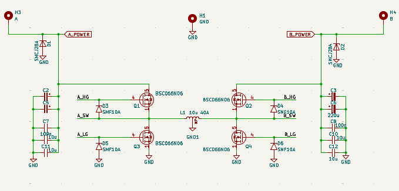
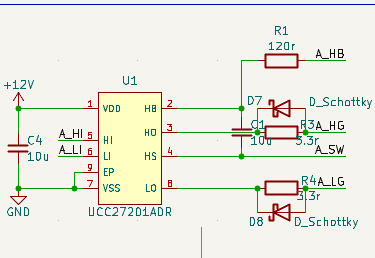
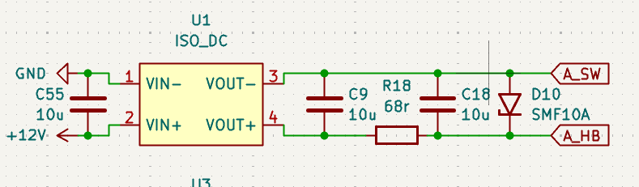

# 四开关双向Buck-Boost

[← 返回 PCB电路 知识地图](./MOC.md)|[←超级电容项目](https://github.com/evil0knight/RM_SUPERCAP_JSU)

## [演示动画](https://gemini.google.com/share/1e10a1f66229),很直观,

## 但请只看第二个对话的那个`🪄 show me the visualization`🥲🥲🥲

### 补充:

你会发现,不管电流方向,PWM无变化,其实是有一点变化的,只不过看不出来

电流方向是怎么决定的?电感电流方向取决于哪侧电压更高，然后就把两端的电压看做是PWM调压就好了,就像用PWM控制LEDY引脚的电压一样

举个例子:电源24V,电容12V的时候,设置占空比是51%就是充电,49%就是放电

最后注意设置一下互补PWM,就这点东西

## 其他的电路设计

主

### 自举电路:

[MOS管知识](MOS.md),先稍微看看,浏览一下

#### A_HG和A_LG上的电阻作用:

因为MOS里是有寄生电感的,过快的电压变化会导致高频振铃和电压尖峰,这会影响信号损坏MOS,所以栅极加电阻是一个行业规律:慢开关

#### 那个二极管:

是因为MOS管漏极和栅极有电容,漏极电压突然增大那么栅极在没有二极管帮助泄流的情况下电压也会增大,然后就导通了,然后上下管一导通直接短路

#### 自举电容:

因为MOS导通是要栅极大于源极的

所以看上管,MOS导通,源极电压为12V,栅极也是,那么直接就关断了

所以这里要用一个电容,电容电压不能突变,源极变成12v,栅极上连着电容直接变成24V了

然后这个芯片还有一个功能就是给这个电容充电(A_HB)

没有这个充电功能,如果电容电压一直高于电池端的时候,那么A侧的上管就会一直导通,那么当电容慢慢漏电内部电压小于12V的时候MOS就会进入电阻区,效率降低且发热

加个隔离电源使电容上的电压一直是12V的
