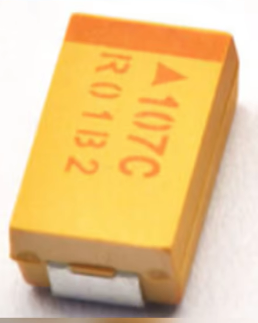
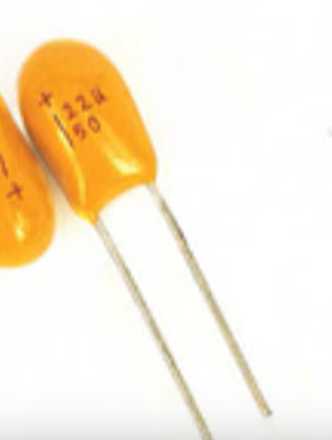

# 钽电容

[← 返回电容索引](../电容.md) | [← 返回 PCB电路 知识地图](../MOC.md)

---

## 特点

钽电容的优点是:电性能优良稳定,体积效率优异,工作温度范围宽,可靠性高,外形多种多样等

它的问题不是不好用，而是比较怕浪涌和过压，所以选型时一定不能贴着额定耐压去用。

过压接反会烧穿PCB,炸的很响

## 选型

- 电压降额要比普通电容更保守，很多场合直接按一半甚至更低去用。
- 上电浪涌大的地方要谨慎，必要时加限流或软启动。
- 极性器件，反接和瞬态过压都比较危险。

## 常见用途

- 体积受限时的局部储能。
- 某些要求参数较稳的电源旁路位置,电源滤波
- 和 MLCC 搭配使用，但一般不拿它直接顶所有场景。
