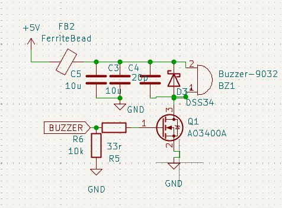

# 蜂鸣器驱动电路

[← 返回 PCB电路](./MOC.md) | [← 主页](../../index.md)

---

## 一、原理图



**核心一句话：蜂鸣器内部是线圈，本质是感性负载；D3 就是它的续流二极管，用来泄放反电动势。**

---

## 二、核心理解：蜂鸣器 ≈ 电感

蜂鸣器（Buzzer-9032 这类电磁式）内部是一个**线圈 + 振动片**，从电路角度看就是一个**带直流电阻的电感**。

电感电流不能突变，所以 Q1 由导通变关断的那一瞬间：

$$V_{spike} = -L\frac{di}{dt}$$

线圈电流被强行切断 → 感应出几十~几百 V 的**反向尖峰**（极性：力图维持原电流方向）→ 直接加在 Q1 的 D-S 之间 → **击穿 MOS**。

D3 的作用就是给这股电流一条出路，把它钳在 $5V + V_F$ 以内。

---

## 三、两种状态下的电流路径

### Q1 导通（蜂鸣器响）

```
+5V ──[FB2]──┬── BZ1(2) ── 线圈 ── BZ1(1) ── Q1(D→S) ── GND
             │
        C5/C3/C4 ── GND
```

电流：`+5V → 蜂鸣器 → Q1 → GND`，方向为流入 pin2、流出 pin1。

此时 D3 **反偏截止**（阳极在 pin1 ≈ 0 V，阴极在 +5V），不参与工作。

### Q1 关断（续流）

```
BZ1(1) ── D3(阳极→阴极) ── +5V ── BZ1(2)
   ↑                                    │
   └──────────  线圈内部  ──────────────┘
```

pin1 电压被顶到 $5V + 0.3V$ 以上 → D3 导通，线圈电流沿 **`线圈 → D3`** 这个两器件小环继续流，慢慢衰减到零。

> **关键点：续流回路只有「蜂鸣器 + D3」两个器件**，不经过 GND，也不经过输入电容 —— 所以 D3 必须紧贴蜂鸣器引脚摆放，环路面积才能最小。详见 [续流路径](./续流路径.md)。

---

## 四、元件清单

| 元件 | 参数 | 作用 |
| ---- | ---- | ---- |
| **BZ1** | Buzzer-9032 | 蜂鸣器，等效为**电感 + 直流电阻** |
| **D3** | DSS34（肖特基） | **续流 / 泄放二极管**，反并联在蜂鸣器两端，阴极朝 +5V |
| **Q1** | AO3400A（NMOS） | **低边开关**，$R_{DS(on)} \approx 28\ m\Omega$，$V_{th} \approx 1.4\ V$，3.3 V 可直驱 |
| **R5** | 33 Ω | 栅极串联电阻，限制栅极充放电电流、抑制振铃、减缓 $dv/dt$ |
| **R6** | 10 kΩ | 栅极下拉，保证 MCU 未初始化 / 复位期间 MOS **默认关断**，防止上电乱响 |
| **FB2** | FerriteBead | 磁珠，阻断蜂鸣器开关脉冲的高频噪声窜到 +5V 主轨（也是 EMI 整改点） |
| **C5 / C3** | 10 µF ×2 | 储能，蜂鸣器是**脉冲大电流**负载，靠它供瞬态，避免把 5V 轨拉塌 |
| **C4** | 20 pF | 高频去耦，抑制开关瞬间的高频振铃 |

---

## 五、设计要点

| 点 | 说明 |
| -- | ---- |
| **为什么用低边 NMOS** | 源极接地，栅极只要相对 GND 有 3.3 V 就能开，**不需要自举 / 电荷泵**；AO3400A 是逻辑电平 MOS，可直接接 MCU 引脚 |
| **为什么用肖特基** | $V_F$ 只有 0.3 V（普通硅管 0.7 V），钳位更低；且**反向恢复快**，PWM 驱动无源蜂鸣器时不会拖尾 |
| **二极管方向别接反** | 阴极必须接 **+5V**（高电位侧），阳极接开关节点。接反 → 蜂鸣器一直响或直接短路 |
| **它是并联在负载两端** | 不是对地钳位。D3 的回路是 `蜂鸣器 → D3`，与 GND 无关 |
| **磁珠 + 电容是一组** | 磁珠单独用会与负载电感谐振，必须配电容；这里 C5/C3 就是那个配对电容 |
| **电压选择** | D3 反压额定 ≥ 供电电压即可，但留余量选 40 V（DSS34）是合理的 |

---

## 六、续流二极管选型

| 类型 | 例子 | 适用 |
| ---- | ---- | ---- |
| 肖特基 | **DSS34**、SS14、1N5819 | ✅ 首选，$V_F$ 低、恢复快 |
| 快恢复 | FR107、ES1D | ✅ 高频 PWM、耐压要求高时 |
| 普通整流 | 1N400x | ⚠️ 恢复慢（µs 级），低频通断尚可，PWM 场合不推荐 |
| TVS | SMAJ5.0A | ✅ 想钳得更紧、允许更高反压时可用，但会拖慢释放 |

---

## 七、常见错误

| 错误 | 后果 |
| ---- | ---- |
| **不给续流二极管** | Q1 被反电动势击穿，是蜂鸣器电路最常见的炸管原因 |
| 用 1N4007 + 高频 PWM | 恢复慢，续流跟不上，波形畸变、发热 |
| 栅极没有下拉电阻 | 上电 / 复位期间 MCU 引脚高阻，MOS 误导通，蜂鸣器乱响 |
| 续流二极管离蜂鸣器很远 | 续流环路面积大 → 寄生电感大 → 尖峰照样高，等于没加 |
| 二极管画成对地 | 续流回路绕经 GND，环路变大，且钳位效果变差 |
| 不区分有源 / 无源蜂鸣器 | 无源蜂鸣器靠 PWM 驱动，开关频率高得多，对续流管和磁珠要求更严 |
