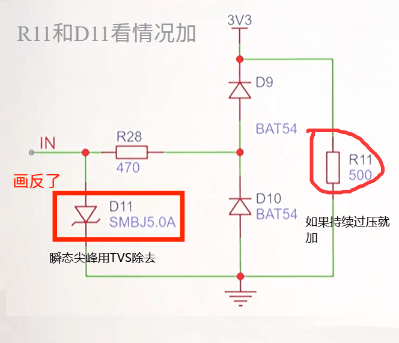
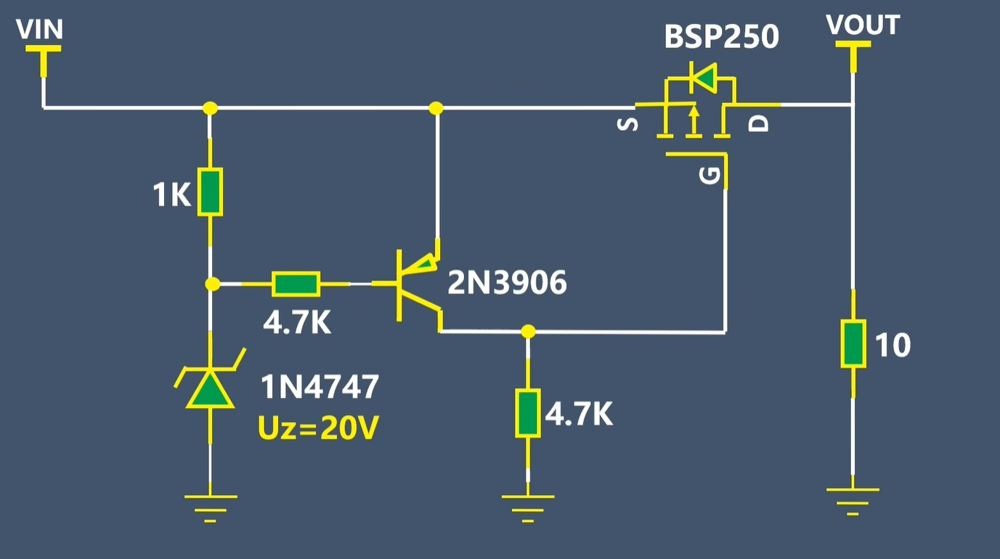

# 过压保护电路

[← 返回 PCB电路](./MOC.md) | [← 主页](../../index.md)

> 分两类：**瞬态**（靠钳位泄放）与**持续**（靠串联开关切断）。

---

## 二、方案一：二极管钳位电路（信号级）

### 参数计算

流过 R28 的电流：

$$
I_{R28} = \frac{V_{IN} - V_{clamp}}{R_{28}}
$$

例：输入 12 V 误接，钳位 3.6 V → $I = (12-3.6)/470 \approx 18\ mA$，R28 功耗 $I^2R \approx 0.15\ W$ → 0603 封装（0.1 W）扛不住，必须用 0805/1206 或加大阻值。

## 局限

- 上钳位把能量灌进 3V3 轨，**电源必须能吸收**（否则换成钳到地的 TVS）
- 只能用于**信号级**，大电流电源线不适用
- 结电容：BAT54 约 10 pF，高速信号（>10 MHz）要选低容钳位管

---

## 三、方案二：串联开关型 OVP（电源级）

### 工作逻辑

| 状态 | 条件                 | 齐纳     | 2N3906 | P-MOS 栅极                             | BSP250         | 输出        |
| ---- | -------------------- | -------- | ------ | -------------------------------------- | -------------- | ----------- |
| 正常 | $V_{IN} < 20.7\ V$ | 截止     | 截止   | 被 4.7K 拉到 GND，$V_{GS} = -V_{IN}$ | **导通** | VIN → VOUT |
| 过压 | $V_{IN} > 20.7\ V$ | 击穿导通 | 导通   | 抬到接近 VIN，$V_{GS} \approx 0$     | **关断** | 切断        |

### 阈值计算

齐纳从 VIN 取电流，经 1K 流入 2N3906 基极，三极管开启需要 $V_{BE} \approx 0.7\ V$：

$$
V_{IN(th)} \approx U_z + V_{BE} + I_B \cdot R_{1K}
$$

代入 $U_z = 20\ V$、$V_{BE} = 0.7\ V$、$I_B$ 很小 → **阈值约 20.7 ~ 21 V**。

想换阈值就换齐纳：1N4746 = 18 V，1N4748 = 22 V。

### 关键设计点

| 点                     | 说明                                                                                              |
| ---------------------- | ------------------------------------------------------------------------------------------------- |
| **P-MOS 耐压**   | $V_{DS}$ 额定值必须**大于最高可能输入**，20 V 阈值至少要选 30 V 以上器件                  |
| **体二极管方向** | P-MOS 体二极管为 D → S（阳极在漏极）。**关断时挡不住 VOUT → VIN 的倒灌**，也不能防反接    |
| **栅极驱动电平** | 栅极最高被抬到 VIN，$V_{GS}$ 不能超过器件 ±20 V 限制，高压场合需加分压或齐纳钳位               |
| **无迟滞**       | 阈值附近会**反复开关（打嗝）**，实用电路要加正反馈做迟滞                                    |
| **损耗**         | P-MOS 串在通路上，$I^2 R_{DS(on)}$ 全落在它身上，大电流要选低 $R_{DS(on)}$ 或用 NMOS + 电荷泵 |
| **关断速度**     | 该电路靠三极管导通抬栅，关断有延迟，µs 级浪涌来不及挡，仍需 TVS 兜底---                          |
