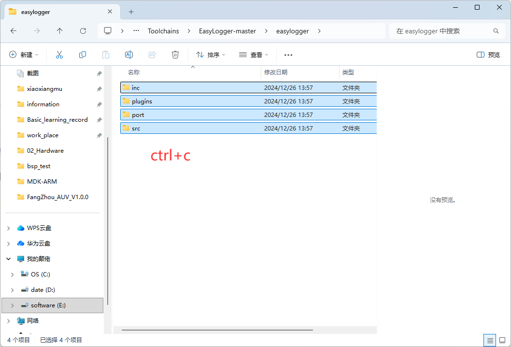
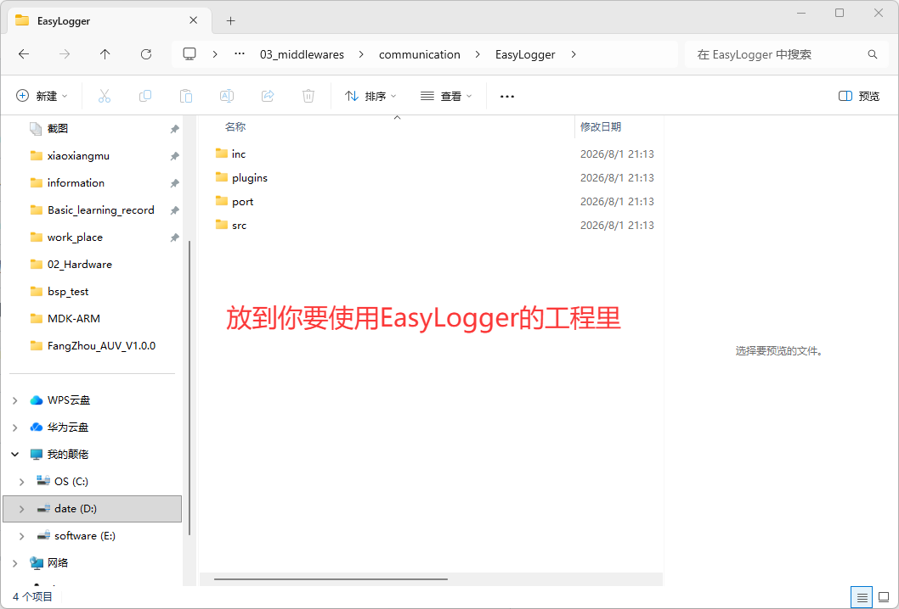

# EasyLogger

[← 返回 配置学习](../配置学习/MOC.md) | [← 返回 debug方法](./MOC.md) | [← 主页](../../index.md)

[←OTA配置](../OTA\环境配置.md)

> [GitHub网址](https://github.com/armink/EasyLogger?tab=readme-ov-file)下载Easylogger源代码

---

## keil配置

1. 我下载到toolchains里了

   
2. keil编译包含:并且包含头文件

## 代码部分:

1. `03_middlewares\communication\EasyLogger\port\elog_port.c`里的 `elog_port_output`函数内部内容添加一下,

   ```
   SEGGER_RTT_Write(0,log,size);
   ```
   如果是printf重定向过的uart:

   ```
   printf("%.*s",size,log);
   ```
2. 这里我对源文件做出了如下修改(toolchains里的已经改好了):关闭 `EasyLogger\inc\elog_cfg.h`里68行异步输出的宏定义,还有79行的缓冲输出,49行"\\r\\n"
3. 如果使用 RTT + EasyLogger，还需关闭 `EasyLogger\inc\elog_cfg.h` 第52行色彩输出的宏定义 `ELOG_COLOR_ENABLE`（RTT 不支持 ANSI 转义序列，开了会崩溃闪退）
4. `EasyLogger\port\elog_port.c` 的90行 `elog_port_get_time`函数:

   ```
   static char time_buf[16];
       uint32_t tick = HAL_GetTick();//注意依托HAL库
       uint32_t ms = tick % 1000U;
       uint32_t sec = (tick / 1000U) % 60U;
       uint32_t min = (tick / 60000U) % 60U;
       uint32_t hour = (tick / 3600000U) % 100U;

       snprintf(time_buf, sizeof(time_buf), "%02lu:%02lu:%02lu.%03lu",
               (unsigned long) hour, (unsigned long) min,
               (unsigned long) sec, (unsigned long) ms);
       return time_buf;
   ```
5. 创建Debug.c把下面的复制进去(Toolchains里我已经创建了可以直接复制)

   ```c
   #include "Debug.h"
   #include "elog.h"
   #include "stdio.h"
   void app_elog_init(void){
       elog_init();
       // elog_set_fmt(level, fmt_flags)
       // level: ELOG_LVL_ASSERT > ERROR > WARN > INFO > DEBUG > VERBOSE
       // fmt_flags 按位或:
       //   ELOG_FMT_TIME  — 时间
       //   ELOG_FMT_LVL   — 日志级别
       //   ELOG_FMT_TAG   — 标签
       //   ELOG_FMT_DIR   — 文件路径
       //   ELOG_FMT_LINE  — 行号
       //   ELOG_FMT_FUNC  — 函数名
       elog_set_fmt(ELOG_LVL_ASSERT, ELOG_FMT_TIME | ELOG_FMT_LVL | ELOG_FMT_TAG | ELOG_FMT_DIR | ELOG_FMT_LINE | ELOG_FMT_FUNC); 
       elog_set_fmt(ELOG_LVL_DEBUG, ELOG_FMT_TIME | ELOG_FMT_LVL | ELOG_FMT_TAG | ELOG_FMT_DIR | ELOG_FMT_LINE | ELOG_FMT_FUNC); 
       elog_set_fmt(ELOG_LVL_ERROR, ELOG_FMT_TIME | ELOG_FMT_LVL | ELOG_FMT_TAG | ELOG_FMT_DIR | ELOG_FMT_LINE | ELOG_FMT_FUNC); 
       elog_set_fmt(ELOG_LVL_WARN,  ELOG_FMT_TIME | ELOG_FMT_LVL | ELOG_FMT_TAG | ELOG_FMT_DIR | ELOG_FMT_LINE | ELOG_FMT_FUNC); 
       elog_set_fmt(ELOG_LVL_INFO,  ELOG_FMT_TIME | ELOG_FMT_LVL | ELOG_FMT_TAG | ELOG_FMT_DIR | ELOG_FMT_LINE | ELOG_FMT_FUNC); 

       elog_start();
   }
   ```
6. 创建 `Debug.h`(Toolchains里我已经创建了可以直接复制)

   ```
   /* Define to prevent recursive inclusion---------*/
   #ifndef __DEBUG_H
   #define __DEBUG_H

   void app_elog_init(void);
   #endif /*DEBUG_H*/
   ```
7. 使用:

   ```c
   /* USER CODE BEGIN 2 */
   app_elog_init();
   /* USER CODE END 2 */

   /* Infinite loop */
   /* USER CODE BEGIN WHILE */
   while (1)
   {
       /* USER CODE END WHILE */
       log_a("Hello EasyLogger!");
       log_e("Hello EasyLogger!");
       log_w("Hello EasyLogger!");
       log_i("Hello EasyLogger!");
       log_d("Hello EasyLogger!");
       log_v("Hello EasyLogger!");
   }
   ```
8.
