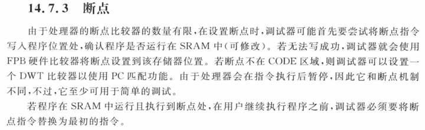
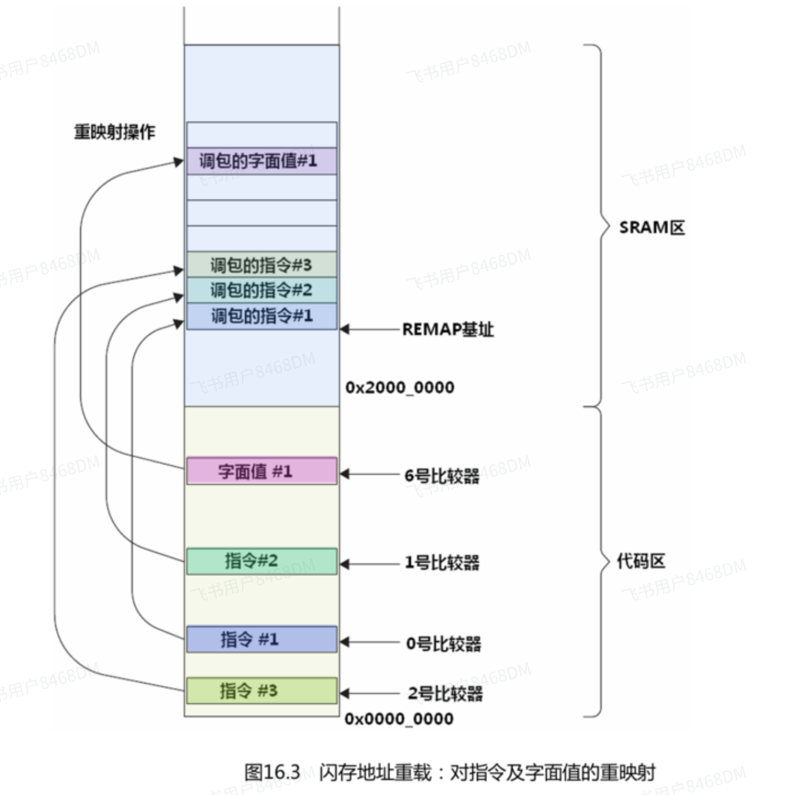
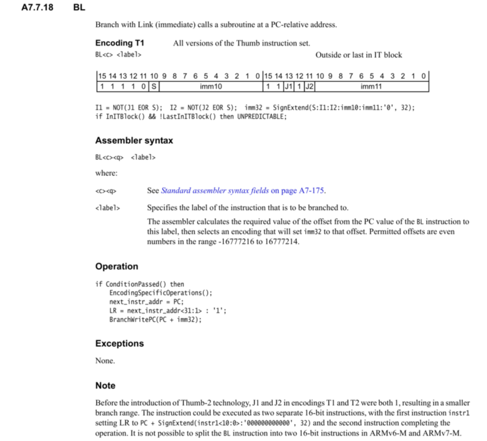

# FPB 单元简介

[← 返回 debug方法](./MOC.md) | [← 主页](../../index.md)

> [立芯链接：指令重映射](https://twd6onxsxva.feishu.cn/docx/MAEAdh6O8oPHoIxVu0qcPh69njS)，[立芯链接：断点](https://twd6onxsxva.feishu.cn/docx/QttOddUuxooenOxrxuhcnqP2nog)

---

FBP（Flash Patch and Breakpoint：Flash 补丁和断点单元）是一个在总线上的外设，实时监控IBUS,DBUS等（监控但是不会消耗CPU指令周期)，

## FPB 断点功能

断点功能理解起来相对简单：在调试期间，可以在程序地址或数据地址处设置一个或多个断点。若执行了断点地址处的程序代码，则会触发断点调试事件并暂停程序执行（暂停模式调试），或触发调试监控异常（若使用调试监控）。之后就能检查寄存器的内容、存储器和外设，并可以利用单步进行调试等。

FPB 主要有两个功能：

- 提供硬件断点特性。提供处理器内核的断点事件，触发暂停模式或调试监控异常等调试模式。
- 通过将 CODE 区域内的存储器访问映射到 SRAM 区域（存储器空间的下一个 0.5 GB），实现对指令或数据的补丁。

《Cortex-M3 与 M4 权威指南》中对断点有如下描述。



程序指令可能运行在 SRAM 中，也可能运行在 Flash 中。设置断点时，调试器会尝试把断点指令（也就是前面介绍的 BKPT 指令）写入程序位置处。若程序在 Flash 中（不可修改），无法成功写入断点指令，则会使用 FPB 单元来设置断点；若程序在 SRAM 中（可修改），可以成功插入断点指令。程序继续运行之前，断点指令将被替换为原始指令。

**步骤一 编写配置函数**

首先给出代码：

```c
void set_breakpoint(uint32_t address)
{
  CoreDebug->DEMCR |= CoreDebug_DEMCR_TRCENA_Msk;  // enable tracing
  CoreDebug->DEMCR |= CoreDebug_DEMCR_MON_EN_Msk;  // enable debug interrupt

  uint8_t res = (FPB->CTRL & FPB_CTRL_NUM_CODE1_Msk) >> FPB_CTRL_NUM_CODE1_Pos;
  assert_param(res);  // the num of comparators

  FPB->CTRL = FPB_CTRL_KEY_Msk | FPB_CTRL_ENABLE_Msk;
  FPB->COMP[0] = (address & 0xFFFFFFFE) | (0x01 << FPB_COMP_REPLACE_Pos) | FPB_COMP_ENABLE_Msk;
}
```

上述函数，用于在address地址处设置硬件断点。

在不连接调试器的情况下，必须使能CoreDebug中的TRACE和DebugMON功能，当断点地址匹配时，将进入DebugMon_Handler中断。

在连接调试器的情况下，进入debug并运行程序，程序将会在断点地址处暂停。

配置FPB_CTRL寄存器用于全局使能比较寄存器，最后配置比较寄存器0。address & 0xFFFFFFFE的原因是，指令地址最低位用于指示该指令是ARM指令还是Thumb指令，因此将其最低位清零。此处使用断点功能，因此将REPLACE位域配置为01，之后使能该比较寄存器。

步骤二 测试函数和中断函数

编写测试函数，当程序运行到该函数时，会触发断点并进入中断，在中断函数中打印信息，程序如下：

```c
void test_function(void)
{
  for (uint8_t i = 0; i < 5; i++) {
    HAL_Delay(1000);
    printf("Running to test_func !!!\r\n");
  }
}

void DebugMon_Handler(void)
{
  uint32_t dfsr = *((volatile uint32_t *)0xE000ED30);

  // 打印 DFSR 内容，用于调试
  printf("DFSR = 0x%08X\n", dfsr);

  // 判断不同的调试异常源
  if (dfsr & (1 << 0)) {
    // DEBUGEVT：表示调试事件触发（例如硬件断点触发）
    printf("Debug Event Triggered (DEBUGEVT)\n");
  } else if (dfsr & (1 << 1)) {
    // VCATCH：表示虚拟中断捕获触发（如硬件断点）
    printf("Virtual Catch Triggered (VCATCH)\n");
  } else if (dfsr & (1 << 2)) {
    // DWTTRAP：数据监视器触发
    printf("Data Watchpoint Triggered (DWTTRAP)\n");
  } else if (dfsr & (1 << 3)) {
    // BKPT：表示软件断点或硬件断点触发
    printf("Breakpoint Triggered (BKPT)\n");
  }

  while (1);
}
```

效果:

```c
set_breakpoint((uint32_t)test_function);
test_function();
```

Q: STM32F411 芯片最多能打多少个硬件断点？为什么 Keil 里我能设置远超 10 个断点？

A：STM32F411 内部包含 FPB单元，支持 最多 6 个代码断点，就是我们平常的 Flash 中的指令断点；DWT模块还支持 最多 4 个数据访问断点，可以用来监控内存读写。

Keil 编译器除了使用芯片自带的硬件断点资源，还会智能切换为 软件断点。软件断点通过在目标地址处插入 BKPT 指令实现，依赖 RAM 可写特性，因此数量几乎无限。Keil 会优先将硬件断点用于 Flash 区，其它位置则使用软件断点。

Q:   硬件断点或 Keil 条件断点是否会占用 CPU 时间来判断触发条件？

A：不会，这些判断完全由 ARM 的 Coresight 调试模块 中的 DWT（Data Watchpoint and Trace）、FPB（Flash Patch and Breakpoint）这些硬件完成，全部由调试模块在硬件层面判断，只有在满足条件时，才会触发异常或进入调试模式。CPU 本身无需执行任何判断代码，不会因此多走一条指令

## FBP指令重映射功能

《Cortex-M3 与 M4 权威指南》中对令重映射功能描述：

```
使用这个重映射功能，可以创建一些“如果...将会...”(what if) 形式的测试——通过把原始指令或字面值取代成另一个来实现。
并且即使是在ROM或flash中运行的代码，也能够参与此种测试。
另一种用法在本质上与这种用法相同，但被取代的是跳转指令，因此行为很像“狸猫换太子”：

对于某个位于flash中的子程序，在SRAM中提供一个冒充它的。
通过闪存地址重载，使得在执行到调用该子程序的指令(BL)时，实际上执行的是被“调包”过的，位于SRAM中的BL，后者则跳转到“狸猫”中。
这种机制使得基于ROM的设备也可以调试（修改过的子程序暂时放到SRAM中）。
```



> 用处：为了降低成本，某些程序可能烧写在单次可编程的ROM中，
> 程序一旦写入便无法更改，若在量产之后发现软件存在bug，更换全部设备需要付出巨大成本，
> 如果使用FPB的重映射功能，便可以使用重映射功能来实现程序补丁，以此来修复bug，并节省成本。

但是跳转过去，需要算出相对位移： [ARM的B,BL跳转指令偏移值计算](https://www.cnblogs.com/from-zero/p/13752017.html "发布于 2020-09-29 21:26")
然后把相对位移放到机器码里：
再把算好的这 4 字节机器码，写到 FPB 的 FP_REMAP 指向的 SRAM 空间里。

跳转回来只需要用PC跳转（注意Thumb 指令集bit0为1）或者直接“*”函数指针跳回来

步骤一 fpb_lib.c文件

首先看一下fpb_redirect_function_call函数的代码：

```c
int fpb_redirect_function_call(uint32_t remap_table_addr,
                               uint32_t instr_addr,
                               uint32_t target_addr,
                               uint8_t reg_index,
                               bool bl_instr)
{
  uint32_t old_instr[2];  // Only used if instruction to replace is half-word aligned.
  uint32_t new_instr;

  if (bl_instr) {
    new_instr = calc_branch_w_link_instr(instr_addr, target_addr);
  } else {  // Branch instruction.
    new_instr = calc_branch_instr(instr_addr, target_addr);
  }

  if (instr_addr % 4 == 0) {  // Instruction is word aligned.
    fpb_comparator_reg_config(reg_index, instr_addr);
    *((uint32_t *)(remap_table_addr + (reg_index * 4))) = little_endian_16_bit(new_instr);
  } else {  // Instruction is half-word aligned.
    old_instr[0] = *((uint32_t *)(instr_addr & 0xFFFFFFFC));
    old_instr[1] = *((uint32_t *)((instr_addr & 0xFFFFFFFC) + 4));

    fpb_comparator_reg_config(reg_index, instr_addr & 0xFFFFFFFC);
    fpb_comparator_reg_config(reg_index + 1, (instr_addr & 0xFFFFFFFC) + 4);

    *((uint32_t *)(remap_table_addr + reg_index * 4)) =
        ((little_endian_16_bit(new_instr) & 0x0000FFFF) << 16) |
        (old_instr[0] & 0x0000FFFF);
    *((uint32_t *)(remap_table_addr + (reg_index + 1) * 4)) =
        (old_instr[1] & 0xFFFF0000) |
        ((little_endian_16_bit(new_instr) & 0xFFFF0000) >> 16);
  }

  return 0;
}
```

这个函数的作用是：根据传入参数，利用remap表格地址、原函数地址、重映射函数地址来计算出BL或者B指令的机器码，写入到remap表格的对应位置。

可以根据reg_index参数，来选择使用那个比较器，例如选择使用4号比较器，那么我们依然可以进debug来调试代码（debug打断点从0号比较器开始用）。

bl_instr参数，用来选择使用BL指令还是B指令，BL指令带返回地址，而B指令不带返回地址，可根据需要选择。

注意：上面代码考虑了指令可能是 16 位 或 32 位 的情况，并能够正确处理对齐和跨字的复杂场景，并且需要注意小端存储。无论instr_addr是字对齐还是半字对齐，代码都能安全地更新重映射表。更多底层细节，需要去查阅内核架构手册的相关部分。

背景知识：ARM 指令的长度

```
16 位指令（Thumb 指令）：   
 - 占用 2 字节。   
 - 可以半字对齐（地址为 0x0、0x2、0x4 等）。
32 位指令（ARM 指令或 Thumb-2 指令）：   
 - 占用 4 字节。  
 - 必须 4 字节对齐（地址为 0x0、0x4、0x8 等）。
```

接着看一下配置FPB寄存器的三个函数，下面是代码：

```c
void fpb_control_enable(void)
{
  FPB->CTRL = 0x03UL;
}

void fpb_remap_reg_config(uint32_t remap_table_addr)
{
  FPB->REMAP = remap_table_addr;
}

void fpb_comparator_reg_config(uint8_t reg_index, uint32_t comp_addr)
{
  FPB->COMP[reg_index] = comp_addr | 0x01UL;
}
```

这个比较简单，FPB寄存器的配置方法在前文中都已经详细介绍过了。

然后是计算BL指令和B指令的函数，代码如下：

```c
uint32_t calc_branch_instr(uint32_t instr_addr, uint32_t target_addr)
{
  uint32_t offset = target_addr - instr_addr;
  uint16_t offset_10_upper = (offset >> 12) & 0x03FF;
  uint16_t offset_11_lower = ((offset - 4) >> 1) & 0x07FF;  // UNCERTAIN about this!

  uint8_t s_pos = 24;
  uint8_t s = (offset - 4) & (1 << s_pos);
  uint8_t i1 = (offset - 4) & (1 << (s_pos - 1));
  uint8_t i2 = (offset - 4) & (1 << (s_pos - 2));

  uint8_t j1 = 0x01 & ((~i1) ^ s);
  uint8_t j2 = 0x01 & ((~i2) ^ s);

  uint16_t upper_bl_instr = (0x1E << 11) | (s << 10) | offset_10_upper;
  uint16_t lower_bl_instr = (0x02 << 14) | (j1 << 13) | (0x01 << 12) |
                            (j2 << 11) | offset_11_lower;

  return (upper_bl_instr << 16) | lower_bl_instr;
}

uint32_t calc_branch_w_link_instr(uint32_t instr_addr, uint32_t target_addr)
{
  uint32_t branch_instr = calc_branch_instr(instr_addr, target_addr);
  return branch_instr | 0x00004000;  // Set bit 14. This is the only difference between B and BL instructions.
}
```

这里的计算方法也已经在前面机器码格式部分介绍过了，根据原函数地址和目标函数地址，计算偏移量（需注意此处偏移量是以half-word为单位的**），然后根据BL指令的机器码格式来计算，然后返回结果。BL指令和B指令只有第14位不同，直接将B指令的第14位写1就可以得到BL指令，前文中也有提到过。**

步骤二 flash_patch.c文件

首先给出代码：

```c
uint32_t remap_table_addr = 0x20010000;
uint32_t instr_addr = (uint32_t)origin_function;
uint32_t target_addr = (uint32_t)patched_function;

int fpb_setup(void)
{
  int error_code = 0;

  fpb_control_enable();
  fpb_remap_reg_config(remap_table_addr);
  error_code = fpb_redirect_function_call(
      remap_table_addr, instr_addr, target_addr, REG_INDEX, false);

  return error_code;
}
```

上述代码，用于初始化配置FPB的重映射功能，remap表格地址被设置为0x20010000，注意这个地址必须位于SRAM中，8 word对齐，且需要预留连续8个word用来存放8个比较器重映射的内容。

instr_addr为原始函数的地址，target_addr为补丁函数的地址。

初始化时直接调用上述fpb_setup函数即可完成配置，然后所有对origin函数的调用将被重映射到patch函数。

四、测试结果

以下分别是测试所用的原函数和补丁函数，主要是打印不同内容，来加以区分：

```c
// This is the original function.
__attribute__((noinline)) void origin_function(void)
{
  while (1) {
    HAL_Delay(5000);
    printf("Original function is running!!!\r\n");
  }
}

// This is the patched function.
__attribute__((used)) void patched_function(void)
{
  while (1) {
    HAL_Delay(5000);
    printf("Patched function is running!!!!!!\r\n");
  }
}
```

对于原函数，因为编译器优化等级的设置，可能会将该函数优化成内联，不一定有调用关系存在，可能会造成重映射失败。因此使用了attribute((noinline))修饰，是为了防止这个函数被内联。

对于补丁函数，由于没有明确调用它，编译器可能会将它移除掉，因此使用attribute((used))修饰，防止被编译器移除掉。

在main函数中，调用初始化函数，然后调用原函数：

```c
fpb_setup();
origin_function();
```

## 相关寄存器

FP_CTRL：    FPB 控制寄存器，用于使能或禁用 FPB，并提供比较器数量等实现信息。

FP_REMAP：FPB 重映射寄存器，用于指定代码或数据被重映射到的 SRAM 地址。

FP_COMPn：FPB 第 n 个比较器寄存器，用于匹配目标地址并配置该比较器执行硬件断点或重映射。
