# Ozone 调试器

[← 返回 配置学习](../配置学习/MOC.md) | [← 返回 debug方法](./MOC.md) | [← 主页](../../index.md)

---

**下载地址：** [https://www.segger.com/downloads/jlink/](https://www.segger.com/downloads/jlink/)

### 配置:

1. 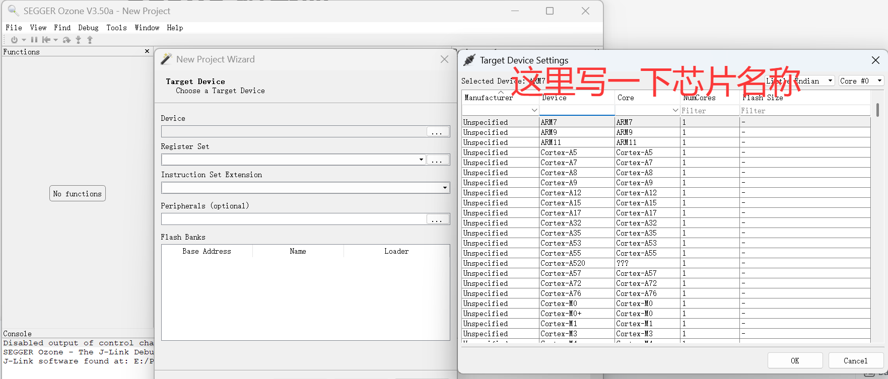
2. 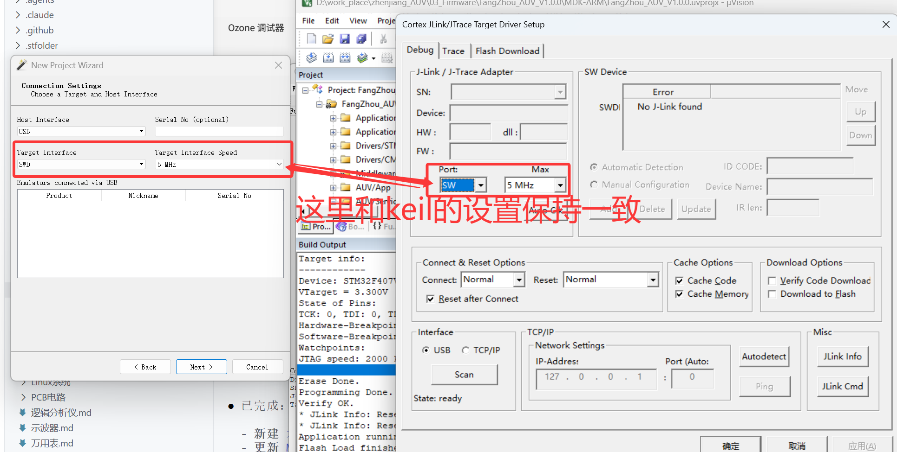
3. 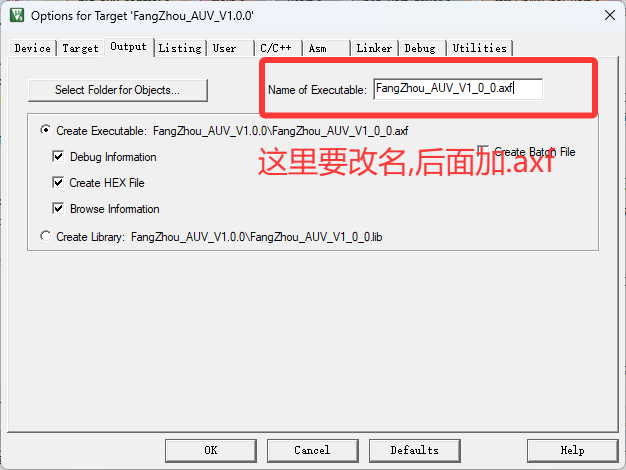

### 使用:

1. 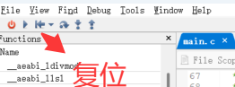
2. 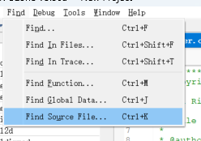 这个是找文件,输入文件名
3. 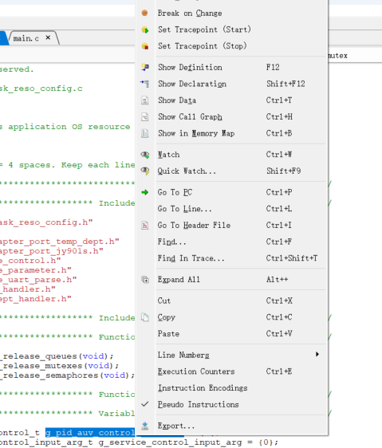 右键+watch查看变量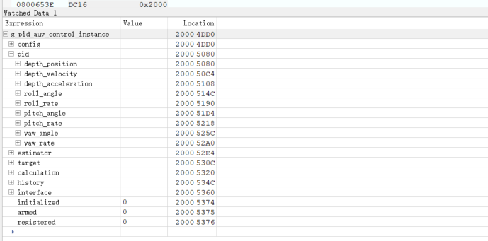
4. 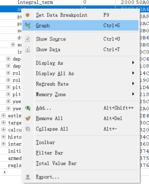右键graph可以查看到变量的最大最小值
5. 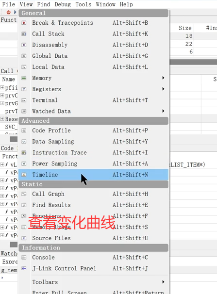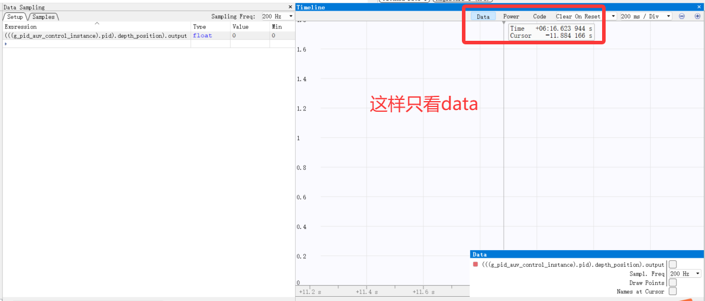
6. call stack,可以查看断点处函数的调用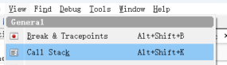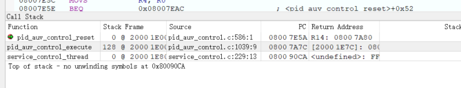
7. 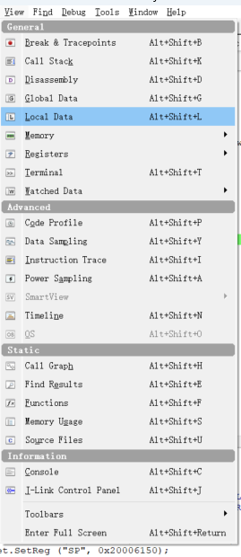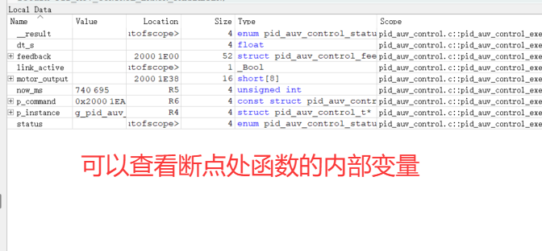
8. 保存线程快照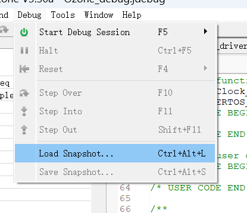
