# RTT 使用

[← 返回 RTT](./MOC.md) | [← 配置学习](../../配置学习/MOC.md) | [← 主页](../../../index.md)

[←OTA配置](../../OTA\环境配置.md)

---

## RTT资源配置

1. 找到jlink驱动的位置然后找到RTT压缩包:

   ```
   E:\Toolchains\JLink_V644b\Samples\RTT
   ```
2. 解压,复制这些文件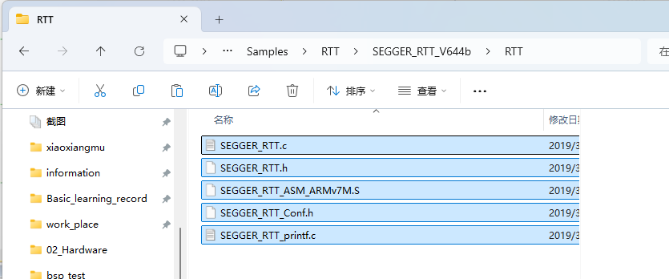
3. 粘贴到自己工程里:`\segger_rtt_demo\03_middlewares\communication\RTT`
4. 配置keil: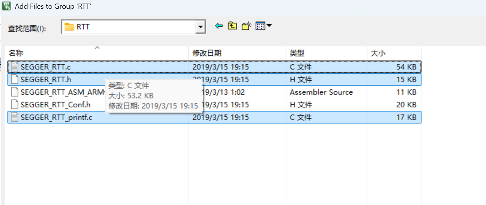

   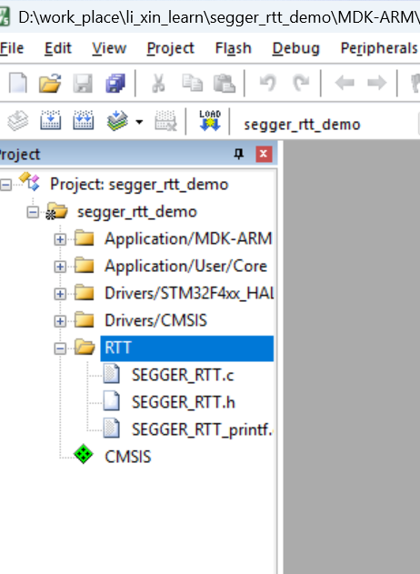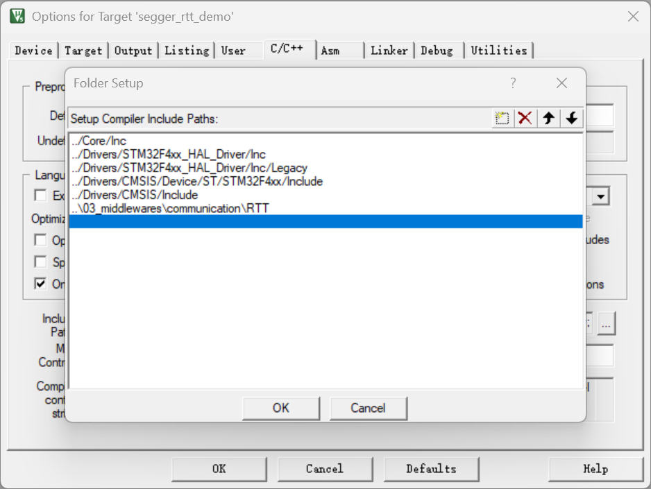
5. 缓冲区大小配置:参考[原理](原理.md)里的官方推荐的那张图去配置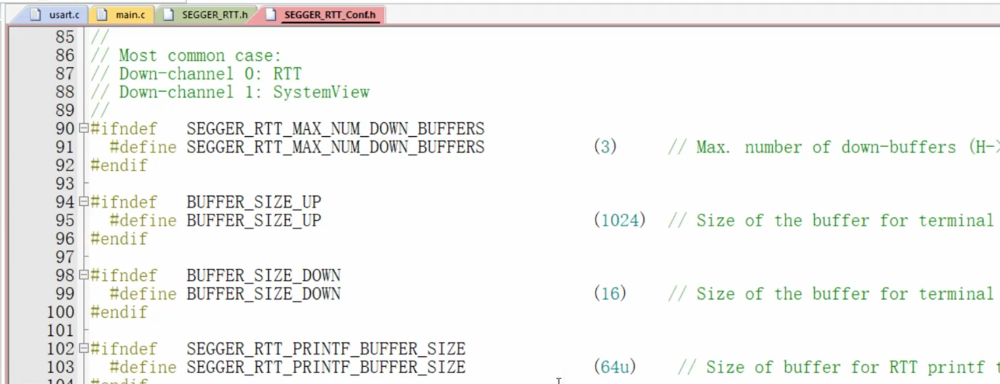

## RTT程序编写

1. 需要
   ```
   #include <stdio.h>
   #include <SEGGER_RTT.h>
   ```
2. 使用函数:
   ```
   SEGGER_RTT_printf(0," ")
   ```

### RTT的printf重定向

> 📎 详见 [printf 重定向笔记](../../嵌软高手/printf重定向.md)

1. 打开 [microlib](../../嵌软高手/microlib打开原因.md)
2. 在 `usart.c` 里：

   ```c
   /* USER CODE BEGIN 0 */
   #include "stdio.h"
   #include <SEGGER_RTT.h>
   /* USER CODE END 0 */
   ```

   ```c
   /* USER CODE BEGIN 1 */
   int fputc(int ch, FILE *f)
   {
     SEGGER_RTT_PutChar(0, ch);
     return ch;
   }
   /* USER CODE END 1 */
   ```

### RTT浮点数

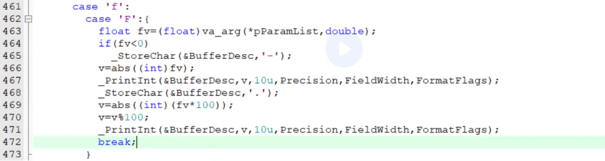

```
case 'f':
case 'F':{
    float fv=(float)va_arg(*pParamList,double);
    if(fv<0)
        _StoreChar(&BufferDesc,'-');
    v=abs((int)fv);
    _PrintInt(&BufferDesc,v,10u,NumDigits,FieldWidth,FormatFlags);
    _StoreChar(&BufferDesc,'.');
    v=abs((int)(fv*100));
    v=v%100;
    _PrintInt(&BufferDesc,v,10u,NumDigits,FieldWidth,FormatFlags);
    break;
}
```

在 `03_middlewares\communication\RTT\SEGGER_RTT_printf.c`

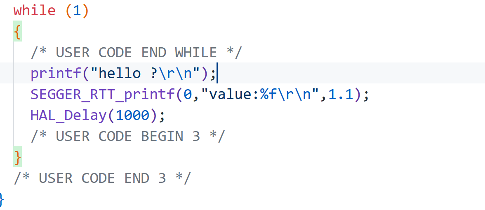

## 观察RTT输出

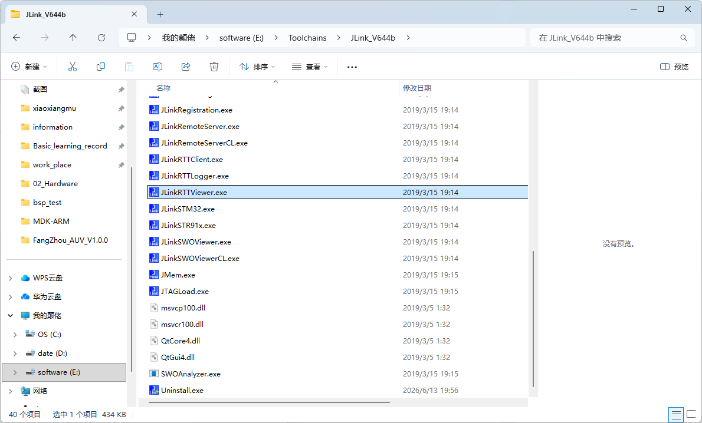

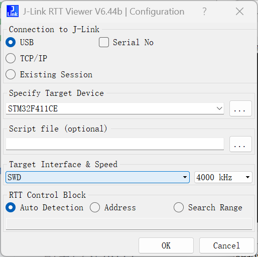

---

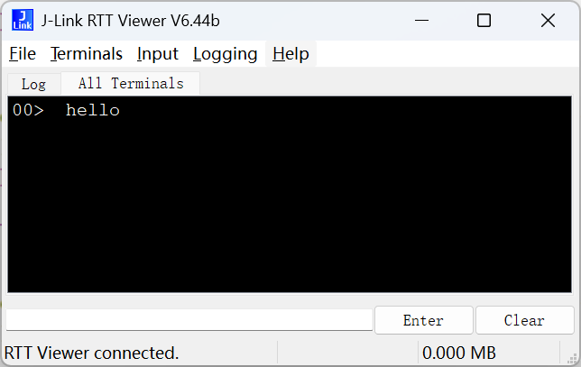

---

设置观察终端: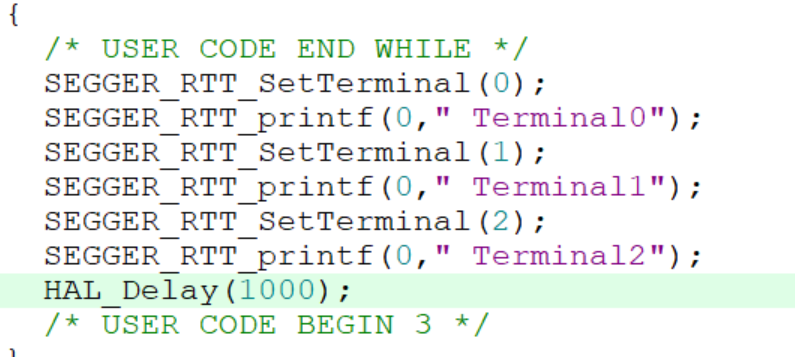

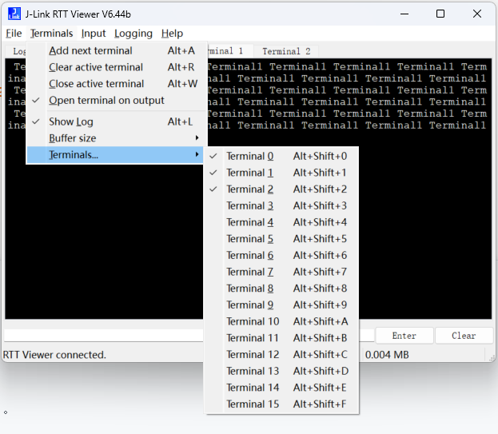

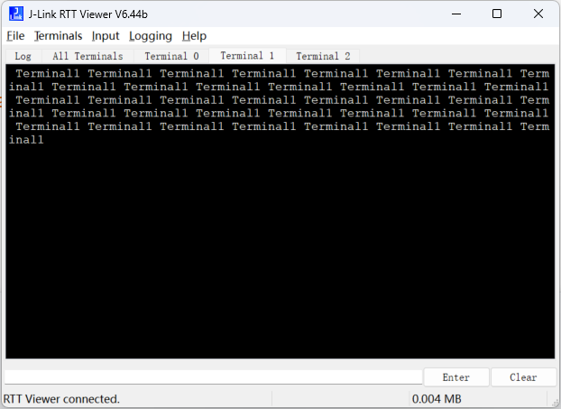

---

设置颜色: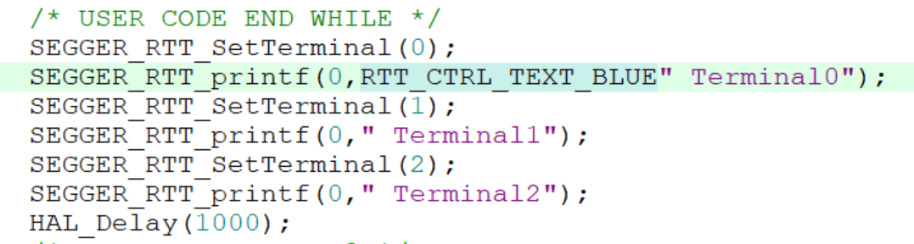

---
