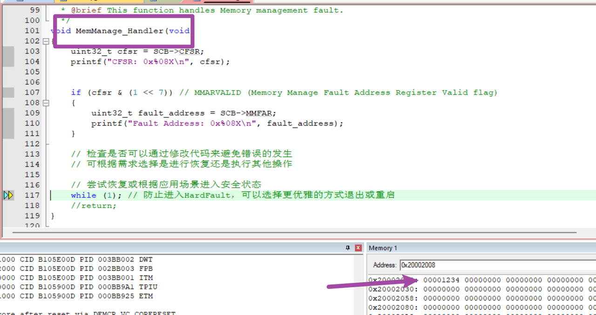
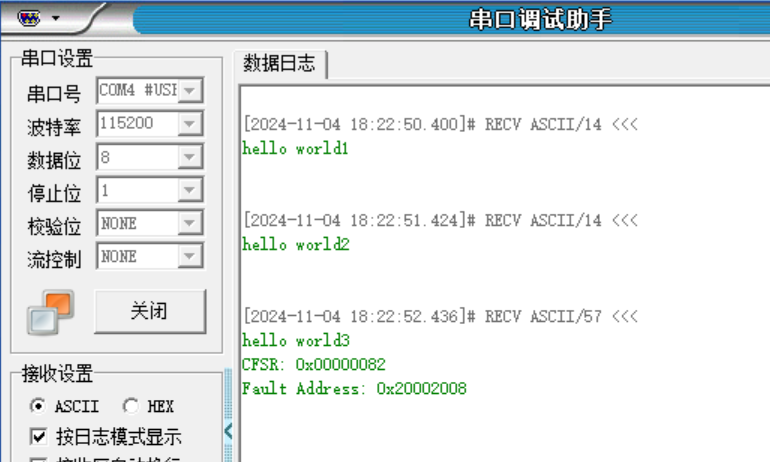

# 离线断点

[← 返回 debug方法](./MOC.md) | [← 主页](../../index.md)

> 通过 MPU 设置离线断点,是同步断点,立即进入MPU中断去处理错误信息(如写到flash或者串口发送)
>
> 还可以再OTA的ABbuffer升级的时候,保护另一个不被修改
>
> MPU 原理（region / 权限 / 寄存器）见 [MPU 内存保护单元](../Cortex-M4内核原理/MPU.md)

---

## Demo:

main.h 中 👇

```C
#define WATCH_ADDRESS    ((volatile uint32_t*)0x20002008)//这里填写要监控的地址
```

main.c 中 👇

```C

void MPU_Config(void)
{
    HAL_MPU_Disable();//先禁用

    // 配置MPU保护区域（将指定地址设为只读）
    MPU_Region_InitTypeDef MPU_InitStruct;
    MPU_InitStruct.Enable = MPU_REGION_ENABLE;
    MPU_InitStruct.BaseAddress = (uint32_t)WATCH_ADDRESS;     // 监视的地址
    MPU_InitStruct.Size = MPU_REGION_SIZE_32B;               // 设置区域大小为32字节,最小就32B,可以F12去看看大小
    MPU_InitStruct.AccessPermission = MPU_REGION_NO_ACCESS;  // 无访问权限
    MPU_InitStruct.IsBufferable = MPU_ACCESS_NOT_BUFFERABLE;
    MPU_InitStruct.IsCacheable = MPU_ACCESS_CACHEABLE;
    MPU_InitStruct.IsShareable = MPU_ACCESS_NOT_SHAREABLE;
    MPU_InitStruct.Number = MPU_REGION_NUMBER0;
    MPU_InitStruct.TypeExtField = MPU_TEX_LEVEL0;
    MPU_InitStruct.SubRegionDisable = 0x00;
    MPU_InitStruct.DisableExec = MPU_INSTRUCTION_ACCESS_DISABLE;

    HAL_MPU_ConfigRegion(&MPU_InitStruct);

    // 启用MPU
    HAL_MPU_Enable(MPU_PRIVILEGED_DEFAULT);
}

int main(void)
{
    HAL_Init();
  
    /* USER CODE BEGIN Init */
  
    // 初始化内核地址判别式并设置监视点
    *WATCH_ADDRESS = 0x1234;  // 初始化对应地址
  
    // 配置离线捕获点
    MPU_Config();
  
    // ........
    osKernelStart();
}
```

freertos.c 👇

```C
void StartDefaultTask(void *argument)
{
    /* USER CODE BEGIN StartDefaultTask */
char  ch[]="hello world\r\n";
  /* Infinite loop */
for(;;)
  {
    printf("hello world1\r\n");
  
    osDelay(1000);
    printf("hello world2\r\n");
    osDelay(1000);
    printf("hello world3\r\n");
  
    *WATCH_ADDRESS = 0x4567;  // 离线访问捕获

}
  /* USER CODE END StartDefaultTask */
}
```

之后，在 stm32f4xx_it.c 👇中

```C
void MemManage_Handler(void)
{
  /* USER CODE BEGIN MemoryManagement_IRQn 0 */
uint32_t cfsr = SCB->CFSR;
    printf("CFSR: 0x%08X\n", cfsr);


    if (cfsr & (1 << 7)) // MMARVALID (Memory Manage Fault Address Register Valid flag)
{
       uint32_t fault_address = SCB->MMFAR;
       printf("Fault Address: 0x%08X\n", fault_address);
    }
  /* USER CODE END MemoryManagement_IRQn 0 */
while (1)
  {
    /* USER CODE BEGIN W1_MemoryManagement_IRQn 0 */
/* USER CODE END W1_MemoryManagement_IRQn 0 */
}
}
```

如果访问监视地址，则会立刻进入异常，并且，值都不会被修改（说明，捕获的时间，非常的快，基本上，不会让 CPU，做其他的操作）

最后，执行完捕获， **值还是 0x1234** ，没有被修改为 0x4567



## 配置解析:

首先，先禁用 MPU：在很多外设，设置中，都会有这种操作

为了，能够在，设置完参数后，对他，进行类似于初始化的一个过程

`#define  MPU_REGION_ENABLE     ((uint8_t)0x01)`：打开 MPU 区域的控制

区域：可配置某一块禁用的区域，按区域来划分

* BaseAddress：监视地址起点
* Size：32 个字节（范围 MPU_REGION_SIZE_32B ~ MPU_REGION_SIZE_4GB）
  * 可以拿来做 Flash 双分区：升级 B 区域，A 区域做 MPU 保护
    * 跑/升级 A 分区的固件的时候，不会去改变 B 分区的固件
* AccessPermission：无、特权模式下rw、full_access 等
* IsBufferable：是否允许缓冲
  * F4111 上，I-Bus、D-Bus ，都只是 Bus，不是 Cache-Bus，所以这里的 IsBufferable 没有什么意义
* IsCacheable：flash 上，进行加速的 cache（地址在 flash 上，这个参数是有用的）为通用性，设置成 CACHEABLE
* IsBufferable：多核处理器，我们这里没有需求
* Number：MPU 区域编号（0~7）每个区域，都可以设置一个起始地址，然后去监控
* TypeExtField：等级（0 ~ 2）
  * 我们会对内存，有个不同的区分（对这块区域，访问的控制）
    * 普通内存
    * 强制排序内存
    * 设备内存

在 STM32F411（Cortex-M4 内核）中，由于没有 L1 缓存（I-Cache,D-Cache)，`TEX` 字段对于内部 RAM 的影响较小
主要用于 `外部存储器`或 `外部设备`的访问类型定义。
内存类型分类（参数：MPU_InitStruct.TypeExtField = MPU_TEX_LEVEL0;）
根据 `TEX`、`C` 和 `B` 的组合，内存区域可以被分类为不同的类型。下面是常见的组合及其对应的内存类型：

1. **普通内存** ：如果是正常的数据存储区域，如 RAM 或外部 SDRAM，通常配置为 **Normal, Non-Cacheable** 或  **Normal, Cacheable** 。
2. **设备内存** ：如果是外设寄存器，通常配置为  **Device Memory** ，确保这些寄存器的访问没有缓存或缓冲，并且顺序严格。
3. **强排序内存** ：用于严格要求顺序的访问场景，尤其是控制寄存器或 DMA 相关的区域。
4. 

| TEX | C | B | 内存类型              | 说明                                               |
| --- | - | - | --------------------- | -------------------------------------------------- |
| 0   | 0 | 0 | Strongly-Ordered      | 强排序内存，所有访问按严格顺序进行，通常用于外设。 |
| 0   | 0 | 1 | Device                | 设备内存，不可缓存，不可缓冲。用于外设寄存器。     |
| 0   | 1 | 0 | Normal, Non-Cacheable | 普通内存，不可缓存，但可以缓冲。                   |
| 0   | 1 | 1 | Normal, Cacheable     | 普通内存，可缓存且可缓冲。                         |
| 1   | x | x | Normal, Cacheable     | 普通内存，细粒度控制，结合外部设备的属性。         |
| 100 | 0 | 0 | Strongly-Ordered      | 强排序内存，与 000 类似，用于内存强顺序要求。      |
| 101 | x | x | Device                | 设备内存，用于外部设备寄存器访问。                 |

* SubRegionDisable：对内存，再次进行更加细小的划分
* DisableExec：是否允许从该区域执行代码
  * （此处为 `MPU_INSTRUCTION_ACCESS_DISABLE`，表示不允许执行任何指令，防止恶意代码执行）
  * 好处：我们做的离线断点，不仅仅是监控一个字节的访问
    * 我们还可以通过分散加载，**把某一些函数，给链接在 WATCH_ADDRESS 地址上**
    * **CPU，如果想在 WATCH_ADDRESS 上执行函数，也会被立刻捕获住**

## 面试扯虎皮:

```
📌 离线断点：
    我们在项目中遇到过一次 数组越界 的问题，但是这个问题它不是必现的
    它在使用一段时间后，在偶尔切换页面后，再做一些操作的时候，会突然崩溃
    我们尝试看了离线的 Hardfault 栈信息（我们如果产生了 Hardfault，会通过 Cmbacktrace 把 Hardfault 的错误栈信息打印到内部 Flash 上，然后再读出来分析），但是由于 Hardfault 并不是同步异常（因为有可能是其他异常没来得及处理，然后升级成了 Hardfault），cpu 产生 Hardfault 后会执行几条流水线中的指令，又由于这个时候还是带操作系统的，OS 可能在产生异常后还会切换任务，这个时候看 Hardfault 信息 很难定位问题
    我们初步怀疑就是 野指针，排查完没有赋值的指针后，又怀疑有 数组越界。
    由于我们用了 LVGL，并且 LVGL 里面切换页面的时候会去加载图标，同事在代码中编写了一个函数，用于 加载图标数据到 iconBuffer 数组中，同时还有很多个类似的 buffer 数组，我们通过 sct 分散加载 把他们都链接到了 SRAM 的特定区域
        uint8_t iconBuffer[32] attribute_((section ("iconBuffer_array_region")));
    并且把原来的数组变大 32 字节（因为 MPU 最小的保护单元就是 32 字节），比如 60 个字节我就设置为 92 个字节，然后让 MPU 保护后面的 32 个字节，我们有五个数组，所以全部保护起来了，于是后来再去测试的时候，真的捕获到数组越界，由于 MPU 是同步异常，所以可以立马定位到进入 MemManage_Handler 的前面一句语句（存在了栈中，通过 Cmbacktrace 打印到 flash 上），而 CPU 不会再去执行几条指令
    后来发现是同事调用调用 memcpy() 的时候没有判断，导致 UI 更新后，新的 UI 太大，超过了原来数组，导致数组越界，而数组越界踩踏了后面的指针数据，造成了野指针，从而崩溃
```

```
📌 👉 概括下上面的内容，发生了什么事情？是因为什么原因导致的呢？又是如何解决的？

上述描述了一次在嵌入式系统开发中遇到的技术难题及其解决方案。
具体来说，遇到了一个不总是出现但会导致系统崩溃的问题，主要表现为系统在运行一段时间后，在特定的操作场景下（如切换页面后进行某些操作）会出现突然崩溃的情况。

问题原因：
  • 初步怀疑是由于野指针或数组越界引起。
  • 经过进一步调查，确定问题是由于同事在 使用 memcpy() 函数复制数据到 iconBuffer 数组时未做边界检查，当新的UI界面数据量过大时，超出了数组的容量限制，导致了数组越界。
  • 数组越界后，额外的数据写入覆盖了相邻内存空间中的其他变量或指针，进而导致程序中的野指针问题，最终引发了系统的崩溃。

解决方法：
  • 开发团队利用 MPU（Memory Protection Unit，内存保护单元）对可能存在问题的数组进行了特殊处理。将这些数组 分配到SRAM的特定区域，并增加了数组大小以包含MPU最小保护单元的大小（32字节）。
  • 对这些数组的后续部分设置了MPU保护，确保 任何超出数组界限的写操作 都会 立即触发 MemManage异常。而不是等到系统状态不稳定时才出现问题。
  • 通过这种方式，开发团队能够在测试中准确捕捉到数组越界的时刻，进而定位到具体的错误代码行。
  • 最终，修复了 memcpy() 使用不当的问题：
    ◦ 确保在复制数据前，进行适当的边界检查，避免了数组越界的发生，解决了系统崩溃的问题

这个案例展示了在嵌入式软件开发中，合理利用硬件特性（如MPU）可以帮助开发者更有效地诊断和解决问题，同时也强调了编程时遵循良好实践的重要性，比如在进行内存操作时务必注意边界条件
```
