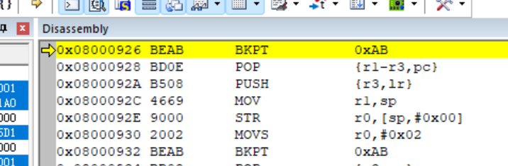
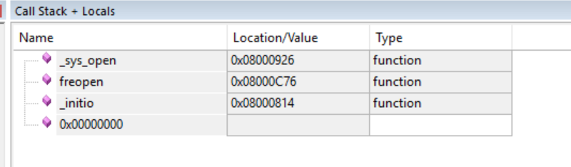

# keil的debug方法

[← 返回 MOC](MOC.md) | [← 主页](../index.md)

---

## BKPT断点:

当遇到 HardFault 等异常断点停住时

**View → Call Stack Window** 找到出问题的函数，然后查这个函数被谁调用，就能定位到出问题的代码

_sys_open 是 printf 的 semihosting,keil默认走 semihosting（通过 BKPT 0xAB 和调试器通信输出到 PC 控制台）。调试器没正确处理这个 semihosting 请求，CPU 就停在了 BKPT

解决:[打开usb microlib](嵌软高手/microlib打开原因.md)
