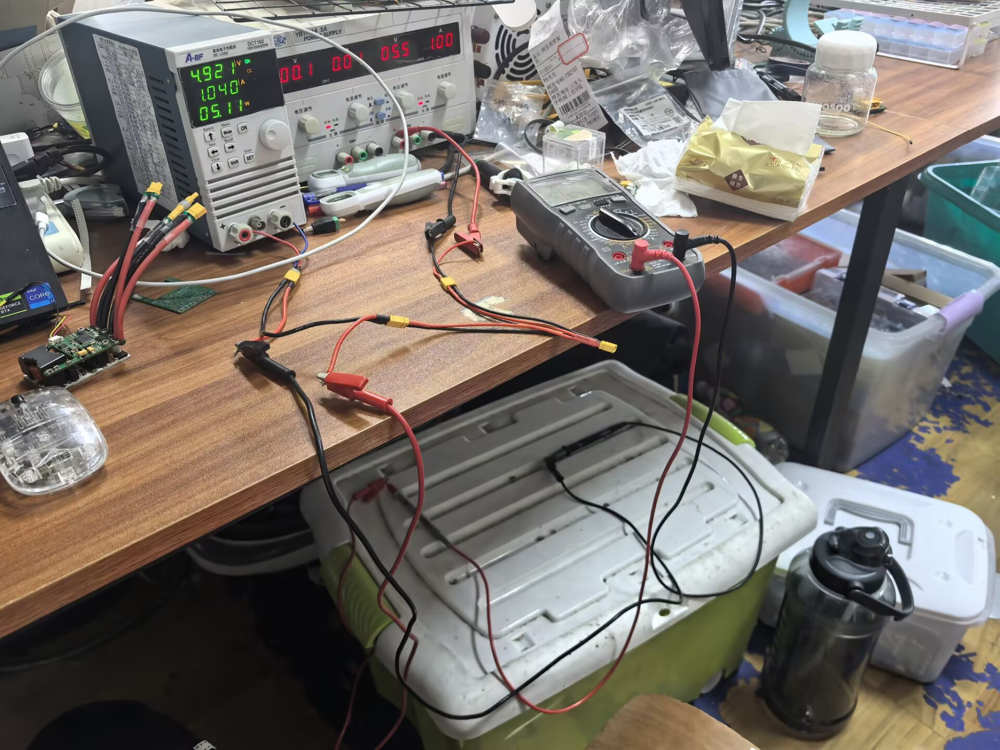
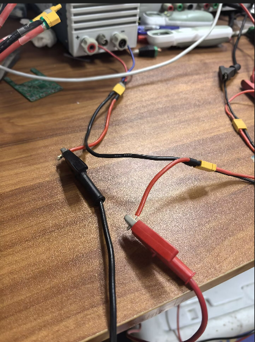
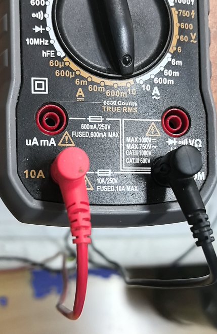
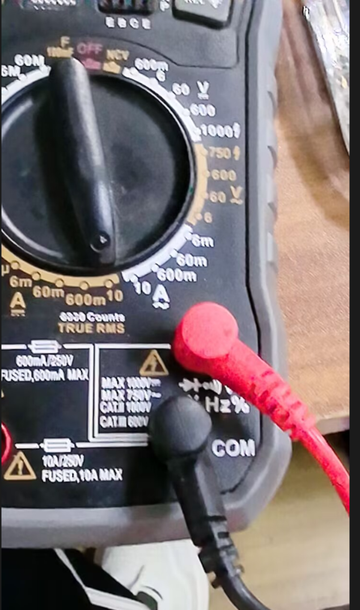

# 万用表

[← 返回 MOC](MOC.md) | [← 主页](../index.md)|←[示波器](示波器.md)

> 这电源箱电流好像有问题,功率计被人拿走了,拿万用表测量一下

---

电表的两端是浮空的,和[示波器](示波器.md)不同

测量电流需要把表⭐**串联**在电路中,里面会有一个很小电阻测量两端的电压差计算出电流

孔位一点要看好,插在测量电流的孔位上,测电流和电压一定不能混

---

下图测电压,⭐**并联**

## 本章小结
